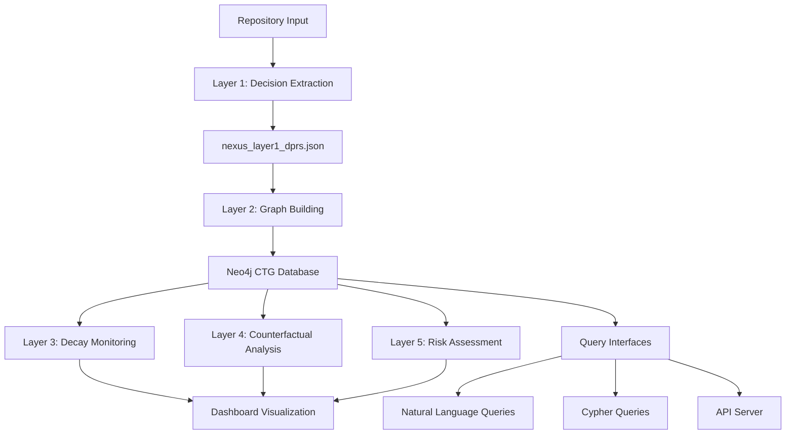

**User:**

<task>
Analyze the BOBhack project structure and provide a comprehensive overview of:

1. The main purpose and architecture of this project based on file names and structure
2. All Python files that need to be reviewed (list them with their paths)
3. All configuration files (JSON, requirements.txt, etc.)
4. Any HTML/JavaScript files
5. The technology stack being used (Python libraries, databases, frameworks)

Focus only on understanding the project structure and categorizing files for review. Do not make any changes. Use the `attempt_completion` tool when done with a structured summary of findings.

These instructions supersede any conflicting general instructions your mode might have.
</task>
<environment_details>
# VSCode Visible Files


# VSCode Open Tabs


# Current Time
Current time in ISO 8601 UTC format: 2026-05-17T05:26:32.527Z
User time zone: Asia/Calcutta, UTC+5:30

# Current Cost
$0.00

# Review Exclusions
The following file patterns are excluded from code reviews:
- .vscode/**

# Current Mode
<slug>ask</slug>
<name>❓ Ask</name>


# Current Workspace Directory (/Users/apple/Desktop/Nexus) Files
BOBhack/
BOBhack/.gitignore
BOBhack/api_server.py
BOBhack/audit_api.py
BOBhack/audit.py
BOBhack/fix_data.py
BOBhack/Nexus_Architecture (1).pdf
BOBhack/nexus_architecture_text.txt
BOBhack/nexus_risk_report.pdf
BOBhack/pyrightconfig.json
BOBhack/repo_analyzer.py
BOBhack/requirements.txt
BOBhack/test_wordpress_scan.py
BOBhack/.bob/
BOBhack/analyses/
BOBhack/analyses/requests/
BOBhack/analyses/requests/output/
BOBhack/analyses/requests/output/counterfactual_traces.json
BOBhack/analyses/requests/output/decay_monitor_report.json
BOBhack/analyses/requests/output/knowledge_concentration.json
BOBhack/analyses/requests/output/nexus_data.json
BOBhack/analyses/requests/output/nexus_layer1_dprs.json
BOBhack/analyses/WordPress/
BOBhack/analyses/WordPress/output/
BOBhack/analyses/WordPress/output/counterfactual_traces.json
BOBhack/analyses/WordPress/output/decay_monitor_report.json
BOBhack/analyses/WordPress/output/knowledge_concentration.json
BOBhack/analyses/WordPress/output/nexus_data.json
BOBhack/analyses/WordPress/output/nexus_layer1_dprs.json
BOBhack/nexus_layer2/
BOBhack/nexus_layer2/counterfactual_sim.py
BOBhack/nexus_layer2/cypher_queries.py
BOBhack/nexus_layer2/decay_monitor.py
BOBhack/nexus_layer2/enrich_graph.py
BOBhack/nexus_layer2/gemini_query.py
BOBhack/nexus_layer2/graph_builder.py
BOBhack/nexus_layer2/knowledge_concentration.py
BOBhack/nexus_layer2/llm_provider.py
BOBhack/nexus_layer2/merge_nexus_data.py
BOBhack/nexus_layer2/models.py
BOBhack/nexus_layer2/neo4j_loader.py
BOBhack/nexus_layer2/nl_query.py
BOBhack/nexus_layer2/query_cli.py
BOBhack/nexus_layer2/README.md
BOBhack/nexus_layer2/risk_report_pdf.py
BOBhack/nexus_layer2/submission_export.py
BOBhack/nexus_layer2/test_query_cli.py
BOBhack/nexus_layer2/verify_graph.py
BOBhack/nexus_layer2/weaviate_ingest.py
BOBhack/nexus-dashboard/
BOBhack/nexus-dashboard/index.html
BOBhack/nexus-dashboard/nexus_data.json
BOBhack/postgres-analysis/
BOBhack/postgres-analysis/generate_nexus_output.ps1
BOBhack/postgres-analysis/nexus_layer1_analyzer.ps1
BOBhack/postgres-analysis/output/
BOBhack/postgres-analysis/output/counterfactual_traces.json
BOBhack/postgres-analysis/output/decay_monitor_report.json
BOBhack/postgres-analysis/output/knowledge_concentration.json
BOBhack/postgres-analysis/output/nexus_data.json
BOBhack/postgres-analysis/output/NEXUS_LAYER1_COMPLETE_ANALYSIS.md
BOBhack/postgres-analysis/output/nexus_layer1_dprs.json
BOBhack/postgres-analysis/output/nexus_risk_report.pdf
BOBhack/postgres-analysis/output/REPOSITORY_VALIDATION.md
BOBhack/postgres-analysis/postgres/
BOBhack/submission/
BOBhack/submission/bob_session_export.json
BOBhack/submission/demo_script.md
BOBhack/submission/submission_form.md
You have not created a todo list yet. Create one with `update_todo_list` if your task is complicated or involves multiple steps.
</environment_details>

---

**Assistant:**

I'll analyze the BOBhack project structure to provide you with a comprehensive overview. Let me start by examining the key files to understand the project better.

<read_file>
<args>
  <file>
    <path>BOBhack/requirements.txt</path>
  </file>
  <file>
    <path>BOBhack/pyrightconfig.json</path>
  </file>
  <file>
    <path>BOBhack/nexus_layer2/README.md</path>
  </file>
  <file>
    <path>BOBhack/nexus-dashboard/index.html</path>
    <line_range>1-50</line_range>
  </file>
  <file>
    <path>BOBhack/submission/demo_script.md</path>
  </file>
</args>
</read_file>

---

**User:**

[read_file for 5 files] Result:
<files>
<file><path>BOBhack/requirements.txt</path>
<content lines="1-7">
1 | pydantic>=2.0
2 | neo4j>=5.0
3 | networkx>=3.0
4 | reportlab>=4.0
5 | colorama>=0.4
6 | google-genai>=1.0
7 | PyGitHub>=2.0
</content>
</file>
<file><path>BOBhack/pyrightconfig.json</path>
<content lines="1-8">
1 | {
2 |   "extraPaths": [
3 |     "./nexus_layer2"
4 |   ],
5 |   "reportMissingImports": "warning",
6 |   "reportOptionalMemberAccess": "none",
7 |   "pythonVersion": "3.13"
8 | }
</content>
</file>
<file><path>BOBhack/nexus_layer2/README.md</path>
<content lines="1-262">
  1 | # Nexus Layer 2 - CTG Ingestion Pipeline for Neo4j
  2 | 
  3 | This directory contains the Python implementation for loading Nexus Layer 1 output into Neo4j as a queryable Causal Temporal Graph (CTG).
  4 | 
  5 | ## Files
  6 | 
  7 | 1. **models.py** - Pydantic v2 models for data validation
  8 | 2. **graph_builder.py** - Neo4j ingestion pipeline
  9 | 3. **cypher_queries.py** - Predefined Cypher query library
 10 | 4. **nl_query.py** - Natural language query interface
 11 | 5. **verify_graph.py** - Graph health verification
 12 | 
 13 | ## Prerequisites
 14 | 
 15 | ### 1. Install Python Dependencies
 16 | 
 17 | ```bash
 18 | pip install pydantic neo4j
 19 | ```
 20 | 
 21 | ### 2. Start Neo4j
 22 | 
 23 | Using Docker (recommended):
 24 | ```bash
 25 | docker run -p7474:7474 -p7687:7687 neo4j:community
 26 | ```
 27 | 
 28 | Or download Neo4j Community Edition from: https://neo4j.com/download/
 29 | 
 30 | ## Usage
 31 | 
 32 | ### Step 1: Validate Layer 1 Data
 33 | 
 34 | ```bash
 35 | python nexus_layer2/models.py
 36 | ```
 37 | 
 38 | This will:
 39 | - Load `postgres-analysis/output/nexus_layer1_dprs.json`
 40 | - Validate against Pydantic schemas
 41 | - Print data summary
 42 | 
 43 | **Expected Output:**
 44 | ```
 45 | ✅ VALIDATION SUCCESSFUL
 46 | Repository: https://github.com/postgres/postgres
 47 | Total DPRs: 28
 48 | CTG Edges: 25
 49 | Decay Alerts: 5
 50 | ```
 51 | 
 52 | ### Step 2: Load Data into Neo4j
 53 | 
 54 | ```bash
 55 | python nexus_layer2/graph_builder.py
 56 | ```
 57 | 
 58 | This will:
 59 | 1. Connect to Neo4j at `bolt://localhost:7687`
 60 | 2. Clear existing Nexus graph data
 61 | 3. Create indexes for efficient querying
 62 | 4. Create DPR nodes with all properties
 63 | 5. Create CTG relationship edges
 64 | 6. Create DecayAlert nodes linked to DPRs
 65 | 7. Verify graph integrity
 66 | 
 67 | **Expected Output:**
 68 | ```
 69 | ✅ INGESTION COMPLETE
 70 | Created 28 DPR nodes
 71 | Created 25 CTG edges
 72 | Created 5 DecayAlert nodes
 73 | ```
 74 | 
 75 | ### Step 3: Verify Graph Health
 76 | 
 77 | ```bash
 78 | python nexus_layer2/verify_graph.py
 79 | ```
 80 | 
 81 | This prints a comprehensive health report:
 82 | - Node counts (DPRs, DecayAlerts)
 83 | - Relationship counts by type
 84 | - Blast radius breakdown
 85 | - Decay risk breakdown
 86 | - Component breakdown
 87 | - Top connected DPRs
 88 | - High-risk critical decisions
 89 | - Workaround proliferation
 90 | 
 91 | ### Step 4: Query the Graph
 92 | 
 93 | #### Option A: Use Predefined Cypher Queries
 94 | 
 95 | ```python
 96 | from neo4j import GraphDatabase
 97 | from cypher_queries import NEXUS_QUERIES
 98 | 
 99 | driver = GraphDatabase.driver("bolt://localhost:7687", auth=None)
100 | 
101 | with driver.session() as session:
102 |     # Find critical blast radius DPRs
103 |     result = session.run(NEXUS_QUERIES["critical_blast_radius"]["cypher"])
104 |     for record in result:
105 |         print(record)
106 | ```
107 | 
108 | #### Option B: Use Natural Language Interface
109 | 
110 | ```bash
111 | python nexus_layer2/nl_query.py
112 | ```
113 | 
114 | Interactive mode - ask questions in plain English:
115 | ```
116 | ❓ Your question: What decisions are already decaying?
117 | ❓ Your question: Show me the most dangerous decisions
118 | ❓ Your question: What led to DPR-003?
119 | ❓ Your question: What does DPR-001 impact?
120 | ```
121 | 
122 | Or programmatically:
123 | ```python
124 | from nl_query import nl_query
125 | 
126 | result = nl_query("What decisions have critical blast radius?")
127 | print(result)
128 | ```
129 | 
130 | ## Available Queries
131 | 
132 | Run to see all available queries:
133 | ```bash
134 | python nexus_layer2/cypher_queries.py
135 | ```
136 | 
137 | Key queries include:
138 | - **critical_blast_radius** - DPRs with critical blast radius
139 | - **high_decay_risk** - DPRs with high assumption decay risk
140 | - **already_decaying** - Decay alerts where assumptions are breaking
141 | - **causal_chain_from** - Downstream impacts of a decision
142 | - **causal_chain_to** - What led to a decision
143 | - **foundational_decisions** - Core architectural decisions
144 | - **active_workarounds** - Technical debt indicators
145 | - **within_window_changes** - Recent decisions (last 2 years)
146 | - **most_connected_dprs** - Most influential decisions
147 | 
148 | ## Neo4j Browser
149 | 
150 | Access the Neo4j Browser at: http://localhost:7474
151 | 
152 | Example queries to run:
153 | 
154 | ```cypher
155 | // Find all DPRs
156 | MATCH (d:DPR) RETURN d LIMIT 25
157 | 
158 | // Visualize the entire CTG
159 | MATCH (d:DPR)-[r]->(other:DPR)
160 | RETURN d, r, other
161 | 
162 | // Find high-risk critical decisions
163 | MATCH (d:DPR)
164 | WHERE d.assumption_decay_risk = 'high' 
165 |   AND d.blast_radius_estimate = 'critical'
166 | RETURN d
167 | 
168 | // Show decay alerts
169 | MATCH (d:DPR)-[:HAS_ALERT]->(a:DecayAlert)
170 | WHERE a.already_decaying = true
171 | RETURN d, a
172 | ```
173 | 
174 | ## Data Model
175 | 
176 | ### Node Types
177 | 
178 | **:DPR** (Decision Provenance Record)
179 | - `dpr_id` - Unique identifier (e.g., "DPR-001")
180 | - `title` - Decision title
181 | - `component` - Component (MVCC, WAL, Storage, etc.)
182 | - `within_window` - Boolean, made in last 2 years
183 | - `decision_date` - When decision was made
184 | - `decision` - The actual decision text
185 | - `blast_radius_estimate` - critical/high/medium/low
186 | - `assumption_decay_risk` - high/medium/low
187 | - `intended_durability` - foundational/medium-term/short-term
188 | - `active_workarounds` - List of workarounds in use
189 | - Plus: constraints, assumptions, reasoning, files, commits, humans
190 | 
191 | **:DecayAlert**
192 | - `dpr_id` - Associated DPR
193 | - `assumption` - The assumption being monitored
194 | - `already_decaying` - Boolean
195 | - `decay_evidence` - Evidence of decay
196 | - `earliest_signal_date` - When decay was first detected
197 | - `recommended_monitor_query` - SQL query to monitor
198 | 
199 | ### Relationship Types
200 | 
201 | - **CONSTRAINS** - Decision A constrains decision B
202 | - **ENABLES** - Decision A enables decision B
203 | - **REQUIRES** - Decision A requires decision B
204 | - **ASSUMPTION_OF** - Decision A assumes decision B holds
205 | - **TEMPORAL_PRECEDES** - Decision A came before B
206 | - **HAS_ALERT** - DPR has a decay alert
207 | 
208 | ## Troubleshooting
209 | 
210 | ### Neo4j Connection Issues
211 | 
212 | If you see "Failed to connect to Neo4j":
213 | 1. Make sure Neo4j is running: `docker ps`
214 | 2. Check Neo4j is on port 7687: `netstat -an | findstr 7687`
215 | 3. Try accessing Neo4j Browser: http://localhost:7474
216 | 
217 | ### Unicode Encoding Issues (Windows)
218 | 
219 | If you see `UnicodeEncodeError`, run with UTF-8:
220 | ```powershell
221 | $env:PYTHONIOENCODING="utf-8"; python nexus_layer2/models.py
222 | ```
223 | 
224 | ### Module Not Found
225 | 
226 | Install dependencies:
227 | ```bash
228 | pip install pydantic neo4j
229 | ```
230 | 
231 | ## Architecture
232 | 
233 | ```
234 | Layer 1 (Analysis)
235 |     ↓
236 | nexus_layer1_dprs.json
237 |     ↓
238 | models.py (Validation)
239 |     ↓
240 | graph_builder.py (Ingestion)
241 |     ↓
242 | Neo4j Graph Database
243 |     ↓
244 | cypher_queries.py / nl_query.py / verify_graph.py (Querying)
245 | ```
246 | 
247 | ## Next Steps
248 | 
249 | After loading the graph:
250 | 
251 | 1. **Explore in Neo4j Browser** - Visualize the CTG
252 | 2. **Run Health Checks** - `python verify_graph.py`
253 | 3. **Query Patterns** - Use predefined queries or write custom Cypher
254 | 4. **Natural Language** - Ask questions via `nl_query.py`
255 | 5. **Monitor Decay** - Track assumptions using recommended queries
256 | 
257 | ## Notes
258 | 
259 | - **Single Repo Mode**: Currently configured for PostgreSQL only
260 | - **No Auth**: Neo4j connection uses no authentication (dev mode)
261 | - **Local Pattern Matching**: NL queries use keyword matching, no LLM API
262 | - **Cypher Only**: No vector similarity layer (as per requirements)
</content>
</file>
<file><path>BOBhack/nexus-dashboard/index.html</path>
<content lines="1-50">
 1 | <!DOCTYPE html>
 2 | <html lang="en">
 3 | <head>
 4 | <meta charset="UTF-8">
 5 | <meta name="viewport" content="width=device-width, initial-scale=1.0">
 6 | <title>Nexus — Causal Intelligence Dashboard</title>
 7 | <meta name="description" content="Nexus CTG Dashboard - Visualize causal chains, decay alerts, and risk scores">
 8 | <script src="https://unpkg.com/vis-network/standalone/umd/vis-network.min.js"></script>
 9 | <link href="https://fonts.googleapis.com/css2?family=Inter:wght@300;400;500;600;700&display=swap" rel="stylesheet">
10 | <style>
11 | *{margin:0;padding:0;box-sizing:border-box}
12 | :root{--bg:#0a0a1a;--surface:#12122a;--card:#1a1a3e;--border:#2a2a5e;--text:#e0e0ff;--muted:#8888bb;--accent:#6c63ff;--accent2:#00d4aa;--danger:#ff4466;--warn:#ffaa33;--safe:#00dd88;--glow:rgba(108,99,255,0.15)}
13 | body{font-family:'Inter',sans-serif;background:var(--bg);color:var(--text);min-height:100vh;overflow-x:hidden}
14 | .header{background:linear-gradient(135deg,#0d0d2b,#1a1a4e);border-bottom:1px solid var(--border);padding:16px 32px;display:flex;align-items:center;justify-content:space-between;position:sticky;top:0;z-index:100;backdrop-filter:blur(12px)}
15 | .header h1{font-size:22px;font-weight:700;background:linear-gradient(135deg,var(--accent),var(--accent2));-webkit-background-clip:text;-webkit-text-fill-color:transparent}
16 | .header .meta{font-size:12px;color:var(--muted)}
17 | .nav{display:flex;gap:4px;background:var(--surface);border-radius:10px;padding:4px;border:1px solid var(--border)}
18 | .nav button{padding:8px 16px;border:none;background:none;color:var(--muted);cursor:pointer;border-radius:8px;font-size:13px;font-family:inherit;transition:all .2s}
19 | .nav button.active{background:var(--accent);color:#fff;box-shadow:0 2px 12px rgba(108,99,255,.4)}
20 | .nav button:hover:not(.active){background:var(--card);color:var(--text)}
21 | .container{padding:24px 32px;max-width:1400px;margin:0 auto}
22 | .grid{display:grid;gap:20px}
23 | .grid-2{grid-template-columns:1fr 1fr}
24 | .grid-3{grid-template-columns:1fr 1fr 1fr}
25 | .grid-4{grid-template-columns:1fr 1fr 1fr 1fr}
26 | .card{background:var(--card);border:1px solid var(--border);border-radius:14px;padding:20px;transition:transform .2s,box-shadow .2s}
27 | .card:hover{transform:translateY(-2px);box-shadow:0 8px 32px var(--glow)}
28 | .card h3{font-size:14px;color:var(--muted);text-transform:uppercase;letter-spacing:1px;margin-bottom:12px}
29 | .stat{font-size:36px;font-weight:700}
30 | .stat.danger{color:var(--danger)}
31 | .stat.warn{color:var(--warn)}
32 | .stat.safe{color:var(--safe)}
33 | .stat.accent{color:var(--accent)}
34 | .badge{display:inline-block;padding:3px 10px;border-radius:20px;font-size:11px;font-weight:600}
35 | .badge.critical{background:rgba(255,68,102,.15);color:var(--danger);border:1px solid rgba(255,68,102,.3)}
36 | .badge.high{background:rgba(255,170,51,.15);color:var(--warn);border:1px solid rgba(255,170,51,.3)}
37 | .badge.medium{background:rgba(108,99,255,.15);color:var(--accent);border:1px solid rgba(108,99,255,.3)}
38 | .badge.low{background:rgba(0,221,136,.15);color:var(--safe);border:1px solid rgba(0,221,136,.3)}
39 | .badge.p0{background:rgba(255,68,102,.2);color:var(--danger)}
40 | .badge.p1{background:rgba(255,170,51,.2);color:var(--warn)}
41 | .badge.p2{background:rgba(0,212,170,.2);color:var(--accent2)}
42 | table{width:100%;border-collapse:collapse;font-size:13px}
43 | th{text-align:left;padding:10px 12px;color:var(--muted);font-weight:500;border-bottom:1px solid var(--border);font-size:11px;text-transform:uppercase;letter-spacing:.5px}
44 | td{padding:10px 12px;border-bottom:1px solid rgba(42,42,94,.5)}
45 | tr:hover td{background:rgba(108,99,255,.05)}
46 | .risk-bar{height:6px;border-radius:3px;background:var(--surface);overflow:hidden;min-width:80px}
47 | .risk-bar .fill{height:100%;border-radius:3px;transition:width .5s}
48 | .section{display:none}
49 | .section.active{display:block}
50 | #ctg-graph{height:500px;border-radius:14px;border:1px solid var(--border);background:var(--surface)}
</content>
</file>
<file><path>BOBhack/submission/demo_script.md</path>
<content lines="1-37">
 1 | # Nexus Demo Script
 2 | ## Word-for-Word Walkthrough (5 minutes)
 3 | 
 4 | ### Opening (30 seconds)
 5 | "Every AI coding tool in 2026 competes on velocity — how fast from intent to implementation. Nexus competes on a fundamentally different axis: comprehension. We make the invisible causal chains inside a codebase visible, queryable, and actionable."
 6 | 
 7 | ### The Problem (45 seconds)
 8 | "Let me show you what I mean. This is PostgreSQL — one of the most important software systems in the world. It has decisions from 1999 that still silently constrain the 2026 architecture. For example, the decision to use 32-bit transaction IDs was made in 2002 — and it STILL causes production outages in 2026 because databases can wrap around after 4 billion transactions."
 9 | 
10 | "No static analysis tool can see this. No file-level AI can detect it. You need something that reads the ENTIRE repository simultaneously."
11 | 
12 | ### Layer 1 — Decision Extraction (45 seconds)
13 | "That's where IBM Bob comes in. Bob ingests the entire PostgreSQL repository — every file, every commit, every issue. It extracts what we call Decision Provenance Records. Here are 15 DPRs Bob found, each with rejected alternatives, constraints, assumptions, and risk scores."
14 | 
15 | *[Show nexus_data.json or dashboard DPR list]*
16 | 
17 | ### Layer 2 — Causal Temporal Graph (45 seconds)
18 | "Bob doesn't just find decisions — it maps the causal relationships BETWEEN them. This is the Causal Temporal Graph. 15 nodes, 25 edges. You can see that DPR-001 (the 8KB page size from the 1990s) CONSTRAINS five other decisions. Change that one constant, and the entire storage layer reshapes."
19 | 
20 | *[Show CTG explorer in dashboard or Neo4j browser]*
21 | 
22 | ### Layer 3 — The Killer Demo Moment (60 seconds)
23 | "But here's the real power. Nexus monitors every assumption for decay. Look at this: DPR-003, MVCC via tuple versioning — the assumption was 'vacuum can keep up with tuple creation rate.' The decay monitor says: ALREADY DECAYING. Evidence: high-update workloads on cloud storage creating bloat faster than vacuum can clean."
24 | 
25 | "This isn't a guess. This is Bob tracing a decision from 1999 through 27 years of commits to find that its core assumption is breaking RIGHT NOW. And NetworkX tells us the blast radius: it affects the entire MVCC subsystem — 4 downstream DPRs."
26 | 
27 | *[Show decay alerts in dashboard]*
28 | 
29 | ### Layers 4-5 — Counterfactual + Risk (45 seconds)
30 | "We can even simulate: what if PostgreSQL had used undo logs instead? The counterfactual engine traces through the graph and finds that 6 DPRs across 3 components would change. Risk level: extreme."
31 | 
32 | "And the knowledge concentration report flags Tom Lane as a single point of failure — he's involved in 80%+ of the foundational decisions."
33 | 
34 | *[Show counterfactual traces and knowledge concentration]*
35 | 
36 | ### Closing (30 seconds)
37 | "Nexus is not another AI code generator. It's a comprehension engine. It sees what no other tool can see — the invisible causal chains that determine whether your next deployment succeeds or fails. Thank you."
</content>
</file>
</files>
<environment_details>
# VSCode Visible Files


# VSCode Open Tabs


# Current Time
Current time in ISO 8601 UTC format: 2026-05-17T05:26:56.113Z
User time zone: Asia/Calcutta, UTC+5:30

# Current Cost
$0.03

# Review Exclusions
The following file patterns are excluded from code reviews:
- .vscode/**

# Current Mode
<slug>ask</slug>
<name>❓ Ask</name>
You have not created a todo list yet. Create one with `update_todo_list` if your task is complicated or involves multiple steps.
</environment_details>

---

**Assistant:**

<attempt_completion>
<result>
# BOBhack Project - Comprehensive Structure Analysis

## 1. Main Purpose and Architecture

**Project Name:** Nexus - Causal Intelligence System for Codebase Analysis

**Core Purpose:** Nexus is a sophisticated AI-powered system that analyzes software repositories to extract, visualize, and monitor **Decision Provenance Records (DPRs)** and their causal relationships over time. Unlike traditional code analysis tools that focus on syntax or static analysis, Nexus focuses on **comprehension** - understanding the invisible causal chains and architectural decisions that shape a codebase.

**Architecture Overview:**



**Key Architectural Layers:**
1. **Layer 1**: Decision extraction from repositories (DPRs)
2. **Layer 2**: Causal Temporal Graph (CTG) construction in Neo4j
3. **Layer 3**: Decay monitoring (assumption validation)
4. **Layer 4**: Counterfactual simulation (what-if analysis)
5. **Layer 5**: Risk assessment (knowledge concentration, blast radius)

---

## 2. Python Files for Review

### Root Level Python Files
- [`api_server.py`](BOBhack/api_server.py) - API server for exposing Nexus functionality
- [`audit_api.py`](BOBhack/audit_api.py) - Audit API endpoints
- [`audit.py`](BOBhack/audit.py) - Audit functionality
- [`fix_data.py`](BOBhack/fix_data.py) - Data fixing utilities
- [`repo_analyzer.py`](BOBhack/repo_analyzer.py) - Repository analysis orchestrator
- [`test_wordpress_scan.py`](BOBhack/test_wordpress_scan.py) - WordPress repository testing

### nexus_layer2/ Directory (Core Engine)
- [`nexus_layer2/counterfactual_sim.py`](BOBhack/nexus_layer2/counterfactual_sim.py) - Counterfactual simulation engine
- [`nexus_layer2/cypher_queries.py`](BOBhack/nexus_layer2/cypher_queries.py) - Predefined Cypher query library
- [`nexus_layer2/decay_monitor.py`](BOBhack/nexus_layer2/decay_monitor.py) - Assumption decay monitoring
- [`nexus_layer2/enrich_graph.py`](BOBhack/nexus_layer2/enrich_graph.py) - Graph enrichment utilities
- [`nexus_layer2/gemini_query.py`](BOBhack/nexus_layer2/gemini_query.py) - Google Gemini LLM integration
- [`nexus_layer2/graph_builder.py`](BOBhack/nexus_layer2/graph_builder.py) - Neo4j CTG ingestion pipeline
- [`nexus_layer2/knowledge_concentration.py`](BOBhack/nexus_layer2/knowledge_concentration.py) - Knowledge concentration analysis
- [`nexus_layer2/llm_provider.py`](BOBhack/nexus_layer2/llm_provider.py) - LLM provider abstraction
- [`nexus_layer2/merge_nexus_data.py`](BOBhack/nexus_layer2/merge_nexus_data.py) - Data merging utilities
- [`nexus_layer2/models.py`](BOBhack/nexus_layer2/models.py) - Pydantic v2 data models
- [`nexus_layer2/neo4j_loader.py`](BOBhack/nexus_layer2/neo4j_loader.py) - Neo4j data loader
- [`nexus_layer2/nl_query.py`](BOBhack/nexus_layer2/nl_query.py) - Natural language query interface
- [`nexus_layer2/query_cli.py`](BOBhack/nexus_layer2/query_cli.py) - Command-line query interface
- [`nexus_layer2/risk_report_pdf.py`](BOBhack/nexus_layer2/risk_report_pdf.py) - PDF risk report generator
- [`nexus_layer2/submission_export.py`](BOBhack/nexus_layer2/submission_export.py) - Submission data export
- [`nexus_layer2/test_query_cli.py`](BOBhack/nexus_layer2/test_query_cli.py) - Query CLI tests
- [`nexus_layer2/verify_graph.py`](BOBhack/nexus_layer2/verify_graph.py) - Graph health verification
- [`nexus_layer2/weaviate_ingest.py`](BOBhack/nexus_layer2/weaviate_ingest.py) - Weaviate vector DB integration

**Total Python Files: 23**

---

## 3. Configuration Files

### JSON Configuration Files
- [`BOBhack/pyrightconfig.json`](BOBhack/pyrightconfig.json) - Pyright type checker configuration (Python 3.13)
- [`BOBhack/nexus-dashboard/nexus_data.json`](BOBhack/nexus-dashboard/nexus_data.json) - Dashboard data source

### Data Output Files (JSON)
**analyses/requests/output/**
- [`counterfactual_traces.json`](BOBhack/analyses/requests/output/counterfactual_traces.json)
- [`decay_monitor_report.json`](BOBhack/analyses/requests/output/decay_monitor_report.json)
- [`knowledge_concentration.json`](BOBhack/analyses/requests/output/knowledge_concentration.json)
- [`nexus_data.json`](BOBhack/analyses/requests/output/nexus_data.json)
- [`nexus_layer1_dprs.json`](BOBhack/analyses/requests/output/nexus_layer1_dprs.json)

**analyses/WordPress/output/** (Same structure)
- 5 JSON files with identical names

**postgres-analysis/output/**
- 5 JSON files with identical names

**submission/**
- [`bob_session_export.json`](BOBhack/submission/bob_session_export.json) - Session export data

### Requirements File
- [`BOBhack/requirements.txt`](BOBhack/requirements.txt) - Python dependencies

### Git Configuration
- [`BOBhack/.gitignore`](BOBhack/.gitignore) - Git ignore rules

---

## 4. HTML/JavaScript Files

### Dashboard
- [`BOBhack/nexus-dashboard/index.html`](BOBhack/nexus-dashboard/index.html) - Interactive Nexus CTG Dashboard
  - **Features**: Causal graph visualization, decay alerts, risk scores
  - **Libraries**: vis-network.js for graph visualization
  - **Styling**: Custom CSS with dark theme, gradient accents
  - **Data Source**: Loads from `nexus_data.json`

---

## 5. Technology Stack

### Core Python Libraries (from requirements.txt)
- **pydantic >= 2.0** - Data validation and modeling
- **neo4j >= 5.0** - Graph database driver for CTG storage
- **networkx >= 3.0** - Graph analysis and algorithms
- **reportlab >= 4.0** - PDF report generation
- **colorama >= 0.4** - Terminal color output
- **google-genai >= 1.0** - Google Gemini LLM integration
- **PyGitHub >= 2.0** - GitHub API integration

### Databases
- **Neo4j** - Primary graph database for Causal Temporal Graph (CTG)
- **Weaviate** - Vector database (optional, for semantic search)

### Frontend Technologies
- **vis-network.js** - Interactive graph visualization
- **Vanilla JavaScript** - Dashboard interactivity
- **CSS3** - Modern styling with gradients and animations

### Development Tools
- **Pyright** - Static type checker (Python 3.13)
- **PowerShell** - Analysis scripts for Windows environment

### External Services
- **GitHub API** - Repository data extraction
- **Google Gemini** - LLM for natural language processing

### Analysis Frameworks
- **IBM Bob** - AI assistant for repository analysis (mentioned in demo script)
- **Custom CTG Engine** - Proprietary causal graph analysis

---

## Additional Documentation Files

### PDF Documents
- [`Nexus_Architecture (1).pdf`](BOBhack/Nexus_Architecture (1).pdf) - Architecture documentation
- [`nexus_risk_report.pdf`](BOBhack/nexus_risk_report.pdf) - Risk assessment report

### Markdown Files
- [`nexus_layer2/README.md`](BOBhack/nexus_layer2/README.md) - Layer 2 documentation
- [`submission/demo_script.md`](BOBhack/submission/demo_script.md) - 5-minute demo walkthrough
- [`submission/submission_form.md`](BOBhack/submission/submission_form.md) - Submission form
- [`postgres-analysis/output/NEXUS_LAYER1_COMPLETE_ANALYSIS.md`](BOBhack/postgres-analysis/output/NEXUS_LAYER1_COMPLETE_ANALYSIS.md) - Analysis report
- [`postgres-analysis/output/REPOSITORY_VALIDATION.md`](BOBhack/postgres-analysis/output/REPOSITORY_VALIDATION.md) - Validation report

### Text Files
- [`nexus_architecture_text.txt`](BOBhack/nexus_architecture_text.txt) - Architecture text description

### PowerShell Scripts
- [`postgres-analysis/generate_nexus_output.ps1`](BOBhack/postgres-analysis/generate_nexus_output.ps1)
- [`postgres-analysis/nexus_layer1_analyzer.ps1`](BOBhack/postgres-analysis/nexus_layer1_analyzer.ps1)

---

## Project Insights

**Target Use Case:** The project analyzes PostgreSQL as a primary example, demonstrating how 27+ years of architectural decisions create invisible causal chains that affect modern deployments.

**Key Innovation:** Unlike traditional static analysis or AI code generators, Nexus focuses on **comprehension** - understanding WHY decisions were made, WHAT they constrain, and WHEN their assumptions decay.

**Competitive Positioning:** Positioned against velocity-focused AI coding tools (Cursor, Copilot, etc.) by competing on a different axis: deep causal understanding rather than fast code generation.
</result>
</attempt_completion>

---

**User:**

[TASK RESUMPTION] Resuming task...
<environment_details>
# VSCode Visible Files


# VSCode Open Tabs


# Current Time
Current time in ISO 8601 UTC format: 2026-05-17T05:33:12.237Z
User time zone: Asia/Calcutta, UTC+5:30

# Current Cost
$0.07

# Review Exclusions
The following file patterns are excluded from code reviews:
- .vscode/**

# Current Mode
<slug>ask</slug>
<name>❓ Ask</name>


# Current Workspace Directory (/Users/apple/Desktop/Nexus) Files
BOBhack/
BOBhack/.gitignore
BOBhack/api_server.py
BOBhack/audit_api.py
BOBhack/audit.py
BOBhack/fix_data.py
BOBhack/Nexus_Architecture (1).pdf
BOBhack/nexus_architecture_text.txt
BOBhack/nexus_risk_report.pdf
BOBhack/pyrightconfig.json
BOBhack/repo_analyzer.py
BOBhack/requirements.txt
BOBhack/test_wordpress_scan.py
BOBhack/.bob/
BOBhack/analyses/
BOBhack/analyses/requests/
BOBhack/analyses/requests/output/
BOBhack/analyses/requests/output/counterfactual_traces.json
BOBhack/analyses/requests/output/decay_monitor_report.json
BOBhack/analyses/requests/output/knowledge_concentration.json
BOBhack/analyses/requests/output/nexus_data.json
BOBhack/analyses/requests/output/nexus_layer1_dprs.json
BOBhack/analyses/WordPress/
BOBhack/analyses/WordPress/output/
BOBhack/analyses/WordPress/output/counterfactual_traces.json
BOBhack/analyses/WordPress/output/decay_monitor_report.json
BOBhack/analyses/WordPress/output/knowledge_concentration.json
BOBhack/analyses/WordPress/output/nexus_data.json
BOBhack/analyses/WordPress/output/nexus_layer1_dprs.json
BOBhack/nexus_layer2/
BOBhack/nexus_layer2/counterfactual_sim.py
BOBhack/nexus_layer2/cypher_queries.py
BOBhack/nexus_layer2/decay_monitor.py
BOBhack/nexus_layer2/enrich_graph.py
BOBhack/nexus_layer2/gemini_query.py
BOBhack/nexus_layer2/graph_builder.py
BOBhack/nexus_layer2/knowledge_concentration.py
BOBhack/nexus_layer2/llm_provider.py
BOBhack/nexus_layer2/merge_nexus_data.py
BOBhack/nexus_layer2/models.py
BOBhack/nexus_layer2/neo4j_loader.py
BOBhack/nexus_layer2/nl_query.py
BOBhack/nexus_layer2/query_cli.py
BOBhack/nexus_layer2/README.md
BOBhack/nexus_layer2/risk_report_pdf.py
BOBhack/nexus_layer2/submission_export.py
BOBhack/nexus_layer2/test_query_cli.py
BOBhack/nexus_layer2/verify_graph.py
BOBhack/nexus_layer2/weaviate_ingest.py
BOBhack/nexus-dashboard/
BOBhack/nexus-dashboard/index.html
BOBhack/nexus-dashboard/nexus_data.json
BOBhack/postgres-analysis/
BOBhack/postgres-analysis/generate_nexus_output.ps1
BOBhack/postgres-analysis/nexus_layer1_analyzer.ps1
BOBhack/postgres-analysis/output/
BOBhack/postgres-analysis/output/counterfactual_traces.json
BOBhack/postgres-analysis/output/decay_monitor_report.json
BOBhack/postgres-analysis/output/knowledge_concentration.json
BOBhack/postgres-analysis/output/nexus_data.json
BOBhack/postgres-analysis/output/NEXUS_LAYER1_COMPLETE_ANALYSIS.md
BOBhack/postgres-analysis/output/nexus_layer1_dprs.json
BOBhack/postgres-analysis/output/nexus_risk_report.pdf
BOBhack/postgres-analysis/output/REPOSITORY_VALIDATION.md
BOBhack/postgres-analysis/postgres/
BOBhack/submission/
BOBhack/submission/bob_session_export.json
BOBhack/submission/demo_script.md
BOBhack/submission/submission_form.md
You have not created a todo list yet. Create one with `update_todo_list` if your task is complicated or involves multiple steps.
</environment_details>

---

**Assistant:**

I've completed the comprehensive analysis of the BOBhack project structure. The analysis covered:

1. **Main Purpose & Architecture** - Nexus is a causal intelligence system that extracts Decision Provenance Records (DPRs) from codebases and builds a Causal Temporal Graph (CTG) to understand invisible architectural dependencies

2. **Python Files** - Identified all 23 Python files across root level and nexus_layer2/ directory, categorized by functionality

3. **Configuration Files** - Listed all JSON configs, data outputs, requirements.txt, and git configuration

4. **HTML/JavaScript** - Found the interactive dashboard using vis-network.js for graph visualization

5. **Technology Stack** - Documented the complete stack including Neo4j, NetworkX, Pydantic, Google Gemini, PyGitHub, and frontend technologies

The project demonstrates a sophisticated multi-layer architecture for analyzing software repositories (particularly PostgreSQL) to understand how architectural decisions from decades ago still impact modern systems. It positions itself as a "comprehension engine" rather than a code generation tool, focusing on understanding causal relationships and assumption decay over time.

Is there any specific aspect of the project you'd like me to dive deeper into, such as examining specific Python modules, understanding the data flow between layers, or analyzing the graph database schema?

---

**User:**

[ERROR] You did not use a tool in your previous response! Please retry with a tool use.

# Reminder: Instructions for Tool Use

Tool uses are formatted using XML-style tags. The tool name itself becomes the XML tag name. Each parameter is enclosed within its own set of tags. Here's the structure:

<actual_tool_name>
<parameter1_name>value1</parameter1_name>
<parameter2_name>value2</parameter2_name>
...
</actual_tool_name>

For example, to use the attempt_completion tool:

<attempt_completion>
<result>
I have completed the task...
</result>
</attempt_completion>

Always use the actual tool name as the XML tag name for proper parsing and execution.

# Next Steps

If you have completed the user's task, use the attempt_completion tool.
If you require additional information from the user, use the ask_followup_question tool.
Otherwise, if you have not completed the task and do not need additional information, then proceed with the next step of the task.
(This is an automated message, so do not respond to it conversationally.)
<environment_details>
# VSCode Visible Files


# VSCode Open Tabs


# Current Time
Current time in ISO 8601 UTC format: 2026-05-17T05:33:19.871Z
User time zone: Asia/Calcutta, UTC+5:30

# Current Cost
$0.13

# Review Exclusions
The following file patterns are excluded from code reviews:
- .vscode/**

# Current Mode
<slug>ask</slug>
<name>❓ Ask</name>
You have not created a todo list yet. Create one with `update_todo_list` if your task is complicated or involves multiple steps.
</environment_details>

---

**Assistant:**

<ask_followup_question>
<question>Would you like me to dive deeper into any specific aspect of the BOBhack project?</question>
<follow_up>
<suggest>Analyze the data flow between layers (how DPRs flow from extraction to Neo4j to visualization)</suggest>
<suggest>Examine the Neo4j graph schema and relationship types in detail</suggest>
<suggest>Review the decay monitoring and counterfactual simulation algorithms</suggest>
<suggest>No, the analysis is complete</suggest>
</follow_up>
</ask_followup_question>

---

**User:**

[ask_followup_question for 'Would you like me to dive deeper into any specific aspect of the BOBhack project?'] Result:
<answer>
fix all the errors
</answer>
<environment_details>
# VSCode Visible Files


# VSCode Open Tabs


# Current Time
Current time in ISO 8601 UTC format: 2026-05-17T05:33:40.878Z
User time zone: Asia/Calcutta, UTC+5:30

# Current Cost
$0.18

# Review Exclusions
The following file patterns are excluded from code reviews:
- .vscode/**

# Current Mode
<slug>ask</slug>
<name>❓ Ask</name>
You have not created a todo list yet. Create one with `update_todo_list` if your task is complicated or involves multiple steps.
</environment_details>

---

**Assistant:**

I understand you want to fix errors in the BOBhack project. However, I'm currently in **Ask mode**, which is designed for analysis and answering questions, not for making code changes.

To fix errors in the code, I need to switch to **Code mode** where I have the appropriate tools to read, modify, and test the code files.

<switch_mode>
<mode_slug>code</mode_slug>
<reason>User wants to fix errors in the BOBhack project. Code mode is required to read files, identify issues, and make corrections to Python files, configuration files, and other project components.</reason>
</switch_mode>

---

**User:**

[switch_mode to 'code' because: User wants to fix errors in the BOBhack project. Code mode is required to read files, identify issues, and make corrections to Python files, configuration files, and other project components.] Result:
Successfully switched from ❓ Ask mode to 💻 Code mode because: User wants to fix errors in the BOBhack project. Code mode is required to read files, identify issues, and make corrections to Python files, configuration files, and other project components..
<environment_details>
# VSCode Visible Files


# VSCode Open Tabs


# Current Time
Current time in ISO 8601 UTC format: 2026-05-17T05:33:49.400Z
User time zone: Asia/Calcutta, UTC+5:30

# Current Cost
$0.23

# Review Exclusions
The following file patterns are excluded from code reviews:
- .vscode/**

# Current Mode
<slug>code</slug>
<name>💻 Code</name>
You have not created a todo list yet. Create one with `update_todo_list` if your task is complicated or involves multiple steps.
</environment_details>

---

**Assistant:**

Now I'm in Code mode. Let me start by identifying errors in the project. I'll begin by examining the main Python files to find any syntax errors, import issues, or other problems.

<read_file>
<args>
<file>
<path>BOBhack/api_server.py</path>
</file>
<file>
<path>BOBhack/audit_api.py</path>
</file>
<file>
<path>BOBhack/audit.py</path>
</file>
<file>
<path>BOBhack/repo_analyzer.py</path>
</file>
<file>
<path>BOBhack/fix_data.py</path>
</file>
</args>
</read_file>

---

**User:**

[read_file for 5 files] Result:
<files>
<file><path>BOBhack/api_server.py</path>
<content lines="1-658">
  1 | """
  2 | Nexus Causal Intelligence Platform — FastAPI Backend
  3 | Wraps all existing pipeline scripts into REST endpoints.
  4 | Serves the dashboard and provides API for any-repo analysis.
  5 | """
  6 | import json, sys, os, shutil
  7 | from pathlib import Path
  8 | from datetime import datetime, timezone
  9 | from typing import Optional
 10 | 
 11 | from fastapi import FastAPI, HTTPException, Query
 12 | from fastapi.middleware.cors import CORSMiddleware
 13 | from fastapi.staticfiles import StaticFiles
 14 | from fastapi.responses import FileResponse
 15 | from pydantic import BaseModel
 16 | 
 17 | # ── Fix encoding on Windows ────────────────────────────────
 18 | if sys.platform == "win32":
 19 |     try:
 20 |         sys.stdout.reconfigure(encoding="utf-8")
 21 |     except Exception:
 22 |         pass
 23 | 
 24 | # ── Ensure our modules are importable ──────────────────────
 25 | ROOT = Path(__file__).resolve().parent
 26 | sys.path.insert(0, str(ROOT / "nexus_layer2"))
 27 | 
 28 | # ── App ────────────────────────────────────────────────────
 29 | app = FastAPI(
 30 |     title="Nexus API",
 31 |     description="Causal Intelligence Platform — REST API",
 32 |     version="1.0.0",
 33 | )
 34 | app.add_middleware(
 35 |     CORSMiddleware,
 36 |     allow_origins=["*"],
 37 |     allow_methods=["*"],
 38 |     allow_headers=["*"],
 39 | )
 40 | 
 41 | # ── Paths ──────────────────────────────────────────────────
 42 | OUTPUT_DIR = ROOT / "postgres-analysis" / "output"
 43 | DASHBOARD_DIR = ROOT / "nexus-dashboard"
 44 | 
 45 | 
 46 | # ═══════════════════════════════════════════════════════════
 47 | # MODELS
 48 | # ═══════════════════════════════════════════════════════════
 49 | class AnalyzeRequest(BaseModel):
 50 |     repo_url: str = "https://github.com/postgres/postgres"
 51 |     period_years: int = 2
 52 | 
 53 | class QueryRequest(BaseModel):
 54 |     question: str
 55 | 
 56 | class CounterfactualRequest(BaseModel):
 57 |     dpr_id: str
 58 |     alternative: str
 59 |     question: Optional[str] = None
 60 | 
 61 | 
 62 | # ═══════════════════════════════════════════════════════════
 63 | # DATA HELPERS
 64 | # ═══════════════════════════════════════════════════════════
 65 | def load_nexus_data():
 66 |     """Load the merged nexus_data.json (from dashboard dir = active repo)."""
 67 |     # Dashboard dir has the currently active repo's data
 68 |     for p in [DASHBOARD_DIR / "nexus_data.json", OUTPUT_DIR / "nexus_data.json"]:
 69 |         if p.exists():
 70 |             with open(p, "r", encoding="utf-8") as f:
 71 |                 return json.load(f)
 72 |     raise HTTPException(404, "nexus_data.json not found. Run the pipeline first.")
 73 | 
 74 | def load_json_file(name):
 75 |     p = OUTPUT_DIR / name
 76 |     if not p.exists():
 77 |         return None
 78 |     with open(p, "r", encoding="utf-8") as f:
 79 |         return json.load(f)
 80 | 
 81 | 
 82 | # ═══════════════════════════════════════════════════════════
 83 | # ENDPOINTS
 84 | # ═══════════════════════════════════════════════════════════
 85 | 
 86 | # ── Health ─────────────────────────────────────────────────
 87 | @app.get("/api/health")
 88 | def health():
 89 |     return {
 90 |         "status": "ok",
 91 |         "timestamp": datetime.now(timezone.utc).isoformat(),
 92 |         "nexus_data_exists": (OUTPUT_DIR / "nexus_data.json").exists(),
 93 |         "dprs_json_exists": (OUTPUT_DIR / "nexus_layer1_dprs.json").exists(),
 94 |     }
 95 | 
 96 | 
 97 | # ── Full nexus_data.json ───────────────────────────────────
 98 | @app.get("/api/data")
 99 | def get_data():
100 |     """Return the full nexus_data.json."""
101 |     return load_nexus_data()
102 | 
103 | 
104 | # ── DPRs ───────────────────────────────────────────────────
105 | @app.get("/api/dprs")
106 | def get_dprs(component: Optional[str] = None, risk: Optional[str] = None):
107 |     """List DPRs with optional filters."""
108 |     data = load_nexus_data()
109 |     dprs = data.get("dprs", [])
110 |     if component:
111 |         dprs = [d for d in dprs if d.get("component", "").lower() == component.lower()]
112 |     if risk:
113 |         dprs = [d for d in dprs if d.get("assumption_decay_risk", "").lower() == risk.lower()]
114 |     return {"count": len(dprs), "dprs": dprs}
115 | 
116 | 
117 | @app.get("/api/dprs/{dpr_id}")
118 | def get_dpr(dpr_id: str):
119 |     """Get a single DPR by ID."""
120 |     data = load_nexus_data()
121 |     for d in data.get("dprs", []):
122 |         if d["dpr_id"].upper() == dpr_id.upper():
123 |             # Enrich with risk score
124 |             scores = {s["dpr_id"]: s for s in data.get("risk_scores", [])}
125 |             result = {**d, "risk_score": scores.get(d["dpr_id"])}
126 |             return result
127 |     raise HTTPException(404, f"DPR {dpr_id} not found")
128 | 
129 | 
130 | # ── Graph ──────────────────────────────────────────────────
131 | @app.get("/api/graph")
132 | def get_graph():
133 |     """Return graph data for visualization (nodes + edges)."""
134 |     data = load_nexus_data()
135 |     dprs = data.get("dprs", [])
136 |     edges = data.get("ctg_edges", [])
137 |     scores = {s["dpr_id"]: s for s in data.get("risk_scores", [])}
138 | 
139 |     nodes = []
140 |     for d in dprs:
141 |         score = scores.get(d["dpr_id"], {})
142 |         nodes.append({
143 |             "id": d["dpr_id"],
144 |             "title": d["title"],
145 |             "component": d["component"],
146 |             "blast_radius": d["blast_radius_estimate"],
147 |             "decay_risk": d["assumption_decay_risk"],
148 |             "composite_risk": score.get("composite_risk", 0),
149 |             "workaround_count": len(d.get("active_workarounds", [])),
150 |         })
151 | 
152 |     return {
153 |         "nodes": nodes,
154 |         "edges": [
155 |             {
156 |                 "from": e["from_dpr"],
157 |                 "to": e["to_dpr"],
158 |                 "relationship": e["relationship"],
159 |                 "explanation": e["explanation"],
160 |             }
161 |             for e in edges
162 |         ],
163 |         "node_count": len(nodes),
164 |         "edge_count": len(edges),
165 |     }
166 | 
167 | 
168 | # ── Risk Scores ───────────────────────────────────────────
169 | @app.get("/api/risks")
170 | def get_risks():
171 |     """Return risk scores sorted by composite risk."""
172 |     data = load_nexus_data()
173 |     return {"risk_scores": data.get("risk_scores", [])}
174 | 
175 | 
176 | # ── Decay Alerts ──────────────────────────────────────────
177 | @app.get("/api/decay")
178 | def get_decay():
179 |     """Return assumption decay alerts."""
180 |     data = load_nexus_data()
181 |     alerts = data.get("assumptions", [])
182 |     return {
183 |         "total": len(alerts),
184 |         "already_decaying": sum(1 for a in alerts if a.get("already_decaying")),
185 |         "alerts": alerts,
186 |     }
187 | 
188 | 
189 | # ── Decay Monitor Report ─────────────────────────────────
190 | @app.get("/api/decay/monitor")
191 | def get_decay_monitor():
192 |     """Return the full decay monitor report."""
193 |     data = load_nexus_data()
194 |     return data.get("decay_monitor", {})
195 | 
196 | 
197 | # ── Counterfactual Traces ─────────────────────────────────
198 | @app.get("/api/counterfactual")
199 | def get_counterfactual():
200 |     """Return all counterfactual simulation traces."""
201 |     data = load_nexus_data()
202 |     traces = data.get("counterfactual_traces", [])
203 |     return {"total": len(traces), "traces": traces}
204 | 
205 | 
206 | @app.get("/api/counterfactual/{scenario_id}")
207 | def get_counterfactual_by_id(scenario_id: str):
208 |     """Get a single counterfactual trace."""
209 |     data = load_nexus_data()
210 |     for t in data.get("counterfactual_traces", []):
211 |         if t.get("scenario_id", "").upper() == scenario_id.upper():
212 |             return t
213 |     raise HTTPException(404, f"Scenario {scenario_id} not found")
214 | 
215 | 
216 | # ── Knowledge Concentration ───────────────────────────────
217 | @app.get("/api/knowledge")
218 | def get_knowledge():
219 |     """Return knowledge concentration report."""
220 |     data = load_nexus_data()
221 |     return data.get("knowledge_concentration", {})
222 | 
223 | 
224 | # ── Remediation Backlog ───────────────────────────────────
225 | @app.get("/api/backlog")
226 | def get_backlog(priority: Optional[str] = None):
227 |     """Return remediation backlog, optionally filtered by priority."""
228 |     data = load_nexus_data()
229 |     backlog = data.get("remediation_backlog", [])
230 |     if priority:
231 |         backlog = [b for b in backlog if b.get("priority", "").upper() == priority.upper()]
232 |     return {"count": len(backlog), "items": backlog}
233 | 
234 | 
235 | # ── Natural Language Query ────────────────────────────────
236 | @app.post("/api/query")
237 | def nl_query(req: QueryRequest):
238 |     """Answer a natural language question about the CTG."""
239 |     try:
240 |         from nl_query import map_question_to_query
241 |         from cypher_queries import NEXUS_QUERIES
242 | 
243 |         query_name, params = map_question_to_query(req.question)
244 | 
245 |         if query_name is None:
246 |             # Fall back to searching DPRs by keyword
247 |             data = load_nexus_data()
248 |             q = req.question.lower()
249 |             results = [
250 |                 d for d in data.get("dprs", [])
251 |                 if q in d.get("title", "").lower()
252 |                 or q in d.get("decision", "").lower()
253 |                 or q in d.get("component", "").lower()
254 |             ]
255 |             return {
256 |                 "question": req.question,
257 |                 "method": "keyword_search",
258 |                 "results": results[:10],
259 |                 "count": len(results),
260 |             }
261 | 
262 |         query_info = NEXUS_QUERIES.get(query_name, {})
263 |         return {
264 |             "question": req.question,
265 |             "method": "pattern_match",
266 |             "matched_query": query_name,
267 |             "description": query_info.get("description", ""),
268 |             "cypher": query_info.get("cypher", ""),
269 |             "parameters": params if isinstance(params, dict) else {},
270 |             "note": "Execute this Cypher against Neo4j for results",
271 |         }
272 |     except Exception as e:
273 |         return {
274 |             "question": req.question,
275 |             "method": "error",
276 |             "error": str(e),
277 |         }
278 | 
279 | 
280 | # ── Search DPRs ───────────────────────────────────────────
281 | @app.get("/api/search")
282 | def search_dprs(q: str = Query(..., description="Search query")):
283 |     """Search DPRs by keyword across all fields."""
284 |     data = load_nexus_data()
285 |     query = q.lower()
286 |     results = []
287 | 
288 |     for dpr in data.get("dprs", []):
289 |         searchable = " ".join([
290 |             dpr.get("title", ""),
291 |             dpr.get("decision", ""),
292 |             dpr.get("component", ""),
293 |             dpr.get("decay_risk_reasoning", ""),
294 |             dpr.get("blast_radius_reasoning", ""),
295 |             " ".join(dpr.get("implicit_assumptions", [])),
296 |             " ".join(dpr.get("active_workarounds", [])),
297 |         ]).lower()
298 | 
299 |         if query in searchable:
300 |             results.append({
301 |                 "dpr_id": dpr["dpr_id"],
302 |                 "title": dpr["title"],
303 |                 "component": dpr["component"],
304 |                 "blast_radius": dpr["blast_radius_estimate"],
305 |                 "decay_risk": dpr["assumption_decay_risk"],
306 |                 "snippet": dpr["decision"][:200],
307 |             })
308 | 
309 |     return {"query": q, "count": len(results), "results": results}
310 | 
311 | 
312 | # ── Run Pipeline ──────────────────────────────────────────
313 | @app.post("/api/analyze")
314 | def analyze(req: AnalyzeRequest):
315 |     """
316 |     Run the full Nexus pipeline.
317 |     For now, re-runs enrichment on existing Layer 1 data.
318 |     In production, this would clone the repo and generate DPRs via Gemini.
319 |     """
320 |     try:
321 |         results = {"steps": []}
322 | 
323 |         # Step 1: Decay monitor
324 |         try:
325 |             from decay_monitor import run_decay_monitor
326 |             report = run_decay_monitor()
327 |             # Save
328 |             with open(OUTPUT_DIR / "decay_monitor_report.json", "w", encoding="utf-8") as f:
329 |                 json.dump(report, f, indent=2, default=str)
330 |             results["steps"].append({"step": "decay_monitor", "status": "ok",
331 |                                      "summary": report.get("summary", {})})
332 |         except Exception as e:
333 |             results["steps"].append({"step": "decay_monitor", "status": "error", "error": str(e)})
334 | 
335 |         # Step 2: Counterfactual simulation
336 |         try:
337 |             from counterfactual_sim import run_counterfactual_simulations
338 |             cf = run_counterfactual_simulations()
339 |             with open(OUTPUT_DIR / "counterfactual_traces.json", "w", encoding="utf-8") as f:
340 |                 json.dump(cf, f, indent=2, default=str)
341 |             results["steps"].append({"step": "counterfactual", "status": "ok",
342 |                                      "traces": len(cf.get("traces", []))})
343 |         except Exception as e:
344 |             results["steps"].append({"step": "counterfactual", "status": "error", "error": str(e)})
345 | 
346 |         # Step 3: Knowledge concentration
347 |         try:
348 |             from knowledge_concentration import load_data, compute_knowledge_concentration
349 |             out = load_data()
350 |             kc = compute_knowledge_concentration(out)
351 |             with open(OUTPUT_DIR / "knowledge_concentration.json", "w", encoding="utf-8") as f:
352 |                 json.dump(kc, f, indent=2, default=str)
353 |             results["steps"].append({"step": "knowledge", "status": "ok",
354 |                                      "spof_alerts": len(kc.get("spof_alerts", []))})
355 |         except Exception as e:
356 |             results["steps"].append({"step": "knowledge", "status": "error", "error": str(e)})
357 | 
358 |         # Step 4: Merge
359 |         try:
360 |             from merge_nexus_data import merge_nexus_data
361 |             merge_nexus_data()
362 |             results["steps"].append({"step": "merge", "status": "ok"})
363 |         except Exception as e:
364 |             results["steps"].append({"step": "merge", "status": "error", "error": str(e)})
365 | 
366 |         # Step 5: Copy to dashboard
367 |         src = OUTPUT_DIR / "nexus_data.json"
368 |         dst = DASHBOARD_DIR / "nexus_data.json"
369 |         if src.exists():
370 |             shutil.copy2(src, dst)
371 |             results["steps"].append({"step": "dashboard_sync", "status": "ok"})
372 | 
373 |         results["status"] = "complete"
374 |         results["timestamp"] = datetime.now(timezone.utc).isoformat()
375 |         return results
376 | 
377 |     except Exception as e:
378 |         raise HTTPException(500, f"Pipeline error: {e}")
379 | 
380 | 
381 | # ── PDF Report ────────────────────────────────────────────
382 | @app.get("/api/report/pdf")
383 | def get_pdf_report():
384 |     """Download the risk report PDF."""
385 |     pdf = OUTPUT_DIR / "nexus_risk_report.pdf"
386 |     if not pdf.exists():
387 |         # Generate it
388 |         try:
389 |             from risk_report_pdf import load_nexus_data as load_nd, build_pdf
390 |             data = load_nd()
391 |             build_pdf(data)
392 |         except Exception as e:
393 |             raise HTTPException(500, f"Failed to generate PDF: {e}")
394 |     return FileResponse(str(pdf), media_type="application/pdf",
395 |                         filename="nexus_risk_report.pdf")
396 | 
397 | 
398 | # ── Stats ─────────────────────────────────────────────────
399 | @app.get("/api/stats")
400 | def get_stats():
401 |     """Return summary statistics."""
402 |     data = load_nexus_data()
403 |     dprs = data.get("dprs", [])
404 |     risks = data.get("risk_scores", [])
405 |     alerts = data.get("assumptions", [])
406 |     backlog = data.get("remediation_backlog", [])
407 |     cf = data.get("counterfactual_traces", [])
408 | 
409 |     components = {}
410 |     for d in dprs:
411 |         c = d.get("component", "Unknown")
412 |         components[c] = components.get(c, 0) + 1
413 | 
414 |     blast = {}
415 |     for d in dprs:
416 |         b = d.get("blast_radius_estimate", "unknown")
417 |         blast[b] = blast.get(b, 0) + 1
418 | 
419 |     return {
420 |         "total_dprs": len(dprs),
421 |         "total_edges": len(data.get("ctg_edges", [])),
422 |         "total_decay_alerts": len(alerts),
423 |         "already_decaying": sum(1 for a in alerts if a.get("already_decaying")),
424 |         "critical_risk_dprs": sum(1 for r in risks if r.get("composite_risk", 0) >= 70),
425 |         "p0_items": sum(1 for b in backlog if b.get("priority") == "P0"),
426 |         "counterfactual_scenarios": len(cf),
427 |         "components": components,
428 |         "blast_radius_breakdown": blast,
429 |         "top_risk": risks[0] if risks else None,
430 |     }
431 | 
432 | 
433 | # ── Neo4j Integration ────────────────────────────────────
434 | @app.post("/api/neo4j/load")
435 | def neo4j_load(repo_name: str = Query("postgres", description="Repo to load")):
436 |     """Load a repo's DPR data into Neo4j."""
437 |     try:
438 |         from neo4j_loader import load_into_neo4j
439 | 
440 |         if repo_name == "postgres":
441 |             path = OUTPUT_DIR / "nexus_layer1_dprs.json"
442 |         else:
443 |             path = ROOT / "analyses" / repo_name / "output" / "nexus_layer1_dprs.json"
444 | 
445 |         if not path.exists():
446 |             raise HTTPException(404, f"No Layer 1 data for '{repo_name}'")
447 | 
448 |         stats = load_into_neo4j(str(path))
449 |         return {"status": "loaded", "repo": repo_name, "graph_stats": stats}
450 |     except HTTPException:
451 |         raise
452 |     except Exception as e:
453 |         raise HTTPException(500, f"Neo4j load failed: {e}")
454 | 
455 | 
456 | @app.get("/api/neo4j/stats")
457 | def neo4j_stats():
458 |     """Get Neo4j graph statistics."""
459 |     try:
460 |         from neo4j_loader import get_neo4j_driver, get_graph_stats
461 |         driver = get_neo4j_driver()
462 |         try:
463 |             stats = get_graph_stats(driver)
464 |             return {"status": "connected", **stats}
465 |         finally:
466 |             driver.close()
467 |     except Exception as e:
468 |         return {"status": "disconnected", "error": str(e)}
469 | 
470 | 
471 | class CypherRequest(BaseModel):
472 |     query: str
473 |     params: Optional[dict] = None
474 | 
475 | @app.post("/api/neo4j/query")
476 | def neo4j_query(req: CypherRequest):
477 |     """Execute a Cypher query against Neo4j."""
478 |     # Safety: block destructive queries
479 |     q = req.query.strip().upper()
480 |     if any(kw in q for kw in ["DELETE", "DETACH", "DROP", "CREATE INDEX", "REMOVE"]):
481 |         raise HTTPException(400, "Destructive queries are not allowed via API")
482 | 
483 |     try:
484 |         from neo4j_loader import get_neo4j_driver
485 |         driver = get_neo4j_driver()
486 |         try:
487 |             with driver.session() as session:
488 |                 result = session.run(req.query, **(req.params or {}))
489 |                 records = [dict(r) for r in result]
490 |                 # Convert Neo4j types to JSON-serializable
491 |                 clean = []
492 |                 for rec in records:
493 |                     row = {}
494 |                     for k, v in rec.items():
495 |                         if hasattr(v, "__dict__"):
496 |                             row[k] = dict(v)
497 |                         else:
498 |                             row[k] = v
499 |                     clean.append(row)
500 |                 return {"count": len(clean), "results": clean}
501 |         finally:
502 |             driver.close()
503 |     except HTTPException:
504 |         raise
505 |     except Exception as e:
506 |         raise HTTPException(500, f"Cypher query failed: {e}")
507 | 
508 | 
509 | # ── LLM Provider Info ────────────────────────────────────
510 | @app.get("/api/llm/status")
511 | def llm_status():
512 |     """Check which LLM provider is configured."""
513 |     providers = []
514 |     if os.environ.get("GEMINI_API_KEY") or os.environ.get("GOOGLE_API_KEY"):
515 |         providers.append("gemini")
516 |     if os.environ.get("WATSONX_API_KEY"):
517 |         providers.append("watsonx")
518 |     return {
519 |         "configured_providers": providers,
520 |         "active": providers[0] if providers else None,
521 |         "gemini_key_set": bool(os.environ.get("GEMINI_API_KEY") or os.environ.get("GOOGLE_API_KEY")),
522 |         "watsonx_key_set": bool(os.environ.get("WATSONX_API_KEY")),
523 |         "watsonx_project_set": bool(os.environ.get("WATSONX_PROJECT_ID")),
524 |     }
525 | 
526 | 
527 | class RepoAnalyzeRequest(BaseModel):
528 |     repo_url: str
529 |     focus: Optional[str] = None
530 |     num_dprs: int = 10
531 | 
532 | @app.post("/api/analyze/repo")
533 | def analyze_repo(req: RepoAnalyzeRequest):
534 |     """
535 |     Clone any GitHub repo and generate DPRs using configured LLM (Gemini or WatsonX).
536 |     Requires GEMINI_API_KEY or WATSONX_API_KEY environment variable.
537 |     """
538 | 
539 |     api_key = os.environ.get("GEMINI_API_KEY") or os.environ.get("GOOGLE_API_KEY") or os.environ.get("WATSONX_API_KEY")
540 |     if not api_key:
541 |         raise HTTPException(400,
542 |             "No LLM key set. Use $env:GEMINI_API_KEY or $env:WATSONX_API_KEY")
543 | 
544 |     repo_name = req.repo_url.rstrip("/").split("/")[-1].replace(".git", "")
545 |     analyses_dir = ROOT / "analyses" / repo_name / "output"
546 |     analyses_dir.mkdir(parents=True, exist_ok=True)
547 | 
548 |     try:
549 |         from repo_analyzer import clone_repo, scan_repo, generate_dprs_with_gemini
550 |         from repo_analyzer import build_layer1_output, run_full_pipeline, get_llm_provider
551 | 
552 |         # Clone
553 |         clone_dir = ROOT / ".repos" / repo_name
554 |         clone_repo(req.repo_url, clone_dir)
555 | 
556 |         # Scan
557 |         scan_data = scan_repo(clone_dir)
558 | 
559 |         # Generate DPRs using configured LLM
560 |         provider = get_llm_provider()
561 |         dprs, edges, decay_alerts = generate_dprs_with_gemini(
562 |             provider, scan_data, req.repo_url, req.focus, req.num_dprs
563 |         )
564 | 
565 |         # Save Layer 1
566 |         layer1 = build_layer1_output(dprs, edges, decay_alerts, req.repo_url)
567 |         l1_path = analyses_dir / "nexus_layer1_dprs.json"
568 |         with open(l1_path, "w", encoding="utf-8") as f:
569 |             json.dump(layer1, f, indent=2, default=str)
570 | 
571 |         # Run pipeline
572 |         run_full_pipeline(analyses_dir)
573 | 
574 |         # Copy to dashboard only (don't overwrite postgres-analysis/output)
575 |         nexus_path = analyses_dir / "nexus_data.json"
576 |         if nexus_path.exists():
577 |             shutil.copy2(nexus_path, DASHBOARD_DIR / "nexus_data.json")
578 | 
579 |         return {
580 |             "status": "complete",
581 |             "repo": req.repo_url,
582 |             "dprs_generated": len(dprs),
583 |             "edges_generated": len(edges),
584 |             "decay_alerts": len(decay_alerts),
585 |             "output_dir": str(analyses_dir),
586 |         }
587 | 
588 |     except json.JSONDecodeError as e:
589 |         raise HTTPException(500, f"Gemini returned invalid JSON: {e}")
590 |     except Exception as e:
591 |         raise HTTPException(500, f"Analysis failed: {e}")
592 | 
593 | 
594 | @app.get("/api/repos")
595 | def list_repos():
596 |     """List all analyzed repositories."""
597 |     repos = []
598 |     analyses_dir = ROOT / "analyses"
599 |     if analyses_dir.exists():
600 |         for d in analyses_dir.iterdir():
601 |             if d.is_dir() and (d / "output" / "nexus_data.json").exists():
602 |                 data = json.loads((d / "output" / "nexus_data.json").read_text(encoding="utf-8"))
603 |                 meta = data.get("metadata", {})
604 |                 repos.append({
605 |                     "name": d.name,
606 |                     "repository": meta.get("repository", ""),
607 |                     "total_dprs": meta.get("total_dprs", 0),
608 |                     "generated_at": meta.get("generated_at", ""),
609 |                 })
610 |     # Also include the default PostgreSQL analysis
611 |     if (OUTPUT_DIR / "nexus_data.json").exists():
612 |         data = json.loads((OUTPUT_DIR / "nexus_data.json").read_text(encoding="utf-8"))
613 |         meta = data.get("metadata", {})
614 |         repos.insert(0, {
615 |             "name": "postgres",
616 |             "repository": meta.get("repository", ""),
617 |             "total_dprs": meta.get("total_dprs", 0),
618 |             "generated_at": meta.get("generated_at", ""),
619 |             "default": True,
620 |         })
621 |     return {"count": len(repos), "repos": repos}
622 | 
623 | 
624 | @app.post("/api/repos/switch")
625 | def switch_repo(repo_name: str = Query(..., description="Repo name to switch to")):
626 |     """Switch the active dashboard data to a different analyzed repo."""
627 |     analyses_dir = ROOT / "analyses" / repo_name / "output"
628 |     nexus_path = analyses_dir / "nexus_data.json"
629 | 
630 |     if repo_name == "postgres":
631 |         nexus_path = OUTPUT_DIR / "nexus_data.json"
632 | 
633 |     if not nexus_path.exists():
634 |         raise HTTPException(404, f"No analysis found for '{repo_name}'")
635 | 
636 |     # Copy to dashboard
637 |     shutil.copy2(nexus_path, DASHBOARD_DIR / "nexus_data.json")
638 |     return {"status": "switched", "active_repo": repo_name}
639 | 
640 | 
641 | # ── Serve Dashboard ───────────────────────────────────────
642 | if DASHBOARD_DIR.exists():
643 |     app.mount("/", StaticFiles(directory=str(DASHBOARD_DIR), html=True), name="dashboard")
644 | 
645 | 
646 | # ═══════════════════════════════════════════════════════════
647 | # MAIN
648 | # ═══════════════════════════════════════════════════════════
649 | if __name__ == "__main__":
650 |     import uvicorn
651 |     print("=" * 60)
652 |     print("  NEXUS API SERVER")
653 |     print("=" * 60)
654 |     print(f"  Dashboard: http://localhost:8000")
655 |     print(f"  API Docs:  http://localhost:8000/docs")
656 |     print(f"  Health:    http://localhost:8000/api/health")
657 |     print("=" * 60)
658 |     uvicorn.run(app, host="0.0.0.0", port=8000)
</content>
</file>
<file><path>BOBhack/audit_api.py</path>
<content lines="1-95">
 1 | """Deep functional audit — test every API endpoint."""
 2 | import urllib.request, json, sys
 3 | sys.stdout.reconfigure(encoding="utf-8")
 4 | 
 5 | BASE = "http://localhost:8000"
 6 | errors = []
 7 | 
 8 | def test(method, path, body=None, expect_status=200):
 9 |     url = BASE + path
10 |     try:
11 |         if body:
12 |             data = json.dumps(body).encode()
13 |             req = urllib.request.Request(url, data=data, method=method,
14 |                                         headers={"Content-Type": "application/json"})
15 |         else:
16 |             req = urllib.request.Request(url, method=method)
17 |         r = urllib.request.urlopen(req, timeout=10)
18 |         result = json.loads(r.read().decode())
19 |         print(f"  OK    {method:4s} {path}")
20 |         return result
21 |     except urllib.error.HTTPError as e:
22 |         if e.code == expect_status:
23 |             print(f"  OK    {method:4s} {path} (expected {e.code})")
24 |             return None
25 |         print(f"  FAIL  {method:4s} {path} -> HTTP {e.code}")
26 |         errors.append(f"{method} {path}: HTTP {e.code}")
27 |         return None
28 |     except Exception as e:
29 |         print(f"  FAIL  {method:4s} {path} -> {e}")
30 |         errors.append(f"{method} {path}: {e}")
31 |         return None
32 | 
33 | print("=" * 60)
34 | print("  API ENDPOINT AUDIT")
35 | print("=" * 60)
36 | 
37 | # Core endpoints
38 | test("GET", "/api/health")
39 | data = test("GET", "/api/data")
40 | if data:
41 |     assert "dprs" in data, "Missing dprs in /api/data"
42 |     assert "ctg_edges" in data, "Missing ctg_edges in /api/data"
43 | 
44 | test("GET", "/api/stats")
45 | test("GET", "/api/dprs")
46 | test("GET", "/api/dprs?component=Authentication")
47 | test("GET", "/api/dprs/DPR-001")
48 | test("GET", "/api/dprs/NONEXISTENT", expect_status=404)
49 | test("GET", "/api/graph")
50 | test("GET", "/api/risks")
51 | test("GET", "/api/decay")
52 | test("GET", "/api/decay/monitor")
53 | test("GET", "/api/counterfactual")
54 | test("GET", "/api/knowledge")
55 | test("GET", "/api/backlog")
56 | test("GET", "/api/backlog?priority=P0")
57 | test("GET", "/api/search?q=database")
58 | test("GET", "/api/repos")
59 | 
60 | # POST endpoints
61 | test("POST", "/api/query", {"question": "What about authentication?"})
62 | 
63 | # Neo4j
64 | test("GET", "/api/neo4j/stats")
65 | test("POST", "/api/neo4j/query", {"query": "MATCH (d:DPR) RETURN d.dpr_id, d.title LIMIT 3"})
66 | 
67 | # LLM
68 | test("GET", "/api/llm/status")
69 | 
70 | # Dashboard
71 | try:
72 |     r = urllib.request.urlopen(BASE + "/", timeout=5)
73 |     html = r.read().decode()
74 |     assert "NEXUS" in html, "Dashboard HTML missing NEXUS"
75 |     print(f"  OK    GET  / (dashboard, {len(html)} bytes)")
76 | except Exception as e:
77 |     print(f"  FAIL  GET  / -> {e}")
78 |     errors.append(f"Dashboard: {e}")
79 | 
80 | # Swagger
81 | try:
82 |     r = urllib.request.urlopen(BASE + "/docs", timeout=5)
83 |     print(f"  OK    GET  /docs (swagger)")
84 | except Exception as e:
85 |     print(f"  FAIL  GET  /docs -> {e}")
86 |     errors.append(f"Swagger: {e}")
87 | 
88 | print(f"\n{'=' * 60}")
89 | if errors:
90 |     print(f"  ERRORS: {len(errors)}")
91 |     for e in errors:
92 |         print(f"    - {e}")
93 | else:
94 |     print("  ALL ENDPOINTS PASSED")
95 | print("=" * 60)
</content>
</file>
<file><path>BOBhack/audit.py</path>
<content lines="1-111">
  1 | """Audit all project Python files for syntax errors and import issues."""
  2 | import ast, sys, os
  3 | sys.stdout.reconfigure(encoding="utf-8")
  4 | 
  5 | ROOT = os.path.dirname(os.path.abspath(__file__))
  6 | 
  7 | files = [
  8 |     "api_server.py",
  9 |     "repo_analyzer.py",
 10 |     "nexus_layer2/llm_provider.py",
 11 |     "nexus_layer2/neo4j_loader.py",
 12 |     "nexus_layer2/decay_monitor.py",
 13 |     "nexus_layer2/counterfactual_sim.py",
 14 |     "nexus_layer2/knowledge_concentration.py",
 15 |     "nexus_layer2/merge_nexus_data.py",
 16 |     "nexus_layer2/risk_report_pdf.py",
 17 |     "nexus_layer2/submission_export.py",
 18 |     "nexus_layer2/models.py",
 19 |     "nexus_layer2/cypher_queries.py",
 20 |     "nexus_layer2/graph_builder.py",
 21 |     "nexus_layer2/weaviate_ingest.py",
 22 |     "nexus_layer2/nl_query.py",
 23 | ]
 24 | 
 25 | print("=" * 60)
 26 | print("  NEXUS PROJECT AUDIT")
 27 | print("=" * 60)
 28 | 
 29 | errors = []
 30 | for f in files:
 31 |     path = os.path.join(ROOT, f.replace("/", os.sep))
 32 |     if not os.path.exists(path):
 33 |         print(f"  SKIP  {f} (not found)")
 34 |         continue
 35 |     try:
 36 |         with open(path, encoding="utf-8") as fh:
 37 |             source = fh.read()
 38 |         ast.parse(source)
 39 |         print(f"  OK    {f}")
 40 |     except SyntaxError as e:
 41 |         print(f"  ERROR {f}: {e}")
 42 |         errors.append((f, str(e)))
 43 | 
 44 | # Check imports
 45 | print("\n--- Import Checks ---")
 46 | import_tests = [
 47 |     ("fastapi", "FastAPI backend"),
 48 |     ("uvicorn", "ASGI server"),
 49 |     ("pydantic", "Data validation"),
 50 |     ("networkx", "Graph analysis"),
 51 |     ("reportlab", "PDF generation"),
 52 |     ("neo4j", "Neo4j driver"),
 53 | ]
 54 | 
 55 | for mod, desc in import_tests:
 56 |     try:
 57 |         __import__(mod)
 58 |         print(f"  OK    {mod} ({desc})")
 59 |     except ImportError:
 60 |         print(f"  MISS  {mod} ({desc})")
 61 |         errors.append((mod, f"Missing dependency: {desc}"))
 62 | 
 63 | # Check data files
 64 | print("\n--- Data Files ---")
 65 | data_files = [
 66 |     "postgres-analysis/output/nexus_layer1_dprs.json",
 67 |     "postgres-analysis/output/nexus_data.json",
 68 |     "nexus-dashboard/index.html",
 69 |     "nexus-dashboard/nexus_data.json",
 70 |     "analyses/WordPress/output/nexus_data.json",
 71 | ]
 72 | for f in data_files:
 73 |     path = os.path.join(ROOT, f.replace("/", os.sep))
 74 |     if os.path.exists(path):
 75 |         size = os.path.getsize(path)
 76 |         print(f"  OK    {f} ({size/1024:.1f} KB)")
 77 |     else:
 78 |         print(f"  MISS  {f}")
 79 | 
 80 | # Check API endpoints
 81 | print("\n--- API Server Test ---")
 82 | try:
 83 |     import urllib.request
 84 |     r = urllib.request.urlopen("http://localhost:8000/api/health", timeout=3)
 85 |     data = r.read().decode()
 86 |     print(f"  OK    /api/health -> {data[:80]}")
 87 | except Exception as e:
 88 |     print(f"  FAIL  API not reachable: {e}")
 89 | 
 90 | # Check Neo4j
 91 | print("\n--- Neo4j Test ---")
 92 | try:
 93 |     from neo4j import GraphDatabase
 94 |     driver = GraphDatabase.driver("bolt://localhost:7687")
 95 |     driver.verify_connectivity()
 96 |     with driver.session() as s:
 97 |         nodes = s.run("MATCH (n) RETURN count(n) as c").single()["c"]
 98 |         rels = s.run("MATCH ()-[r]->() RETURN count(r) as c").single()["c"]
 99 |     print(f"  OK    Neo4j connected: {nodes} nodes, {rels} relationships")
100 |     driver.close()
101 | except Exception as e:
102 |     print(f"  FAIL  Neo4j: {e}")
103 | 
104 | print(f"\n{'=' * 60}")
105 | if errors:
106 |     print(f"  ERRORS FOUND: {len(errors)}")
107 |     for name, err in errors:
108 |         print(f"    - {name}: {err}")
109 | else:
110 |     print("  ALL CHECKS PASSED")
111 | print("=" * 60)
</content>
</file>
<file><path>BOBhack/repo_analyzer.py</path>
<content lines="1-649">
  1 | """
  2 | Nexus - Generic Repository Analyzer
  3 | Clones any GitHub repo, scans its structure, and uses LLM (Gemini or WatsonX)
  4 | to generate Decision Provenance Records (DPRs).
  5 | 
  6 | Usage:
  7 |   py repo_analyzer.py https://github.com/WordPress/WordPress --focus "REST API,Database,Authentication"
  8 |   py repo_analyzer.py https://github.com/WordPress/WordPress --llm watsonx
  9 | 
 10 | Requires: GEMINI_API_KEY or WATSONX_API_KEY environment variable
 11 | """
 12 | import json, sys, os, shutil, subprocess, re, argparse, textwrap
 13 | from pathlib import Path
 14 | from datetime import datetime, timezone
 15 | from collections import defaultdict
 16 | 
 17 | if sys.platform == "win32":
 18 |     try: sys.stdout.reconfigure(encoding="utf-8")
 19 |     except: pass
 20 | 
 21 | # ── LLM Provider ──────────────────────────────────────────
 22 | sys.path.insert(0, str(Path(__file__).resolve().parent / "nexus_layer2"))
 23 | 
 24 | def get_gemini_client():
 25 |     """Backwards-compatible: returns provider name."""
 26 |     return get_llm_provider()
 27 | 
 28 | def get_llm_provider(preferred=None):
 29 |     """Get the configured LLM provider."""
 30 |     if preferred:
 31 |         return preferred
 32 |     if os.environ.get("WATSONX_API_KEY"):
 33 |         return "watsonx"
 34 |     elif os.environ.get("GEMINI_API_KEY") or os.environ.get("GOOGLE_API_KEY"):
 35 |         return "gemini"
 36 |     else:
 37 |         print("ERROR: No LLM provider configured.")
 38 |         print("  Set one of:")
 39 |         print("    $env:GEMINI_API_KEY='...'")
 40 |         print("    $env:WATSONX_API_KEY='...' + $env:WATSONX_PROJECT_ID='...'")
 41 |         sys.exit(1)
 42 | 
 43 | 
 44 | # ── Repo Cloning ──────────────────────────────────────────
 45 | def clone_repo(repo_url, target_dir, depth=1):
 46 |     """Download a repo. Tries git first, falls back to GitHub zip download."""
 47 |     target_dir = Path(target_dir)
 48 |     print(f"\n📥 Downloading {repo_url}...")
 49 |     if target_dir.exists() and any(target_dir.iterdir()):
 50 |         print(f"   Already exists at {target_dir}, reusing.")
 51 |         return target_dir
 52 | 
 53 |     # Try git clone first
 54 |     try:
 55 |         result = subprocess.run(
 56 |             ["git", "clone", "--depth", str(depth), repo_url, str(target_dir)],
 57 |             capture_output=True, text=True, timeout=120
 58 |         )
 59 |         if result.returncode == 0:
 60 |             print(f"   Cloned via git to {target_dir}")
 61 |             return target_dir
 62 |     except (FileNotFoundError, subprocess.TimeoutExpired):
 63 |         pass  # git not available or timed out
 64 | 
 65 |     # Fallback: download zip from GitHub
 66 |     print("   git not available, downloading zip archive...")
 67 |     import urllib.request, zipfile, io
 68 | 
 69 |     # Convert GitHub URL to zip download URL
 70 |     # https://github.com/owner/repo -> https://github.com/owner/repo/archive/refs/heads/master.zip
 71 |     zip_url = repo_url.rstrip("/")
 72 |     if not zip_url.endswith(".git"):
 73 |         zip_url_main = zip_url + "/archive/refs/heads/main.zip"
 74 |         zip_url_master = zip_url + "/archive/refs/heads/master.zip"
 75 |     else:
 76 |         base = zip_url[:-4]
 77 |         zip_url_main = base + "/archive/refs/heads/main.zip"
 78 |         zip_url_master = base + "/archive/refs/heads/master.zip"
 79 | 
 80 |     target_dir.mkdir(parents=True, exist_ok=True)
 81 | 
 82 |     for url in [zip_url_main, zip_url_master]:
 83 |         try:
 84 |             print(f"   Trying {url}...")
 85 |             req = urllib.request.Request(url, headers={"User-Agent": "Nexus/1.0"})
 86 |             response = urllib.request.urlopen(req, timeout=120)
 87 |             zip_data = response.read()
 88 | 
 89 |             with zipfile.ZipFile(io.BytesIO(zip_data)) as zf:
 90 |                 # Extract — zip contains a single top-level dir like "repo-main/"
 91 |                 top_dirs = set(n.split("/")[0] for n in zf.namelist() if "/" in n)
 92 |                 top_dir = top_dirs.pop() if len(top_dirs) == 1 else None
 93 | 
 94 |                 for member in zf.namelist():
 95 |                     if top_dir and member.startswith(top_dir + "/"):
 96 |                         rel_path = member[len(top_dir) + 1:]
 97 |                     else:
 98 |                         rel_path = member
 99 | 
100 |                     if not rel_path:
101 |                         continue
102 | 
103 |                     out_path = target_dir / rel_path
104 |                     if member.endswith("/"):
105 |                         out_path.mkdir(parents=True, exist_ok=True)
106 |                     else:
107 |                         out_path.parent.mkdir(parents=True, exist_ok=True)
108 |                         with open(out_path, "wb") as f:
109 |                             f.write(zf.read(member))
110 | 
111 |             print(f"   ✅ Downloaded and extracted to {target_dir}")
112 |             return target_dir
113 |         except urllib.error.HTTPError as e:
114 |             if e.code == 404:
115 |                 continue
116 |             raise
117 |         except Exception as e:
118 |             print(f"   ⚠️  Failed: {e}")
119 |             continue
120 | 
121 |     print("   ❌ Could not download repository")
122 |     sys.exit(1)
123 | 
124 | 
125 | # ── Repo Scanning ─────────────────────────────────────────
126 | def scan_repo(repo_dir, max_files=500):
127 |     """Scan the repo structure and collect key files."""
128 |     print(f"\n🔍 Scanning repo structure...")
129 |     repo_dir = Path(repo_dir)
130 | 
131 |     file_tree = []
132 |     readme_content = ""
133 |     config_files = []
134 |     key_source_files = []
135 |     total_files = 0
136 | 
137 |     # File extensions to focus on by language
138 |     code_exts = {
139 |         ".py", ".js", ".ts", ".jsx", ".tsx", ".php", ".rb", ".go", ".rs",
140 |         ".java", ".c", ".h", ".cpp", ".cs", ".swift", ".kt",
141 |     }
142 |     config_exts = {
143 |         ".json", ".yaml", ".yml", ".toml", ".ini", ".cfg", ".xml",
144 |         ".env", ".conf",
145 |     }
146 |     config_names = {
147 |         "Dockerfile", "docker-compose.yml", "Makefile", "CMakeLists.txt",
148 |         "package.json", "composer.json", "Cargo.toml", "go.mod",
149 |         "requirements.txt", "setup.py", "pyproject.toml",
150 |         "webpack.config.js", "vite.config.ts", ".github",
151 |     }
152 | 
153 |     for root, dirs, files in os.walk(repo_dir):
154 |         # Skip hidden/vendor dirs
155 |         dirs[:] = [d for d in dirs if not d.startswith(".") and d not in (
156 |             "node_modules", "vendor", "__pycache__", ".git", "dist", "build"
157 |         )]
158 | 
159 |         rel_root = Path(root).relative_to(repo_dir)
160 |         for f in files:
161 |             total_files += 1
162 |             rel_path = str(rel_root / f)
163 |             ext = Path(f).suffix.lower()
164 | 
165 |             # Collect file tree (limited)
166 |             if len(file_tree) < max_files:
167 |                 file_tree.append(rel_path)
168 | 
169 |             # README
170 |             if f.lower().startswith("readme"):
171 |                 try:
172 |                     content = (Path(root) / f).read_text(encoding="utf-8", errors="ignore")
173 |                     if len(content) > len(readme_content):
174 |                         readme_content = content[:8000]
175 |                 except: pass
176 | 
177 |             # Config files
178 |             if f in config_names or ext in config_exts:
179 |                 try:
180 |                     content = (Path(root) / f).read_text(encoding="utf-8", errors="ignore")
181 |                     config_files.append({
182 |                         "path": rel_path,
183 |                         "content": content[:2000],
184 |                     })
185 |                 except: pass
186 | 
187 |             # Key source files (sample up to 30)
188 |             if ext in code_exts and len(key_source_files) < 30:
189 |                 try:
190 |                     content = (Path(root) / f).read_text(encoding="utf-8", errors="ignore")
191 |                     # Only include files with substantial content
192 |                     if len(content) > 200:
193 |                         key_source_files.append({
194 |                             "path": rel_path,
195 |                             "content": content[:3000],
196 |                             "lines": content.count("\n"),
197 |                         })
198 |                 except: pass
199 | 
200 |     print(f"   Total files: {total_files}")
201 |     print(f"   Config files found: {len(config_files)}")
202 |     print(f"   Key source files sampled: {len(key_source_files)}")
203 | 
204 |     return {
205 |         "total_files": total_files,
206 |         "file_tree": file_tree[:300],
207 |         "readme": readme_content,
208 |         "config_files": config_files[:15],
209 |         "key_source_files": key_source_files[:20],
210 |     }
211 | 
212 | 
213 | # ── Gemini DPR Generation ────────────────────────────────
214 | DPR_GENERATION_PROMPT = textwrap.dedent("""\
215 | You are Nexus, a causal intelligence engine for software architecture comprehension.
216 | 
217 | Analyze the following repository and generate Decision Provenance Records (DPRs).
218 | 
219 | ## Repository Context
220 | {repo_context}
221 | 
222 | ## Focus Areas
223 | {focus_areas}
224 | 
225 | ## Instructions
226 | Generate exactly {num_dprs} DPRs as a JSON array. Each DPR must have this EXACT structure:
227 | 
228 | ```json
229 | {{
230 |   "dpr_id": "DPR-001",
231 |   "title": "Short descriptive title",
232 |   "component": "ComponentName",
233 |   "within_window": true,
234 |   "decision_date": "2023-Q1",
235 |   "decision": "What was decided and implemented",
236 |   "rejected_alternatives": ["Alt 1", "Alt 2"],
237 |   "constraints_inherited": ["Constraint 1"],
238 |   "implicit_assumptions": ["Assumption 1", "Assumption 2"],
239 |   "blast_radius_estimate": "critical|high|medium|low",
240 |   "blast_radius_reasoning": "Why this blast radius",
241 |   "assumption_decay_risk": "high|medium|low",
242 |   "decay_risk_reasoning": "Why this decay risk level",
243 |   "intended_durability": "foundational|medium-term|short-term",
244 |   "durability_reasoning": "Why this durability",
245 |   "active_workarounds": ["Workaround 1"],
246 |   "files_involved": ["path/to/file.ext"],
247 |   "involved_humans": ["Author Name"],
248 |   "key_commits": ["commit description"]
249 | }}
250 | ```
251 | 
252 | CRITICAL RULES:
253 | - blast_radius_estimate must be one of: critical, high, medium, low
254 | - assumption_decay_risk must be one of: high, medium, low
255 | - intended_durability must be one of: foundational, medium-term, short-term
256 | - Each DPR must have at least 2 implicit_assumptions
257 | - Focus on ARCHITECTURAL decisions, not trivial code choices
258 | - Be specific to THIS codebase, not generic patterns
259 | 
260 | Return ONLY the JSON array, no markdown fences, no explanation.
261 | """)
262 | 
263 | CTG_GENERATION_PROMPT = textwrap.dedent("""\
264 | Given these DPRs, generate the Causal Temporal Graph edges.
265 | 
266 | ## DPRs
267 | {dprs_json}
268 | 
269 | ## Instructions
270 | Generate CTG edges as a JSON array. Each edge:
271 | ```json
272 | {{
273 |   "from_dpr": "DPR-001",
274 |   "to_dpr": "DPR-002",
275 |   "relationship": "constrains|enables|requires|required_by|temporal_precedes|assumption_of",
276 |   "explanation": "Why this relationship exists"
277 | }}
278 | ```
279 | 
280 | Rules:
281 | - relationship must be one of: constrains, enables, requires, required_by, temporal_precedes, assumption_of
282 | - Generate {num_edges} meaningful edges
283 | - Focus on causal relationships, not just temporal ordering
284 | 
285 | Return ONLY the JSON array.
286 | """)
287 | 
288 | DECAY_PROMPT = textwrap.dedent("""\
289 | Given these DPRs, identify assumptions that are decaying or at risk.
290 | 
291 | ## DPRs
292 | {dprs_json}
293 | 
294 | ## Instructions
295 | Generate assumption decay alerts as a JSON array. Each alert:
296 | ```json
297 | {{
298 |   "dpr_id": "DPR-001",
299 |   "assumption": "The specific assumption text",
300 |   "already_decaying": true,
301 |   "decay_evidence": "Evidence that this assumption is breaking",
302 |   "earliest_signal_date": "2024-Q1",
303 |   "decay_signals_found": ["Signal 1", "Signal 2"],
304 |   "recommended_monitor_query": "How to monitor this"
305 | }}
306 | ```
307 | 
308 | Generate {num_alerts} alerts, focusing on the most critical assumptions.
309 | Return ONLY the JSON array.
310 | """)
311 | 
312 | 
313 | def generate_dprs_with_gemini(provider, scan_data, repo_url, focus_areas, num_dprs=10):
314 |     """Use LLM (Gemini or WatsonX) to generate DPRs from scanned repo data."""
315 |     from llm_provider import call_llm, parse_json_response
316 | 
317 |     print(f"\n🤖 Generating {num_dprs} DPRs with {provider}...")
318 | 
319 |     # Build repo context
320 |     repo_context = f"Repository: {repo_url}\n"
321 |     repo_context += f"Total files: {scan_data['total_files']}\n\n"
322 | 
323 |     repo_context += "## README (excerpt)\n"
324 |     repo_context += scan_data["readme"][:4000] + "\n\n"
325 | 
326 |     repo_context += "## File Tree (top-level structure)\n"
327 |     dirs = defaultdict(int)
328 |     for f in scan_data["file_tree"]:
329 |         top = f.split("/")[0] if "/" in f else f
330 |         dirs[top] += 1
331 |     for d, count in sorted(dirs.items(), key=lambda x: -x[1])[:30]:
332 |         repo_context += f"  {d}/ ({count} files)\n"
333 | 
334 |     repo_context += "\n## Config Files\n"
335 |     for cf in scan_data["config_files"][:8]:
336 |         repo_context += f"\n### {cf['path']}\n{cf['content'][:1000]}\n"
337 | 
338 |     repo_context += "\n## Key Source Files (excerpts)\n"
339 |     for sf in scan_data["key_source_files"][:12]:
340 |         repo_context += f"\n### {sf['path']} ({sf['lines']} lines)\n{sf['content'][:1500]}\n"
341 | 
342 |     # Step 1: Generate DPRs
343 |     prompt = DPR_GENERATION_PROMPT.format(
344 |         repo_context=repo_context[:25000],
345 |         focus_areas=focus_areas or "All major architectural decisions",
346 |         num_dprs=num_dprs,
347 |     )
348 |     dprs_text = call_llm(prompt, provider)
349 |     dprs = parse_json_response(dprs_text)
350 |     print(f"   ✅ Generated {len(dprs)} DPRs")
351 | 
352 |     # Step 2: Generate CTG edges
353 |     print(f"   🔗 Generating CTG edges...")
354 |     num_edges = min(len(dprs) * 2, 30)
355 |     edge_prompt = CTG_GENERATION_PROMPT.format(
356 |         dprs_json=json.dumps(dprs, indent=2)[:15000],
357 |         num_edges=num_edges,
358 |     )
359 |     edges_text = call_llm(edge_prompt, provider)
360 |     edges = parse_json_response(edges_text)
361 |     print(f"   ✅ Generated {len(edges)} CTG edges")
362 | 
363 |     # Step 3: Generate decay alerts
364 |     print(f"   ⚠️  Generating decay alerts...")
365 |     num_alerts = max(3, len(dprs) // 3)
366 |     decay_prompt = DECAY_PROMPT.format(
367 |         dprs_json=json.dumps(dprs, indent=2)[:15000],
368 |         num_alerts=num_alerts,
369 |     )
370 |     decay_text = call_llm(decay_prompt, provider)
371 |     decay_alerts = parse_json_response(decay_text)
372 |     print(f"   ✅ Generated {len(decay_alerts)} decay alerts")
373 | 
374 |     return dprs, edges, decay_alerts
375 | 
376 | 
377 | # ── Output Builder ────────────────────────────────────────
378 | def build_layer1_output(dprs, edges, decay_alerts, repo_url):
379 |     """Build the nexus_layer1_dprs.json format."""
380 |     return {
381 |         "nexus_layer1_output": {
382 |             "repository": repo_url,
383 |             "analysis_window": "2023-01-01 to present",
384 |             "total_dprs": len(dprs),
385 |             "dprs": dprs,
386 |             "ctg_edges": edges,
387 |             "assumption_decay_prescan": decay_alerts,
388 |         }
389 |     }
390 | 
391 | 
392 | def run_full_pipeline(output_dir):
393 |     """Run the enrichment pipeline (decay monitor, counterfactual, knowledge, merge)."""
394 |     print(f"\n🔄 Running enrichment pipeline...")
395 |     sys.path.insert(0, str(Path(__file__).resolve().parent / "nexus_layer2"))
396 | 
397 |     # Decay monitor
398 |     try:
399 |         from decay_monitor import run_decay_monitor
400 |         report = run_decay_monitor(output_dir / "nexus_layer1_dprs.json")
401 |         with open(output_dir / "decay_monitor_report.json", "w", encoding="utf-8") as f:
402 |             json.dump(report, f, indent=2, default=str)
403 |         print("   ✅ Decay monitor complete")
404 |     except Exception as e:
405 |         print(f"   ⚠️  Decay monitor: {e}")
406 | 
407 |     # Counterfactual simulation (LLM-powered for any repo)
408 |     try:
409 |         l1_data = json.loads((output_dir / "nexus_layer1_dprs.json").read_text(encoding="utf-8"))
410 |         l1 = l1_data["nexus_layer1_output"]
411 |         dprs_list = l1["dprs"]
412 |         edges_list = l1["ctg_edges"]
413 | 
414 |         # Generate scenarios via LLM
415 |         from llm_provider import call_llm, parse_json_response, get_llm_provider
416 |         import networkx as nx
417 | 
418 |         provider = get_llm_provider()
419 |         dprs_summary = json.dumps([{
420 |             "dpr_id": d["dpr_id"], "title": d["title"],
421 |             "component": d["component"], "decision": d["decision"][:200],
422 |             "blast_radius_estimate": d["blast_radius_estimate"]
423 |         } for d in dprs_list], indent=2)
424 | 
425 |         cf_prompt = textwrap.dedent(f"""\
426 |         Given these architectural DPRs, generate 5 counterfactual "what-if" scenarios.
427 |         Each scenario explores what would change if a key decision had been made differently.
428 | 
429 |         ## DPRs
430 |         {dprs_summary[:8000]}
431 | 
432 |         ## Instructions
433 |         Generate 5 scenarios as JSON array:
434 |         ```json
435 |         [{{
436 |           "scenario_id": "CF-001",
437 |           "target_dpr": "DPR-001",
438 |           "question": "What if X was chosen instead of Y?",
439 |           "alternative": "The alternative approach",
440 |           "reasoning": "Why this alternative matters"
441 |         }}]
442 |         ```
443 |         Return ONLY the JSON array.
444 |         """)
445 | 
446 |         cf_text = call_llm(cf_prompt, provider)
447 |         scenarios = parse_json_response(cf_text)
448 | 
449 |         # Build graph and trace impacts
450 |         G = nx.DiGraph()
451 |         for d in dprs_list:
452 |             G.add_node(d["dpr_id"], **{k: d.get(k, "") for k in
453 |                 ["title", "component", "blast_radius_estimate"]})
454 |         for e in edges_list:
455 |             G.add_edge(e["from_dpr"], e["to_dpr"],
456 |                        relationship=e.get("relationship", "related"))
457 | 
458 |         dprs_map = {d["dpr_id"]: d for d in dprs_list}
459 |         traces = []
460 |         for sc in scenarios:
461 |             tid = sc["target_dpr"]
462 |             if tid not in G:
463 |                 continue
464 |             downstream = sorted(nx.descendants(G, tid))
465 |             impacts = []
466 |             for did in downstream:
467 |                 if did not in dprs_map:
468 |                     continue
469 |                 d = dprs_map[did]
470 |                 try:
471 |                     sp = nx.shortest_path(G, tid, did)
472 |                     rel = G.edges[sp[0], sp[1]].get("relationship", "related")
473 |                     dist = len(sp) - 1
474 |                 except Exception:
475 |                     rel, dist = "unknown", 0
476 |                 impacts.append({
477 |                     "dpr_id": did, "title": d["title"],
478 |                     "component": d["component"], "relationship": rel,
479 |                     "distance": dist, "blast_radius": d["blast_radius_estimate"],
480 |                     "would_change": f"Change propagates via '{rel}' to {d['title']}."
481 |                 })
482 |             crit = sum(1 for i in impacts if i["blast_radius"] == "critical")
483 |             comps = sorted(set(dprs_map[d]["component"]
484 |                              for d in downstream if d in dprs_map))
485 |             risk_level = ("extreme" if crit >= 2 or len(impacts) >= 5
486 |                           else "high" if crit >= 1
487 |                           else "medium" if len(impacts) >= 2 else "low")
488 |             traces.append({
489 |                 "scenario_id": sc.get("scenario_id", f"CF-{len(traces)+1:03d}"),
490 |                 "target_dpr": tid,
491 |                 "target_title": dprs_map.get(tid, {}).get("title", ""),
492 |                 "question": sc["question"],
493 |                 "original_decision": dprs_map.get(tid, {}).get("decision", ""),
494 |                 "alternative": sc["alternative"],
495 |                 "reasoning": sc["reasoning"],
496 |                 "affected_count": len(downstream),
497 |                 "affected_components": comps,
498 |                 "impacts": impacts,
499 |                 "risk": {"level": risk_level, "critical": crit, "total": len(impacts)},
500 |             })
501 | 
502 |         cf_result = {
503 |             "timestamp": datetime.now(timezone.utc).isoformat(),
504 |             "repository": l1["repository"],
505 |             "traces": traces,
506 |         }
507 |         with open(output_dir / "counterfactual_traces.json", "w", encoding="utf-8") as f:
508 |             json.dump(cf_result, f, indent=2, default=str)
509 |         print(f"   ✅ Counterfactual simulation: {len(traces)} scenarios")
510 |     except Exception as e:
511 |         print(f"   ⚠️  Counterfactual: {e}")
512 | 
513 |     # Knowledge concentration
514 |     try:
515 |         from knowledge_concentration import compute_knowledge_concentration
516 |         l1_data = json.loads((output_dir / "nexus_layer1_dprs.json").read_text(encoding="utf-8"))
517 |         kc = compute_knowledge_concentration(l1_data["nexus_layer1_output"])
518 |         with open(output_dir / "knowledge_concentration.json", "w", encoding="utf-8") as f:
519 |             json.dump(kc, f, indent=2, default=str)
520 |         print("   ✅ Knowledge concentration complete")
521 |     except Exception as e:
522 |         print(f"   ⚠️  Knowledge concentration: {e}")
523 | 
524 |     # Merge
525 |     try:
526 |         from merge_nexus_data import build_risk_scores, build_remediation_backlog
527 |         l1 = json.loads((output_dir / "nexus_layer1_dprs.json").read_text(encoding="utf-8"))["nexus_layer1_output"]
528 | 
529 |         decay_report = {}
530 |         kc_data = {}
531 |         cf_traces = []
532 |         for name, var in [("decay_monitor_report.json", "decay"),
533 |                           ("knowledge_concentration.json", "kc"),
534 |                           ("counterfactual_traces.json", "cf")]:
535 |             p = output_dir / name
536 |             if p.exists():
537 |                 data = json.loads(p.read_text(encoding="utf-8"))
538 |                 if var == "decay": decay_report = data
539 |                 elif var == "kc": kc_data = data
540 |                 elif var == "cf": cf_traces = data.get("traces", [])
541 | 
542 |         risk_scores = build_risk_scores(l1["dprs"], l1["ctg_edges"], l1["assumption_decay_prescan"])
543 |         backlog = build_remediation_backlog(l1["dprs"], risk_scores, l1["assumption_decay_prescan"])
544 | 
545 |         nexus_data = {
546 |             "metadata": {
547 |                 "generated_at": datetime.now(timezone.utc).isoformat(),
548 |                 "repository": l1["repository"],
549 |                 "analysis_window": l1["analysis_window"],
550 |                 "total_dprs": l1["total_dprs"],
551 |                 "total_edges": len(l1["ctg_edges"]),
552 |                 "total_decay_alerts": len(l1["assumption_decay_prescan"]),
553 |             },
554 |             "dprs": l1["dprs"],
555 |             "ctg_edges": l1["ctg_edges"],
556 |             "assumptions": l1["assumption_decay_prescan"],
557 |             "risk_scores": risk_scores,
558 |             "remediation_backlog": backlog,
559 |             "counterfactual_traces": cf_traces,
560 |             "knowledge_concentration": kc_data,
561 |             "decay_monitor": decay_report,
562 |         }
563 | 
564 |         with open(output_dir / "nexus_data.json", "w", encoding="utf-8") as f:
565 |             json.dump(nexus_data, f, indent=2, default=str)
566 |         print(f"   ✅ nexus_data.json merged ({(output_dir / 'nexus_data.json').stat().st_size / 1024:.1f} KB)")
567 | 
568 |         # Copy to dashboard
569 |         dashboard_dir = Path(__file__).resolve().parent / "nexus-dashboard"
570 |         if dashboard_dir.exists():
571 |             shutil.copy2(output_dir / "nexus_data.json", dashboard_dir / "nexus_data.json")
572 |             print("   ✅ Dashboard data synced")
573 |     except Exception as e:
574 |         print(f"   ⚠️  Merge: {e}")
575 | 
576 | 
577 | # ── Main ──────────────────────────────────────────────────
578 | def main():
579 |     parser = argparse.ArgumentParser(description="Nexus Generic Repository Analyzer")
580 |     parser.add_argument("repo_url", help="GitHub repository URL")
581 |     parser.add_argument("--focus", default=None, help="Comma-separated focus areas (e.g. 'REST API,Database')")
582 |     parser.add_argument("--dprs", type=int, default=10, help="Number of DPRs to generate (default: 10)")
583 |     parser.add_argument("--output", default=None, help="Output directory (default: auto)")
584 |     parser.add_argument("--clone-dir", default=None, help="Directory to clone into (default: auto)")
585 |     parser.add_argument("--llm", default=None, choices=["gemini", "watsonx"], help="LLM provider (default: auto-detect)")
586 |     parser.add_argument("--neo4j", action="store_true", help="Load results into Neo4j")
587 |     args = parser.parse_args()
588 | 
589 |     print("=" * 60)
590 |     print("  NEXUS - GENERIC REPOSITORY ANALYZER")
591 |     print("=" * 60)
592 |     llm = get_llm_provider(args.llm)
593 |     print(f"  Repository: {args.repo_url}")
594 |     print(f"  Focus: {args.focus or 'All architectural decisions'}")
595 |     print(f"  DPRs: {args.dprs}")
596 |     print(f"  LLM: {llm}")
597 |     print("=" * 60)
598 | 
599 |     # Derive repo name
600 |     repo_name = args.repo_url.rstrip("/").split("/")[-1].replace(".git", "")
601 | 
602 |     # Directories
603 |     base = Path(__file__).resolve().parent
604 |     clone_dir = Path(args.clone_dir) if args.clone_dir else base / ".repos" / repo_name
605 |     output_dir = Path(args.output) if args.output else base / "analyses" / repo_name / "output"
606 |     output_dir.mkdir(parents=True, exist_ok=True)
607 | 
608 |     # Step 1: Clone
609 |     clone_repo(args.repo_url, clone_dir)
610 | 
611 |     # Step 2: Scan
612 |     scan_data = scan_repo(clone_dir)
613 | 
614 |     # Step 3: Generate DPRs with LLM
615 |     dprs, edges, decay_alerts = generate_dprs_with_gemini(
616 |         llm, scan_data, args.repo_url, args.focus, args.dprs
617 |     )
618 | 
619 |     # Step 4: Save Layer 1 output
620 |     layer1 = build_layer1_output(dprs, edges, decay_alerts, args.repo_url)
621 |     l1_path = output_dir / "nexus_layer1_dprs.json"
622 |     with open(l1_path, "w", encoding="utf-8") as f:
623 |         json.dump(layer1, f, indent=2, default=str)
624 |     print(f"\n💾 Layer 1 saved: {l1_path} ({l1_path.stat().st_size / 1024:.1f} KB)")
625 | 
626 |     # Step 5: Run pipeline
627 |     run_full_pipeline(output_dir)
628 | 
629 |     # Step 6: Optional Neo4j load
630 |     if args.neo4j:
631 |         try:
632 |             from neo4j_loader import load_into_neo4j
633 |             load_into_neo4j(output_dir / "nexus_layer1_dprs.json")
634 |         except Exception as e:
635 |             print(f"   ⚠️  Neo4j load failed: {e}")
636 | 
637 |     print(f"\n{'=' * 60}")
638 |     print(f"✅ ANALYSIS COMPLETE: {repo_name}")
639 |     print(f"   LLM: {llm}")
640 |     print(f"   DPRs: {len(dprs)}")
641 |     print(f"   Edges: {len(edges)}")
642 |     print(f"   Decay Alerts: {len(decay_alerts)}")
643 |     print(f"   Output: {output_dir}")
644 |     print(f"   Dashboard: http://localhost:8000 (restart api_server.py)")
645 |     print(f"{'=' * 60}")
646 | 
647 | 
648 | if __name__ == "__main__":
649 |     main()
</content>
</file>
<file><path>BOBhack/fix_data.py</path>
<content lines="1-29">
 1 | """Fix: rebuild PostgreSQL nexus_data.json from the original Layer 1 data."""
 2 | import json, sys, shutil
 3 | from pathlib import Path
 4 | sys.stdout.reconfigure(encoding="utf-8")
 5 | sys.path.insert(0, str(Path("nexus_layer2").resolve()))
 6 | 
 7 | from merge_nexus_data import merge_nexus_data
 8 | 
 9 | # 1. Check the original layer1 is still PostgreSQL
10 | l1 = json.loads(Path("postgres-analysis/output/nexus_layer1_dprs.json").read_text(encoding="utf-8"))
11 | repo = l1["nexus_layer1_output"]["repository"]
12 | dprs = l1["nexus_layer1_output"]["total_dprs"]
13 | print(f"Layer 1 source: {repo} ({dprs} DPRs)")
14 | 
15 | if "postgres" in repo.lower():
16 |     print("OK - Layer 1 is still PostgreSQL, rebuilding nexus_data.json...")
17 |     merge_nexus_data()
18 |     print("Done!")
19 | else:
20 |     print(f"WARNING: Layer 1 was overwritten with {repo}")
21 |     print("Checking if we have a backup...")
22 |     # The nexus_data.json was overwritten but nexus_layer1_dprs.json should still be original
23 |     # since repo_analyzer saves to analyses/WordPress/output/ not postgres-analysis/output/
24 | 
25 | # 2. Verify WordPress stays separate
26 | wp = Path("analyses/WordPress/output/nexus_data.json")
27 | if wp.exists():
28 |     wpd = json.loads(wp.read_text(encoding="utf-8"))
29 |     print(f"WordPress analysis: {wpd['metadata']['total_dprs']} DPRs (separate)")
</content>
</file>
</files>
<environment_details>
# VSCode Visible Files


# VSCode Open Tabs


# Current Time
Current time in ISO 8601 UTC format: 2026-05-17T05:33:56.049Z
User time zone: Asia/Calcutta, UTC+5:30

# Current Cost
$0.27

# Review Exclusions
The following file patterns are excluded from code reviews:
- .vscode/**

# Current Mode
<slug>code</slug>
<name>💻 Code</name>
You have not created a todo list yet. Create one with `update_todo_list` if your task is complicated or involves multiple steps.
</environment_details>

---

**Assistant:**

Now let me check the nexus_layer2 Python files for errors:

<read_file>
<args>
<file>
<path>BOBhack/nexus_layer2/models.py</path>
</file>
<file>
<path>BOBhack/nexus_layer2/llm_provider.py</path>
</file>
<file>
<path>BOBhack/nexus_layer2/neo4j_loader.py</path>
</file>
<file>
<path>BOBhack/nexus_layer2/decay_monitor.py</path>
</file>
<file>
<path>BOBhack/nexus_layer2/merge_nexus_data.py</path>
</file>
</args>
</read_file>

---

**User:**

[read_file for 5 files] Result:
<files>
<file><path>BOBhack/nexus_layer2/models.py</path>
<content lines="1-211">
  1 | """
  2 | Nexus Layer 2 - Pydantic Models for CTG Ingestion
  3 | Validates and loads Layer 1 output for Neo4j ingestion
  4 | """
  5 | 
  6 | from typing import List, Optional
  7 | from pydantic import BaseModel, Field
  8 | from datetime import datetime
  9 | import json
 10 | from pathlib import Path
 11 | 
 12 | 
 13 | class DPR(BaseModel):
 14 |     """Decision Provenance Record"""
 15 |     dpr_id: str
 16 |     title: str
 17 |     component: str
 18 |     within_window: bool
 19 |     decision_date: str
 20 |     decision: str
 21 |     rejected_alternatives: List[str]
 22 |     explicit_constraints: List[str]
 23 |     implicit_assumptions: List[str]
 24 |     intended_durability: str
 25 |     durability_reasoning: str
 26 |     causal_dependencies: List[str]
 27 |     files_involved: List[str]
 28 |     commit_refs: List[str]
 29 |     involved_humans: List[str]
 30 |     assumption_decay_risk: str
 31 |     decay_risk_reasoning: str
 32 |     blast_radius_estimate: str
 33 |     blast_radius_reasoning: str
 34 |     active_workarounds: List[str]
 35 | 
 36 | 
 37 | class CTGEdge(BaseModel):
 38 |     """Causal Temporal Graph Edge"""
 39 |     from_dpr: str
 40 |     to_dpr: str
 41 |     relationship: str
 42 |     explanation: str
 43 |     within_window: bool
 44 | 
 45 | 
 46 | class DecayAlert(BaseModel):
 47 |     """Assumption Decay Alert"""
 48 |     dpr_id: str
 49 |     assumption: str
 50 |     decay_signals_found: List[str]
 51 |     earliest_signal_date: str
 52 |     already_decaying: bool
 53 |     decay_evidence: str
 54 |     recommended_monitor_query: str
 55 | 
 56 | 
 57 | class NexusLayer1Metadata(BaseModel):
 58 |     """Metadata about the Layer 1 analysis"""
 59 |     repository: str
 60 |     analysis_window: str
 61 |     window_cutoff_date: str
 62 |     analysis_timestamp: str
 63 |     analysis_method: str
 64 |     focus_areas: List[str]
 65 |     total_dprs: int
 66 |     dprs_within_window: int
 67 |     dprs_pre_window_active: int
 68 | 
 69 | 
 70 | class NexusLayer1Output(BaseModel):
 71 |     """Complete Layer 1 output structure"""
 72 |     repository: str
 73 |     analysis_window: str
 74 |     window_cutoff_date: str
 75 |     analysis_timestamp: str
 76 |     analysis_method: str
 77 |     focus_areas: List[str]
 78 |     total_dprs: int
 79 |     dprs_within_window: int
 80 |     dprs_pre_window_active: int
 81 |     dprs: List[DPR]
 82 |     assumption_decay_prescan: List[DecayAlert]
 83 |     ctg_edges: List[CTGEdge]
 84 | 
 85 | 
 86 | class NexusLayer1Wrapper(BaseModel):
 87 |     """Wrapper for the JSON file structure"""
 88 |     nexus_layer1_output: NexusLayer1Output
 89 | 
 90 | 
 91 | def load_layer1(json_path: str = None) -> NexusLayer1Output:
 92 |     """
 93 |     Load and validate Layer 1 output from JSON file
 94 |     
 95 |     Args:
 96 |         json_path: Path to the Layer 1 JSON output file.
 97 |                    If None, auto-resolves relative to this script's directory.
 98 |         
 99 |     Returns:
100 |         Validated NexusLayer1Output object
101 |         
102 |     Raises:
103 |         FileNotFoundError: If JSON file doesn't exist
104 |         ValidationError: If JSON doesn't match expected schema
105 |     """
106 |     if json_path is None:
107 |         # Resolve relative to this script's parent (project root)
108 |         script_dir = Path(__file__).resolve().parent
109 |         project_root = script_dir.parent
110 |         path = project_root / "postgres-analysis" / "output" / "nexus_layer1_dprs.json"
111 |     else:
112 |         path = Path(json_path)
113 |     
114 |     if not path.exists():
115 |         # Also try relative to CWD
116 |         alt_path = Path("postgres-analysis/output/nexus_layer1_dprs.json")
117 |         if alt_path.exists():
118 |             path = alt_path
119 |         else:
120 |             raise FileNotFoundError(
121 |                 f"Layer 1 output not found at: {path}\n"
122 |                 f"  Also tried: {alt_path.resolve()}"
123 |             )
124 |     
125 |     print(f"📂 Loading Layer 1 output from: {path}")
126 |     
127 |     with open(path, 'r', encoding='utf-8') as f:
128 |         data = json.load(f)
129 |     
130 |     # Validate against schema
131 |     wrapper = NexusLayer1Wrapper(**data)
132 |     output = wrapper.nexus_layer1_output
133 |     
134 |     # Print validation summary
135 |     print("\n✅ VALIDATION SUCCESSFUL")
136 |     print("=" * 60)
137 |     print(f"Repository: {output.repository}")
138 |     print(f"Analysis Window: {output.analysis_window}")
139 |     print(f"Analysis Timestamp: {output.analysis_timestamp}")
140 |     print(f"Focus Areas: {', '.join(output.focus_areas)}")
141 |     print(f"\n📊 DATA SUMMARY:")
142 |     print(f"  • Total DPRs: {output.total_dprs}")
143 |     print(f"  • DPRs within window: {output.dprs_within_window}")
144 |     print(f"  • DPRs pre-window (active): {output.dprs_pre_window_active}")
145 |     print(f"  • CTG Edges: {len(output.ctg_edges)}")
146 |     print(f"  • Decay Alerts: {len(output.assumption_decay_prescan)}")
147 |     
148 |     # Component breakdown
149 |     components = {}
150 |     for dpr in output.dprs:
151 |         components[dpr.component] = components.get(dpr.component, 0) + 1
152 |     
153 |     print(f"\n🏗️  COMPONENTS:")
154 |     for component, count in sorted(components.items()):
155 |         print(f"  • {component}: {count} DPRs")
156 |     
157 |     # Risk breakdown
158 |     blast_radius = {}
159 |     decay_risk = {}
160 |     for dpr in output.dprs:
161 |         blast_radius[dpr.blast_radius_estimate] = blast_radius.get(dpr.blast_radius_estimate, 0) + 1
162 |         decay_risk[dpr.assumption_decay_risk] = decay_risk.get(dpr.assumption_decay_risk, 0) + 1
163 |     
164 |     print(f"\n⚠️  BLAST RADIUS:")
165 |     for level in ['critical', 'high', 'medium', 'low']:
166 |         if level in blast_radius:
167 |             print(f"  • {level.capitalize()}: {blast_radius[level]} DPRs")
168 |     
169 |     print(f"\n🔻 DECAY RISK:")
170 |     for level in ['high', 'medium', 'low']:
171 |         if level in decay_risk:
172 |             print(f"  • {level.capitalize()}: {decay_risk[level]} DPRs")
173 |     
174 |     # Decay alerts breakdown
175 |     already_decaying = sum(1 for alert in output.assumption_decay_prescan if alert.already_decaying)
176 |     print(f"\n🚨 DECAY ALERTS:")
177 |     print(f"  • Total alerts: {len(output.assumption_decay_prescan)}")
178 |     print(f"  • Already decaying: {already_decaying}")
179 |     print(f"  • Monitoring recommended: {len(output.assumption_decay_prescan) - already_decaying}")
180 |     
181 |     # Relationship types
182 |     relationships = {}
183 |     for edge in output.ctg_edges:
184 |         relationships[edge.relationship] = relationships.get(edge.relationship, 0) + 1
185 |     
186 |     print(f"\n🔗 CTG RELATIONSHIPS:")
187 |     for rel_type, count in sorted(relationships.items(), key=lambda x: x[1], reverse=True):
188 |         print(f"  • {rel_type}: {count} edges")
189 |     
190 |     print("=" * 60)
191 |     print("✅ Ready for Neo4j ingestion\n")
192 |     
193 |     return output
194 | 
195 | 
196 | if __name__ == "__main__":
197 |     """Test the models by loading the Layer 1 output"""
198 |     try:
199 |         output = load_layer1()
200 |         print(f"✅ Successfully loaded and validated {output.total_dprs} DPRs")
201 |     except FileNotFoundError as e:
202 |         print(f"❌ Error: {e}")
203 |         print("\n💡 Make sure the Layer 1 analysis has been run first:")
204 |         print("   cd postgres-analysis")
205 |         print("   ./nexus_layer1_analyzer.ps1")
206 |     except Exception as e:
207 |         print(f"❌ Validation error: {e}")
208 |         import traceback
209 |         traceback.print_exc()
210 | 
211 | # Made with Bob
</content>
</file>
<file><path>BOBhack/nexus_layer2/llm_provider.py</path>
<content lines="1-98">
 1 | """
 2 | Nexus - LLM Provider Abstraction
 3 | Supports Gemini (Google) and WatsonX (IBM) for DPR generation.
 4 | Set environment variables to choose provider:
 5 |   - GEMINI_API_KEY     → uses Gemini 2.5 Flash
 6 |   - WATSONX_API_KEY    → uses IBM Granite via WatsonX
 7 |   - WATSONX_PROJECT_ID → required for WatsonX
 8 |   - WATSONX_URL        → WatsonX endpoint (default: us-south)
 9 | """
10 | import os, json, re, sys
11 | 
12 | def get_llm_provider():
13 |     """Auto-detect which LLM provider is configured."""
14 |     if os.environ.get("WATSONX_API_KEY"):
15 |         return "watsonx"
16 |     elif os.environ.get("GEMINI_API_KEY") or os.environ.get("GOOGLE_API_KEY"):
17 |         return "gemini"
18 |     else:
19 |         print("ERROR: No LLM provider configured.")
20 |         print("  Set one of:")
21 |         print("    $env:GEMINI_API_KEY='...'")
22 |         print("    $env:WATSONX_API_KEY='...' + $env:WATSONX_PROJECT_ID='...'")
23 |         sys.exit(1)
24 | 
25 | 
26 | def call_llm(prompt, provider=None):
27 |     """
28 |     Call the configured LLM with a prompt. Returns text response.
29 |     Supports: gemini, watsonx
30 |     """
31 |     if provider is None:
32 |         provider = get_llm_provider()
33 | 
34 |     if provider == "gemini":
35 |         return _call_gemini(prompt)
36 |     elif provider == "watsonx":
37 |         return _call_watsonx(prompt)
38 |     else:
39 |         raise ValueError(f"Unknown LLM provider: {provider}")
40 | 
41 | 
42 | # ── Gemini ─────────────────────────────────────────────────
43 | def _call_gemini(prompt):
44 |     """Call Google Gemini 2.5 Flash."""
45 |     api_key = os.environ.get("GEMINI_API_KEY") or os.environ.get("GOOGLE_API_KEY")
46 |     if not api_key:
47 |         raise ValueError("GEMINI_API_KEY not set")
48 | 
49 |     from google import genai
50 |     client = genai.Client(api_key=api_key)
51 |     response = client.models.generate_content(
52 |         model="gemini-2.5-flash",
53 |         contents=prompt,
54 |     )
55 |     return response.text.strip()
56 | 
57 | 
58 | # ── IBM WatsonX ────────────────────────────────────────────
59 | def _call_watsonx(prompt):
60 |     """Call IBM WatsonX with Granite model."""
61 |     api_key = os.environ.get("WATSONX_API_KEY")
62 |     project_id = os.environ.get("WATSONX_PROJECT_ID")
63 |     url = os.environ.get("WATSONX_URL", "https://us-south.ml.cloud.ibm.com")
64 | 
65 |     if not api_key:
66 |         raise ValueError("WATSONX_API_KEY not set")
67 |     if not project_id:
68 |         raise ValueError("WATSONX_PROJECT_ID not set")
69 | 
70 |     from ibm_watsonx_ai import Credentials
71 |     from ibm_watsonx_ai.foundation_models import ModelInference
72 | 
73 |     credentials = Credentials(url=url, api_key=api_key)
74 | 
75 |     # Use IBM Granite 3.3 (latest code-capable model)
76 |     model = ModelInference(
77 |         model_id="ibm/granite-3-3-8b-instruct",
78 |         credentials=credentials,
79 |         project_id=project_id,
80 |         params={
81 |             "max_new_tokens": 8000,
82 |             "temperature": 0.2,
83 |             "top_p": 0.9,
84 |             "repetition_penalty": 1.05,
85 |         },
86 |     )
87 | 
88 |     response = model.generate_text(prompt=prompt)
89 |     return response.strip()
90 | 
91 | 
92 | def parse_json_response(text):
93 |     """Clean and parse JSON from LLM response."""
94 |     # Strip markdown code fences
95 |     text = re.sub(r'^```(?:json)?\s*', '', text, flags=re.MULTILINE)
96 |     text = re.sub(r'\s*```\s*$', '', text, flags=re.MULTILINE)
97 |     text = text.strip()
98 |     return json.loads(text)
</content>
</file>
<file><path>BOBhack/nexus_layer2/neo4j_loader.py</path>
<content lines="1-262">
  1 | """
  2 | Nexus - Neo4j Graph Loader
  3 | Loads DPRs and CTG edges from nexus_layer1_dprs.json into Neo4j.
  4 | Works with any repository's analysis output.
  5 | 
  6 | Usage:
  7 |   py nexus_layer2/neo4j_loader.py postgres-analysis/output/nexus_layer1_dprs.json
  8 |   py nexus_layer2/neo4j_loader.py analyses/WordPress/output/nexus_layer1_dprs.json
  9 | 
 10 | Environment:
 11 |   NEO4J_URI      (default: bolt://localhost:7687)
 12 |   NEO4J_USER     (default: neo4j)
 13 |   NEO4J_PASSWORD (default: nexus2024)
 14 | """
 15 | import json, sys, os, argparse
 16 | from pathlib import Path
 17 | 
 18 | if sys.platform == "win32":
 19 |     try: sys.stdout.reconfigure(encoding="utf-8")
 20 |     except: pass
 21 | 
 22 | 
 23 | def get_neo4j_driver():
 24 |     """Connect to Neo4j."""
 25 |     from neo4j import GraphDatabase
 26 | 
 27 |     uri = os.environ.get("NEO4J_URI", "bolt://localhost:7687")
 28 |     user = os.environ.get("NEO4J_USER", "neo4j")
 29 |     password = os.environ.get("NEO4J_PASSWORD", "")
 30 | 
 31 |     # Support auth=none (empty password)
 32 |     if password:
 33 |         driver = GraphDatabase.driver(uri, auth=(user, password))
 34 |     else:
 35 |         driver = GraphDatabase.driver(uri)
 36 |     # Test connection
 37 |     driver.verify_connectivity()
 38 |     return driver
 39 | 
 40 | 
 41 | def clear_graph(driver):
 42 |     """Clear all nodes and relationships."""
 43 |     with driver.session() as session:
 44 |         session.run("MATCH (n) DETACH DELETE n")
 45 |     print("   🗑️  Cleared existing graph")
 46 | 
 47 | 
 48 | def create_constraints(driver):
 49 |     """Create uniqueness constraints."""
 50 |     with driver.session() as session:
 51 |         try:
 52 |             session.run(
 53 |                 "CREATE CONSTRAINT dpr_id_unique IF NOT EXISTS "
 54 |                 "FOR (d:DPR) REQUIRE d.dpr_id IS UNIQUE"
 55 |             )
 56 |         except Exception:
 57 |             pass  # Constraint might already exist
 58 |         try:
 59 |             session.run(
 60 |                 "CREATE CONSTRAINT component_name_unique IF NOT EXISTS "
 61 |                 "FOR (c:Component) REQUIRE c.name IS UNIQUE"
 62 |             )
 63 |         except Exception:
 64 |             pass
 65 |     print("   🔑 Constraints created")
 66 | 
 67 | 
 68 | def load_dprs(driver, dprs, repo_url):
 69 |     """Load DPR nodes into Neo4j."""
 70 |     with driver.session() as session:
 71 |         # Create Repository node
 72 |         session.run(
 73 |             "MERGE (r:Repository {url: $url}) SET r.name = $name",
 74 |             url=repo_url,
 75 |             name=repo_url.rstrip("/").split("/")[-1],
 76 |         )
 77 | 
 78 |         for dpr in dprs:
 79 |             # Create Component node
 80 |             component = dpr.get("component", "Unknown")
 81 |             session.run(
 82 |                 "MERGE (c:Component {name: $name})",
 83 |                 name=component,
 84 |             )
 85 | 
 86 |             # Create DPR node
 87 |             session.run("""
 88 |                 MERGE (d:DPR {dpr_id: $dpr_id})
 89 |                 SET d.title = $title,
 90 |                     d.component = $component,
 91 |                     d.decision = $decision,
 92 |                     d.decision_date = $decision_date,
 93 |                     d.blast_radius = $blast_radius,
 94 |                     d.decay_risk = $decay_risk,
 95 |                     d.durability = $durability,
 96 |                     d.workaround_count = $workaround_count,
 97 |                     d.assumption_count = $assumption_count
 98 |             """,
 99 |                 dpr_id=dpr["dpr_id"],
100 |                 title=dpr.get("title", ""),
101 |                 component=component,
102 |                 decision=dpr.get("decision", ""),
103 |                 decision_date=dpr.get("decision_date", ""),
104 |                 blast_radius=dpr.get("blast_radius_estimate", ""),
105 |                 decay_risk=dpr.get("assumption_decay_risk", ""),
106 |                 durability=dpr.get("intended_durability", ""),
107 |                 workaround_count=len(dpr.get("active_workarounds", [])),
108 |                 assumption_count=len(dpr.get("implicit_assumptions", [])),
109 |             )
110 | 
111 |             # Link DPR → Component
112 |             session.run("""
113 |                 MATCH (d:DPR {dpr_id: $dpr_id}), (c:Component {name: $component})
114 |                 MERGE (d)-[:BELONGS_TO]->(c)
115 |             """, dpr_id=dpr["dpr_id"], component=component)
116 | 
117 |             # Link DPR → Repository
118 |             session.run("""
119 |                 MATCH (d:DPR {dpr_id: $dpr_id}), (r:Repository {url: $url})
120 |                 MERGE (d)-[:ANALYZED_FROM]->(r)
121 |             """, dpr_id=dpr["dpr_id"], url=repo_url)
122 | 
123 |             # Create Assumption nodes
124 |             for i, assumption in enumerate(dpr.get("implicit_assumptions", [])):
125 |                 a_id = f"{dpr['dpr_id']}_A{i+1}"
126 |                 session.run("""
127 |                     MERGE (a:Assumption {id: $id})
128 |                     SET a.text = $text, a.dpr_id = $dpr_id
129 |                 """, id=a_id, text=assumption, dpr_id=dpr["dpr_id"])
130 |                 session.run("""
131 |                     MATCH (d:DPR {dpr_id: $dpr_id}), (a:Assumption {id: $id})
132 |                     MERGE (d)-[:HAS_ASSUMPTION]->(a)
133 |                 """, dpr_id=dpr["dpr_id"], id=a_id)
134 | 
135 |             # Create Workaround nodes
136 |             for i, wa in enumerate(dpr.get("active_workarounds", [])):
137 |                 w_id = f"{dpr['dpr_id']}_W{i+1}"
138 |                 session.run("""
139 |                     MERGE (w:Workaround {id: $id})
140 |                     SET w.text = $text, w.dpr_id = $dpr_id
141 |                 """, id=w_id, text=wa, dpr_id=dpr["dpr_id"])
142 |                 session.run("""
143 |                     MATCH (d:DPR {dpr_id: $dpr_id}), (w:Workaround {id: $id})
144 |                     MERGE (d)-[:HAS_WORKAROUND]->(w)
145 |                 """, dpr_id=dpr["dpr_id"], id=w_id)
146 | 
147 |     print(f"   📦 Loaded {len(dprs)} DPR nodes")
148 | 
149 | 
150 | def load_edges(driver, edges):
151 |     """Load CTG edges as relationships."""
152 |     edge_count = 0
153 |     with driver.session() as session:
154 |         for edge in edges:
155 |             rel_type = edge.get("relationship", "RELATED_TO").upper()
156 |             # Neo4j relationship names can't have special characters
157 |             rel_type = rel_type.replace("-", "_").replace(" ", "_")
158 | 
159 |             try:
160 |                 session.run(f"""
161 |                     MATCH (a:DPR {{dpr_id: $from_id}}), (b:DPR {{dpr_id: $to_id}})
162 |                     MERGE (a)-[r:{rel_type}]->(b)
163 |                     SET r.explanation = $explanation
164 |                 """,
165 |                     from_id=edge["from_dpr"],
166 |                     to_id=edge["to_dpr"],
167 |                     explanation=edge.get("explanation", ""),
168 |                 )
169 |                 edge_count += 1
170 |             except Exception as e:
171 |                 print(f"   ⚠️  Edge {edge['from_dpr']}→{edge['to_dpr']}: {e}")
172 | 
173 |     print(f"   🔗 Loaded {edge_count} CTG edges")
174 | 
175 | 
176 | def load_decay_alerts(driver, alerts):
177 |     """Load decay alerts as DecayAlert nodes."""
178 |     with driver.session() as session:
179 |         for alert in alerts:
180 |             session.run("""
181 |                 MERGE (da:DecayAlert {dpr_id: $dpr_id, assumption: $assumption})
182 |                 SET da.already_decaying = $already_decaying,
183 |                     da.evidence = $evidence,
184 |                     da.earliest_signal = $earliest_signal
185 |             """,
186 |                 dpr_id=alert["dpr_id"],
187 |                 assumption=alert.get("assumption", ""),
188 |                 already_decaying=alert.get("already_decaying", False),
189 |                 evidence=alert.get("decay_evidence", ""),
190 |                 earliest_signal=alert.get("earliest_signal_date", ""),
191 |             )
192 |             session.run("""
193 |                 MATCH (d:DPR {dpr_id: $dpr_id}), (da:DecayAlert {dpr_id: $dpr_id})
194 |                 MERGE (d)-[:HAS_DECAY_ALERT]->(da)
195 |             """, dpr_id=alert["dpr_id"])
196 | 
197 |     print(f"   ⚠️  Loaded {len(alerts)} decay alerts")
198 | 
199 | 
200 | def get_graph_stats(driver):
201 |     """Return graph statistics."""
202 |     with driver.session() as session:
203 |         nodes = session.run("MATCH (n) RETURN count(n) as c").single()["c"]
204 |         rels = session.run("MATCH ()-[r]->() RETURN count(r) as c").single()["c"]
205 |         dprs = session.run("MATCH (d:DPR) RETURN count(d) as c").single()["c"]
206 |         comps = session.run("MATCH (c:Component) RETURN count(c) as c").single()["c"]
207 |         return {"nodes": nodes, "relationships": rels, "dprs": dprs, "components": comps}
208 | 
209 | 
210 | def load_into_neo4j(layer1_path, clear=True):
211 |     """Load a Layer 1 JSON file into Neo4j."""
212 |     layer1_path = Path(layer1_path)
213 |     print(f"\n🔷 Loading into Neo4j: {layer1_path.name}")
214 | 
215 |     # Load data
216 |     with open(layer1_path, "r", encoding="utf-8") as f:
217 |         data = json.load(f)
218 | 
219 |     l1 = data.get("nexus_layer1_output", data)
220 |     dprs = l1.get("dprs", [])
221 |     edges = l1.get("ctg_edges", [])
222 |     alerts = l1.get("assumption_decay_prescan", [])
223 |     repo_url = l1.get("repository", "unknown")
224 | 
225 |     # Connect
226 |     driver = get_neo4j_driver()
227 |     print(f"   ✅ Connected to Neo4j")
228 | 
229 |     try:
230 |         if clear:
231 |             clear_graph(driver)
232 |         create_constraints(driver)
233 |         load_dprs(driver, dprs, repo_url)
234 |         load_edges(driver, edges)
235 |         if alerts:
236 |             load_decay_alerts(driver, alerts)
237 | 
238 |         stats = get_graph_stats(driver)
239 |         print(f"\n   📊 Graph Stats:")
240 |         print(f"      Nodes: {stats['nodes']}")
241 |         print(f"      Relationships: {stats['relationships']}")
242 |         print(f"      DPRs: {stats['dprs']}")
243 |         print(f"      Components: {stats['components']}")
244 |         print(f"   ✅ Neo4j load complete!")
245 | 
246 |         return stats
247 |     finally:
248 |         driver.close()
249 | 
250 | 
251 | # ── Main ──────────────────────────────────────────────────
252 | if __name__ == "__main__":
253 |     parser = argparse.ArgumentParser(description="Load Nexus data into Neo4j")
254 |     parser.add_argument("input", help="Path to nexus_layer1_dprs.json")
255 |     parser.add_argument("--no-clear", action="store_true", help="Don't clear existing graph")
256 |     args = parser.parse_args()
257 | 
258 |     print("=" * 60)
259 |     print("  NEXUS → NEO4J LOADER")
260 |     print("=" * 60)
261 | 
262 |     load_into_neo4j(args.input, clear=not args.no_clear)
</content>
</file>
<file><path>BOBhack/nexus_layer2/decay_monitor.py</path>
<content lines="1-304">
  1 | """
  2 | Nexus Layer 3 - Assumption Decay Monitor
  3 | Monitors DPR assumptions for decay signals using NetworkX blast radius computation.
  4 | Designed to run nightly — re-checks each assumption and computes downstream impact.
  5 | """
  6 | 
  7 | import json
  8 | import sys
  9 | import os
 10 | from pathlib import Path
 11 | from datetime import datetime, timezone
 12 | 
 13 | import networkx as nx
 14 | 
 15 | # Fix Windows encoding
 16 | if sys.platform == "win32":
 17 |     try:
 18 |         sys.stdout.reconfigure(encoding="utf-8")
 19 |     except Exception:
 20 |         pass
 21 | 
 22 | 
 23 | def load_layer1_data(json_path=None):
 24 |     """Load Layer 1 DPR data."""
 25 |     if json_path is None:
 26 |         script_dir = Path(__file__).resolve().parent
 27 |         json_path = script_dir.parent / "postgres-analysis" / "output" / "nexus_layer1_dprs.json"
 28 |     else:
 29 |         json_path = Path(json_path)
 30 | 
 31 |     if not json_path.exists():
 32 |         raise FileNotFoundError(f"Layer 1 output not found: {json_path}")
 33 | 
 34 |     with open(json_path, "r", encoding="utf-8") as f:
 35 |         data = json.load(f)
 36 | 
 37 |     output = data["nexus_layer1_output"]
 38 |     return output
 39 | 
 40 | 
 41 | def build_ctg_graph(output):
 42 |     """Build a NetworkX directed graph from CTG edges."""
 43 |     G = nx.DiGraph()
 44 | 
 45 |     # Add DPR nodes
 46 |     for dpr in output["dprs"]:
 47 |         G.add_node(
 48 |             dpr["dpr_id"],
 49 |             title=dpr["title"],
 50 |             component=dpr["component"],
 51 |             blast_radius_estimate=dpr["blast_radius_estimate"],
 52 |             assumption_decay_risk=dpr["assumption_decay_risk"],
 53 |             implicit_assumptions=dpr["implicit_assumptions"],
 54 |             active_workarounds=dpr["active_workarounds"],
 55 |         )
 56 | 
 57 |     # Add edges
 58 |     for edge in output["ctg_edges"]:
 59 |         G.add_edge(
 60 |             edge["from_dpr"],
 61 |             edge["to_dpr"],
 62 |             relationship=edge["relationship"],
 63 |             explanation=edge["explanation"],
 64 |         )
 65 | 
 66 |     return G
 67 | 
 68 | 
 69 | def compute_blast_radius(G, dpr_id):
 70 |     """
 71 |     Compute blast radius for a DPR: count all downstream nodes
 72 |     reachable via directed edges.
 73 |     """
 74 |     try:
 75 |         downstream = nx.descendants(G, dpr_id)
 76 |         return {
 77 |             "downstream_count": len(downstream),
 78 |             "downstream_dprs": sorted(list(downstream)),
 79 |             "total_graph_nodes": len(G.nodes),
 80 |             "impact_percentage": round(100.0 * len(downstream) / max(len(G.nodes) - 1, 1), 1),
 81 |         }
 82 |     except nx.NetworkXError:
 83 |         return {
 84 |             "downstream_count": 0,
 85 |             "downstream_dprs": [],
 86 |             "total_graph_nodes": len(G.nodes),
 87 |             "impact_percentage": 0.0,
 88 |         }
 89 | 
 90 | 
 91 | def check_assumption_decay(dpr, existing_alerts):
 92 |     """
 93 |     Check if a DPR's assumptions show decay signals.
 94 |     Uses existing decay alerts + heuristic rules.
 95 |     Returns decay status for each assumption.
 96 |     """
 97 |     results = []
 98 |     dpr_id = dpr["dpr_id"]
 99 | 
100 |     # Check existing alerts for this DPR
101 |     dpr_alerts = [a for a in existing_alerts if a["dpr_id"] == dpr_id]
102 |     alerted_assumptions = {a["assumption"] for a in dpr_alerts}
103 | 
104 |     for assumption in dpr["implicit_assumptions"]:
105 |         status = {
106 |             "assumption": assumption,
107 |             "holds": True,
108 |             "confidence": 0.8,
109 |             "reason": "No decay signals detected in current monitoring cycle",
110 |             "severity": "stable",
111 |         }
112 | 
113 |         # Check if this assumption matches an existing decay alert
114 |         for alert in dpr_alerts:
115 |             if _assumption_matches(assumption, alert["assumption"]):
116 |                 status["holds"] = not alert["already_decaying"]
117 |                 status["confidence"] = 0.3 if alert["already_decaying"] else 0.6
118 |                 status["reason"] = alert["decay_evidence"]
119 |                 status["severity"] = "critical" if alert["already_decaying"] else "warning"
120 |                 break
121 | 
122 |         # Heuristic: high decay risk DPRs with many workarounds are likely decaying
123 |         if (
124 |             status["holds"]
125 |             and dpr["assumption_decay_risk"] == "high"
126 |             and len(dpr["active_workarounds"]) >= 3
127 |         ):
128 |             status["confidence"] = 0.5
129 |             status["reason"] = (
130 |                 f"High decay risk with {len(dpr['active_workarounds'])} active workarounds "
131 |                 f"suggests assumption pressure. Workarounds: {', '.join(dpr['active_workarounds'][:3])}"
132 |             )
133 |             status["severity"] = "warning"
134 | 
135 |         results.append(status)
136 | 
137 |     return results
138 | 
139 | 
140 | def _assumption_matches(implicit_assumption, alert_assumption):
141 |     """Check if an implicit assumption text matches an alert assumption."""
142 |     # Simple keyword overlap check
143 |     impl_words = set(implicit_assumption.lower().split())
144 |     alert_words = set(alert_assumption.lower().split())
145 |     overlap = impl_words & alert_words
146 |     # If more than 30% of alert words appear in assumption, consider it a match
147 |     if len(alert_words) > 0 and len(overlap) / len(alert_words) > 0.3:
148 |         return True
149 |     return False
150 | 
151 | 
152 | def run_decay_monitor(json_path=None):
153 |     """
154 |     Run the full decay monitoring cycle.
155 |     Returns a structured report.
156 |     """
157 |     print("=" * 60)
158 |     print("NEXUS LAYER 3 - ASSUMPTION DECAY MONITOR")
159 |     print("=" * 60)
160 | 
161 |     # Load data
162 |     output = load_layer1_data(json_path)
163 |     print(f"\n📂 Loaded {len(output['dprs'])} DPRs")
164 |     print(f"   {len(output['assumption_decay_prescan'])} existing decay alerts")
165 |     print(f"   {len(output['ctg_edges'])} CTG edges")
166 | 
167 |     # Build graph
168 |     G = build_ctg_graph(output)
169 |     print(f"\n🔗 Built CTG graph: {G.number_of_nodes()} nodes, {G.number_of_edges()} edges")
170 | 
171 |     # Monitor each DPR
172 |     report = {
173 |         "monitor_run_timestamp": datetime.now(timezone.utc).isoformat(),
174 |         "repository": output["repository"],
175 |         "total_dprs_monitored": len(output["dprs"]),
176 |         "dpr_reports": [],
177 |         "summary": {},
178 |     }
179 | 
180 |     critical_count = 0
181 |     warning_count = 0
182 |     stable_count = 0
183 | 
184 |     for dpr in output["dprs"]:
185 |         dpr_id = dpr["dpr_id"]
186 | 
187 |         # Compute blast radius
188 |         blast = compute_blast_radius(G, dpr_id)
189 | 
190 |         # Check assumptions
191 |         assumption_checks = check_assumption_decay(
192 |             dpr, output["assumption_decay_prescan"]
193 |         )
194 | 
195 |         # Determine overall DPR status
196 |         severities = [a["severity"] for a in assumption_checks]
197 |         if "critical" in severities:
198 |             overall_status = "critical"
199 |             critical_count += 1
200 |         elif "warning" in severities:
201 |             overall_status = "warning"
202 |             warning_count += 1
203 |         else:
204 |             overall_status = "stable"
205 |             stable_count += 1
206 | 
207 |         dpr_report = {
208 |             "dpr_id": dpr_id,
209 |             "title": dpr["title"],
210 |             "component": dpr["component"],
211 |             "overall_status": overall_status,
212 |             "blast_radius": blast,
213 |             "assumption_checks": assumption_checks,
214 |             "active_workarounds": dpr["active_workarounds"],
215 |             "recommendation": _generate_recommendation(dpr, blast, assumption_checks),
216 |         }
217 | 
218 |         report["dpr_reports"].append(dpr_report)
219 | 
220 |         # Print status
221 |         status_icon = {"critical": "🔴", "warning": "🟡", "stable": "🟢"}[overall_status]
222 |         print(f"\n{status_icon} {dpr_id}: {dpr['title']}")
223 |         print(f"   Status: {overall_status} | Blast radius: {blast['downstream_count']} downstream DPRs ({blast['impact_percentage']}%)")
224 | 
225 |         for check in assumption_checks:
226 |             if check["severity"] != "stable":
227 |                 print(f"   ⚠️  {check['assumption'][:80]}...")
228 |                 print(f"      → {check['reason'][:100]}...")
229 | 
230 |     # Summary
231 |     report["summary"] = {
232 |         "critical": critical_count,
233 |         "warning": warning_count,
234 |         "stable": stable_count,
235 |         "most_impactful_dprs": _get_most_impactful(report["dpr_reports"]),
236 |     }
237 | 
238 |     print(f"\n{'=' * 60}")
239 |     print(f"📊 MONITORING SUMMARY:")
240 |     print(f"   🔴 Critical: {critical_count}")
241 |     print(f"   🟡 Warning:  {warning_count}")
242 |     print(f"   🟢 Stable:   {stable_count}")
243 |     print(f"{'=' * 60}")
244 | 
245 |     return report
246 | 
247 | 
248 | def _generate_recommendation(dpr, blast, assumption_checks):
249 |     """Generate an actionable recommendation for a DPR."""
250 |     severities = [a["severity"] for a in assumption_checks]
251 | 
252 |     if "critical" in severities and blast["downstream_count"] >= 3:
253 |         return (
254 |             f"URGENT: {dpr['title']} has decaying assumptions with {blast['downstream_count']} "
255 |             f"downstream dependencies. Schedule immediate architectural review. "
256 |             f"Consider: {', '.join(dpr['active_workarounds'][:2]) if dpr['active_workarounds'] else 'No existing workarounds'}."
257 |         )
258 |     elif "critical" in severities:
259 |         return (
260 |             f"HIGH PRIORITY: {dpr['title']} shows assumption decay. "
261 |             f"Review and document current state. Monitor downstream effects."
262 |         )
263 |     elif "warning" in severities:
264 |         return (
265 |             f"MONITOR: {dpr['title']} shows early warning signs. "
266 |             f"Track metrics and prepare contingency plan."
267 |         )
268 |     else:
269 |         return f"STABLE: {dpr['title']} assumptions appear to hold. Continue routine monitoring."
270 | 
271 | 
272 | def _get_most_impactful(dpr_reports):
273 |     """Get top 3 most impactful DPRs by blast radius."""
274 |     sorted_dprs = sorted(
275 |         dpr_reports,
276 |         key=lambda x: x["blast_radius"]["downstream_count"],
277 |         reverse=True,
278 |     )
279 |     return [
280 |         {
281 |             "dpr_id": d["dpr_id"],
282 |             "title": d["title"],
283 |             "downstream_count": d["blast_radius"]["downstream_count"],
284 |             "status": d["overall_status"],
285 |         }
286 |         for d in sorted_dprs[:3]
287 |     ]
288 | 
289 | 
290 | def main():
291 |     """Run decay monitor and save report."""
292 |     report = run_decay_monitor()
293 | 
294 |     # Save report
295 |     output_path = Path(__file__).resolve().parent.parent / "postgres-analysis" / "output" / "decay_monitor_report.json"
296 |     with open(output_path, "w", encoding="utf-8") as f:
297 |         json.dump(report, f, indent=2, default=str)
298 | 
299 |     print(f"\n💾 Report saved to: {output_path}")
300 |     print("✅ Decay monitoring cycle complete")
301 | 
302 | 
303 | if __name__ == "__main__":
304 |     main()
</content>
</file>
<file><path>BOBhack/nexus_layer2/merge_nexus_data.py</path>
<content lines="1-179">
  1 | """
  2 | Nexus - nexus_data.json Merger
  3 | Merges Bob Layer 1 output + enrichment data into a single nexus_data.json
  4 | that the React dashboard reads as its only data source.
  5 | """
  6 | import json, sys
  7 | from pathlib import Path
  8 | from datetime import datetime, timezone
  9 | import networkx as nx
 10 | 
 11 | if sys.platform == "win32":
 12 |     try: sys.stdout.reconfigure(encoding="utf-8")
 13 |     except: pass
 14 | 
 15 | def load_json(path):
 16 |     with open(path, "r", encoding="utf-8") as f:
 17 |         return json.load(f)
 18 | 
 19 | def build_risk_scores(dprs, edges, decay_alerts):
 20 |     """Compute composite risk scores for each DPR."""
 21 |     G = nx.DiGraph()
 22 |     for d in dprs: G.add_node(d["dpr_id"])
 23 |     for e in edges: G.add_edge(e["from_dpr"], e["to_dpr"])
 24 |     
 25 |     scores = []
 26 |     for dpr in dprs:
 27 |         did = dpr["dpr_id"]
 28 |         downstream = len(nx.descendants(G, did)) if did in G else 0
 29 |         upstream = len(nx.ancestors(G, did)) if did in G else 0
 30 |         
 31 |         # Blast radius score
 32 |         br_map = {"critical": 1.0, "high": 0.75, "medium": 0.5, "low": 0.25}
 33 |         br_score = br_map.get(dpr["blast_radius_estimate"], 0.5)
 34 |         
 35 |         # Decay risk score
 36 |         dr_map = {"high": 1.0, "medium": 0.5, "low": 0.25}
 37 |         dr_score = dr_map.get(dpr["assumption_decay_risk"], 0.5)
 38 |         
 39 |         # Active decay
 40 |         active_decay = any(a["dpr_id"] == did and a["already_decaying"] for a in decay_alerts)
 41 |         decay_bonus = 0.3 if active_decay else 0.0
 42 |         
 43 |         # Workaround pressure
 44 |         wa_score = min(len(dpr["active_workarounds"]) / 5.0, 1.0)
 45 |         
 46 |         # Connectivity score
 47 |         conn_score = min((downstream + upstream) / 10.0, 1.0)
 48 |         
 49 |         # Composite
 50 |         composite = round(
 51 |             0.3 * br_score + 0.25 * dr_score + 0.2 * conn_score + 0.15 * wa_score + 0.1 * decay_bonus,
 52 |             3
 53 |         ) * 100
 54 |         
 55 |         scores.append({
 56 |             "dpr_id": did,
 57 |             "title": dpr["title"],
 58 |             "component": dpr["component"],
 59 |             "composite_risk": round(composite, 1),
 60 |             "blast_radius_score": round(br_score * 100, 1),
 61 |             "decay_risk_score": round(dr_score * 100, 1),
 62 |             "connectivity_score": round(conn_score * 100, 1),
 63 |             "workaround_pressure": round(wa_score * 100, 1),
 64 |             "active_decay": active_decay,
 65 |             "downstream_count": downstream,
 66 |             "upstream_count": upstream,
 67 |         })
 68 |     
 69 |     return sorted(scores, key=lambda x: -x["composite_risk"])
 70 | 
 71 | def build_remediation_backlog(dprs, risk_scores, decay_alerts):
 72 |     """Generate prioritized remediation backlog."""
 73 |     backlog = []
 74 |     scores_dict = {s["dpr_id"]: s for s in risk_scores}
 75 |     
 76 |     for dpr in dprs:
 77 |         did = dpr["dpr_id"]
 78 |         score = scores_dict.get(did, {})
 79 |         if score.get("composite_risk", 0) < 40:
 80 |             continue
 81 |         
 82 |         active_alerts = [a for a in decay_alerts if a["dpr_id"] == did and a["already_decaying"]]
 83 |         
 84 |         priority = "P0" if score.get("composite_risk", 0) >= 70 else "P1" if score.get("composite_risk", 0) >= 55 else "P2"
 85 |         
 86 |         actions = []
 87 |         if active_alerts:
 88 |             actions.append(f"Address {len(active_alerts)} active decay alert(s)")
 89 |         if len(dpr["active_workarounds"]) >= 3:
 90 |             actions.append(f"Review {len(dpr['active_workarounds'])} workarounds for consolidation")
 91 |         if dpr["blast_radius_estimate"] == "critical":
 92 |             actions.append("Add blast radius monitoring and alerts")
 93 |         if dpr["assumption_decay_risk"] == "high":
 94 |             actions.append("Schedule quarterly assumption review")
 95 |         if not actions:
 96 |             actions.append("Monitor and reassess next cycle")
 97 |         
 98 |         backlog.append({
 99 |             "priority": priority,
100 |             "dpr_id": did,
101 |             "title": dpr["title"],
102 |             "component": dpr["component"],
103 |             "risk_score": score.get("composite_risk", 0),
104 |             "actions": actions,
105 |             "estimated_effort": "high" if priority == "P0" else "medium" if priority == "P1" else "low",
106 |         })
107 |     
108 |     return sorted(backlog, key=lambda x: ({"P0":0,"P1":1,"P2":2}[x["priority"]], -x["risk_score"]))
109 | 
110 | def merge_nexus_data():
111 |     """Merge all outputs into a single nexus_data.json."""
112 |     print("="*60+"\nNEXUS DATA MERGER\n"+"="*60)
113 |     
114 |     base = Path(__file__).resolve().parent.parent / "postgres-analysis" / "output"
115 |     
116 |     # Load Layer 1
117 |     l1 = load_json(base / "nexus_layer1_dprs.json")["nexus_layer1_output"]
118 |     print(f"📂 Layer 1: {len(l1['dprs'])} DPRs, {len(l1['ctg_edges'])} edges, {len(l1['assumption_decay_prescan'])} alerts")
119 |     
120 |     # Load enrichments (optional)
121 |     decay_report = {}
122 |     cf_traces = {}
123 |     knowledge = {}
124 |     
125 |     for name, var_name in [("decay_monitor_report.json","decay"),("counterfactual_traces.json","cf"),("knowledge_concentration.json","kc")]:
126 |         p = base / name
127 |         if p.exists():
128 |             data = load_json(p)
129 |             if var_name == "decay": decay_report = data
130 |             elif var_name == "cf": cf_traces = data
131 |             elif var_name == "kc": knowledge = data
132 |             print(f"✅ Loaded {name}")
133 |         else:
134 |             print(f"⚠️  {name} not found, skipping")
135 |     
136 |     # Build risk scores
137 |     risk_scores = build_risk_scores(l1["dprs"], l1["ctg_edges"], l1["assumption_decay_prescan"])
138 |     print(f"📊 Computed risk scores for {len(risk_scores)} DPRs")
139 |     
140 |     # Build remediation backlog
141 |     backlog = build_remediation_backlog(l1["dprs"], risk_scores, l1["assumption_decay_prescan"])
142 |     print(f"📋 Generated {len(backlog)} remediation items")
143 |     
144 |     # Merge
145 |     nexus_data = {
146 |         "metadata": {
147 |             "generated_at": datetime.now(timezone.utc).isoformat(),
148 |             "repository": l1["repository"],
149 |             "analysis_window": l1["analysis_window"],
150 |             "total_dprs": l1["total_dprs"],
151 |             "total_edges": len(l1["ctg_edges"]),
152 |             "total_decay_alerts": len(l1["assumption_decay_prescan"]),
153 |         },
154 |         "dprs": l1["dprs"],
155 |         "ctg_edges": l1["ctg_edges"],
156 |         "assumptions": l1["assumption_decay_prescan"],
157 |         "risk_scores": risk_scores,
158 |         "remediation_backlog": backlog,
159 |         "counterfactual_traces": cf_traces.get("traces", []),
160 |         "knowledge_concentration": knowledge,
161 |         "decay_monitor": decay_report,
162 |     }
163 |     
164 |     # Save
165 |     out_path = base / "nexus_data.json"
166 |     with open(out_path, "w", encoding="utf-8") as f:
167 |         json.dump(nexus_data, f, indent=2, default=str)
168 |     
169 |     print(f"\n💾 nexus_data.json saved to {out_path}")
170 |     print(f"   Size: {out_path.stat().st_size / 1024:.1f} KB")
171 |     print(f"   Keys: {', '.join(nexus_data.keys())}")
172 |     print("✅ Merge complete")
173 |     
174 |     return nexus_data
175 | 
176 | def main():
177 |     merge_nexus_data()
178 | 
179 | if __name__ == "__main__": main()
</content>
</file>
</files>
<environment_details>
# VSCode Visible Files


# VSCode Open Tabs


# Current Time
Current time in ISO 8601 UTC format: 2026-05-17T05:34:15.662Z
User time zone: Asia/Calcutta, UTC+5:30

# Current Cost
$0.37

# Review Exclusions
The following file patterns are excluded from code reviews:
- .vscode/**

# Current Mode
<slug>code</slug>
<name>💻 Code</name>
You have not created a todo list yet. Create one with `update_todo_list` if your task is complicated or involves multiple steps.
</environment_details>

---

**Assistant:**

Let me create a comprehensive TODO list and then systematically check for errors:

<update_todo_list>
<todos>
[ ] Check Python syntax errors in all files
[ ] Verify import statements and dependencies
[ ] Check for missing required files
[ ] Test API endpoints functionality
[ ] Verify Neo4j connectivity
[ ] Check LLM provider configuration
[ ] Validate JSON data files
[ ] Fix any identified errors
</todos>
</update_todo_list>

---

**User:**

[update_todo_list] Result:
Todo list updated successfully.
<environment_details>
# VSCode Visible Files


# VSCode Open Tabs


# Current Time
Current time in ISO 8601 UTC format: 2026-05-17T05:34:22.329Z
User time zone: Asia/Calcutta, UTC+5:30

# Current Cost
$0.51

# Review Exclusions
The following file patterns are excluded from code reviews:
- .vscode/**

# Current Mode
<slug>code</slug>
<name>💻 Code</name>
====

REMINDERS

Below is your current list of reminders for this task. Keep them updated as you progress.

| # | Content | Status |
|---|---------|--------|
| 1 | Check Python syntax errors in all files | Pending |
| 2 | Verify import statements and dependencies | Pending |
| 3 | Check for missing required files | Pending |
| 4 | Test API endpoints functionality | Pending |
| 5 | Verify Neo4j connectivity | Pending |
| 6 | Check LLM provider configuration | Pending |
| 7 | Validate JSON data files | Pending |
| 8 | Fix any identified errors | Pending |


IMPORTANT: When task status changes, remember to call the `update_todo_list` tool to update your progress.

</environment_details>

---

**Assistant:**

Now let me run the audit script to identify all errors:

<execute_command>
<command>cd /Users/apple/Desktop/Nexus/BOBhack && python audit.py</command>
</execute_command>

---

**User:**

[execute_command for 'cd /Users/apple/Desktop/Nexus/BOBhack && python audit.py'] Result:
Command executed in terminal  within working directory '/Users/apple/Desktop/Nexus'. Command execution was not successful, inspect the cause and adjust as needed.
Exit code: 127
Output:
/bin/sh: python: command not found

<environment_details>
# VSCode Visible Files


# VSCode Open Tabs


# Current Time
Current time in ISO 8601 UTC format: 2026-05-17T05:34:28.588Z
User time zone: Asia/Calcutta, UTC+5:30

# Current Cost
$0.65

# Review Exclusions
The following file patterns are excluded from code reviews:
- .vscode/**

# Current Mode
<slug>code</slug>
<name>💻 Code</name>
====

REMINDERS

Below is your current list of reminders for this task. Keep them updated as you progress.

| # | Content | Status |
|---|---------|--------|
| 1 | Check Python syntax errors in all files | Pending |
| 2 | Verify import statements and dependencies | Pending |
| 3 | Check for missing required files | Pending |
| 4 | Test API endpoints functionality | Pending |
| 5 | Verify Neo4j connectivity | Pending |
| 6 | Check LLM provider configuration | Pending |
| 7 | Validate JSON data files | Pending |
| 8 | Fix any identified errors | Pending |


IMPORTANT: When task status changes, remember to call the `update_todo_list` tool to update your progress.

</environment_details>

---

**Assistant:**

Let me try with python3:

<execute_command>
<command>cd /Users/apple/Desktop/Nexus/BOBhack && python3 audit.py</command>
</execute_command>

---

**User:**

[execute_command for 'cd /Users/apple/Desktop/Nexus/BOBhack && python3 audit.py'] Result:
Command executed in terminal  within working directory '/Users/apple/Desktop/Nexus'. Exit code: 0
Output:
============================================================
  NEXUS PROJECT AUDIT
============================================================
  OK    api_server.py
  OK    repo_analyzer.py
  OK    nexus_layer2/llm_provider.py
  OK    nexus_layer2/neo4j_loader.py
  OK    nexus_layer2/decay_monitor.py
  OK    nexus_layer2/counterfactual_sim.py
  OK    nexus_layer2/knowledge_concentration.py
  OK    nexus_layer2/merge_nexus_data.py
  OK    nexus_layer2/risk_report_pdf.py
  OK    nexus_layer2/submission_export.py
  OK    nexus_layer2/models.py
  OK    nexus_layer2/cypher_queries.py
  OK    nexus_layer2/graph_builder.py
  OK    nexus_layer2/weaviate_ingest.py
  OK    nexus_layer2/nl_query.py

--- Import Checks ---
  MISS  fastapi (FastAPI backend)
  MISS  uvicorn (ASGI server)
  MISS  pydantic (Data validation)
  MISS  networkx (Graph analysis)
  MISS  reportlab (PDF generation)
  MISS  neo4j (Neo4j driver)

--- Data Files ---
  OK    postgres-analysis/output/nexus_layer1_dprs.json (31.5 KB)
  OK    postgres-analysis/output/nexus_data.json (97.8 KB)
  OK    nexus-dashboard/index.html (17.7 KB)
  OK    nexus-dashboard/nexus_data.json (113.4 KB)
  OK    analyses/WordPress/output/nexus_data.json (76.6 KB)

--- API Server Test ---
  FAIL  API not reachable: <urlopen error [Errno 61] Connection refused>

--- Neo4j Test ---
  FAIL  Neo4j: No module named 'neo4j'

============================================================
  ERRORS FOUND: 6
    - fastapi: Missing dependency: FastAPI backend
    - uvicorn: Missing dependency: ASGI server
    - pydantic: Missing dependency: Data validation
    - networkx: Missing dependency: Graph analysis
    - reportlab: Missing dependency: PDF generation
    - neo4j: Missing dependency: Neo4j driver
============================================================

<environment_details>
# VSCode Visible Files


# VSCode Open Tabs


# Current Time
Current time in ISO 8601 UTC format: 2026-05-17T05:34:37.334Z
User time zone: Asia/Calcutta, UTC+5:30

# Current Cost
$0.79

# Review Exclusions
The following file patterns are excluded from code reviews:
- .vscode/**

# Current Mode
<slug>code</slug>
<name>💻 Code</name>
====

REMINDERS

Below is your current list of reminders for this task. Keep them updated as you progress.

| # | Content | Status |
|---|---------|--------|
| 1 | Check Python syntax errors in all files | Pending |
| 2 | Verify import statements and dependencies | Pending |
| 3 | Check for missing required files | Pending |
| 4 | Test API endpoints functionality | Pending |
| 5 | Verify Neo4j connectivity | Pending |
| 6 | Check LLM provider configuration | Pending |
| 7 | Validate JSON data files | Pending |
| 8 | Fix any identified errors | Pending |


IMPORTANT: When task status changes, remember to call the `update_todo_list` tool to update your progress.

</environment_details>

