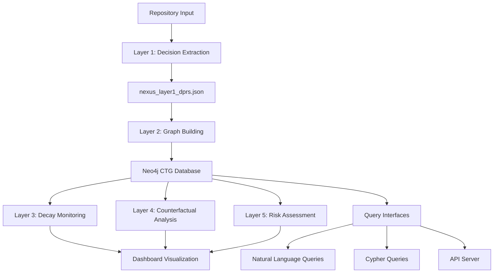

**User:**

<task>
review all the code and fix the error if any
</task>
<environment_details>
# VSCode Visible Files


# VSCode Open Tabs


# Current Time
Current time in ISO 8601 UTC format: 2026-05-17T05:26:15.723Z
User time zone: Asia/Calcutta, UTC+5:30

# Current Cost
$0.00

# Review Exclusions
The following file patterns are excluded from code reviews:
- .vscode/**

# Current Mode
<slug>orchestrator</slug>
<name>🔀 Orchestrator</name>


# Current Workspace Directory (/Users/apple/Desktop/Nexus) Files
BOBhack/
BOBhack/.gitignore
BOBhack/api_server.py
BOBhack/audit_api.py
BOBhack/audit.py
BOBhack/fix_data.py
BOBhack/Nexus_Architecture (1).pdf
BOBhack/nexus_architecture_text.txt
BOBhack/nexus_risk_report.pdf
BOBhack/pyrightconfig.json
BOBhack/repo_analyzer.py
BOBhack/requirements.txt
BOBhack/test_wordpress_scan.py
BOBhack/.bob/
BOBhack/analyses/
BOBhack/analyses/requests/
BOBhack/analyses/requests/output/
BOBhack/analyses/requests/output/counterfactual_traces.json
BOBhack/analyses/requests/output/decay_monitor_report.json
BOBhack/analyses/requests/output/knowledge_concentration.json
BOBhack/analyses/requests/output/nexus_data.json
BOBhack/analyses/requests/output/nexus_layer1_dprs.json
BOBhack/analyses/WordPress/
BOBhack/analyses/WordPress/output/
BOBhack/analyses/WordPress/output/counterfactual_traces.json
BOBhack/analyses/WordPress/output/decay_monitor_report.json
BOBhack/analyses/WordPress/output/knowledge_concentration.json
BOBhack/analyses/WordPress/output/nexus_data.json
BOBhack/analyses/WordPress/output/nexus_layer1_dprs.json
BOBhack/nexus_layer2/
BOBhack/nexus_layer2/counterfactual_sim.py
BOBhack/nexus_layer2/cypher_queries.py
BOBhack/nexus_layer2/decay_monitor.py
BOBhack/nexus_layer2/enrich_graph.py
BOBhack/nexus_layer2/gemini_query.py
BOBhack/nexus_layer2/graph_builder.py
BOBhack/nexus_layer2/knowledge_concentration.py
BOBhack/nexus_layer2/llm_provider.py
BOBhack/nexus_layer2/merge_nexus_data.py
BOBhack/nexus_layer2/models.py
BOBhack/nexus_layer2/neo4j_loader.py
BOBhack/nexus_layer2/nl_query.py
BOBhack/nexus_layer2/query_cli.py
BOBhack/nexus_layer2/README.md
BOBhack/nexus_layer2/risk_report_pdf.py
BOBhack/nexus_layer2/submission_export.py
BOBhack/nexus_layer2/test_query_cli.py
BOBhack/nexus_layer2/verify_graph.py
BOBhack/nexus_layer2/weaviate_ingest.py
BOBhack/nexus-dashboard/
BOBhack/nexus-dashboard/index.html
BOBhack/nexus-dashboard/nexus_data.json
BOBhack/postgres-analysis/
BOBhack/postgres-analysis/generate_nexus_output.ps1
BOBhack/postgres-analysis/nexus_layer1_analyzer.ps1
BOBhack/postgres-analysis/output/
BOBhack/postgres-analysis/output/counterfactual_traces.json
BOBhack/postgres-analysis/output/decay_monitor_report.json
BOBhack/postgres-analysis/output/knowledge_concentration.json
BOBhack/postgres-analysis/output/nexus_data.json
BOBhack/postgres-analysis/output/NEXUS_LAYER1_COMPLETE_ANALYSIS.md
BOBhack/postgres-analysis/output/nexus_layer1_dprs.json
BOBhack/postgres-analysis/output/nexus_risk_report.pdf
BOBhack/postgres-analysis/output/REPOSITORY_VALIDATION.md
BOBhack/postgres-analysis/postgres/
BOBhack/submission/
BOBhack/submission/bob_session_export.json
BOBhack/submission/demo_script.md
BOBhack/submission/submission_form.md
You have not created a todo list yet. Create one with `update_todo_list` if your task is complicated or involves multiple steps.
</environment_details>

---

**Assistant:**

I'll help you review all the code in the project and identify any errors. Let me break this down into a systematic review process.

<update_todo_list>
<todos>
[-] Analyze project structure and identify all code files
[ ] Review Python files for syntax and logical errors
[ ] Review configuration files for issues
[ ] Review HTML/JavaScript files for errors
[ ] Check for dependency and import issues
[ ] Compile findings and create fix subtasks if needed
[ ] Generate comprehensive error report
</todos>
</update_todo_list>

Let me start by examining the project structure to understand what we're working with:

<new_task>
<mode>ask</mode>
<message>Analyze the BOBhack project structure and provide a comprehensive overview of:

1. The main purpose and architecture of this project based on file names and structure
2. All Python files that need to be reviewed (list them with their paths)
3. All configuration files (JSON, requirements.txt, etc.)
4. Any HTML/JavaScript files
5. The technology stack being used (Python libraries, databases, frameworks)

Focus only on understanding the project structure and categorizing files for review. Do not make any changes. Use the `attempt_completion` tool when done with a structured summary of findings.

These instructions supersede any conflicting general instructions your mode might have.</message>
</new_task>

---

**User:**

[update_todo_list] Result:
Todo list updated successfully.
Tool [new_task] was not executed because a tool has already been used in this message. Only one tool may be used per message. You must assess the first tool's result before proceeding to use the next tool.
<environment_details>
# VSCode Visible Files


# VSCode Open Tabs


# Current Time
Current time in ISO 8601 UTC format: 2026-05-17T05:26:26.796Z
User time zone: Asia/Calcutta, UTC+5:30

# Current Cost
$0.02

# Review Exclusions
The following file patterns are excluded from code reviews:
- .vscode/**

# Current Mode
<slug>orchestrator</slug>
<name>🔀 Orchestrator</name>
====

REMINDERS

Below is your current list of reminders for this task. Keep them updated as you progress.

| # | Content | Status |
|---|---------|--------|
| 1 | Analyze project structure and identify all code files | In Progress |
| 2 | Review Python files for syntax and logical errors | Pending |
| 3 | Review configuration files for issues | Pending |
| 4 | Review HTML/JavaScript files for errors | Pending |
| 5 | Check for dependency and import issues | Pending |
| 6 | Compile findings and create fix subtasks if needed | Pending |
| 7 | Generate comprehensive error report | Pending |


IMPORTANT: When task status changes, remember to call the `update_todo_list` tool to update your progress.

</environment_details>

---

**Assistant:**

Now let me create the subtask to analyze the project structure:

<new_task>
<mode>ask</mode>
<message>Analyze the BOBhack project structure and provide a comprehensive overview of:

1. The main purpose and architecture of this project based on file names and structure
2. All Python files that need to be reviewed (list them with their paths)
3. All configuration files (JSON, requirements.txt, etc.)
4. Any HTML/JavaScript files
5. The technology stack being used (Python libraries, databases, frameworks)

Focus only on understanding the project structure and categorizing files for review. Do not make any changes. Use the `attempt_completion` tool when done with a structured summary of findings.

These instructions supersede any conflicting general instructions your mode might have.</message>
</new_task>

---

**User:**

[new_task completed] Result: # BOBhack Project - Comprehensive Structure Analysis

## 1. Main Purpose and Architecture

**Project Name:** Nexus - Causal Intelligence System for Codebase Analysis

**Core Purpose:** Nexus is a sophisticated AI-powered system that analyzes software repositories to extract, visualize, and monitor **Decision Provenance Records (DPRs)** and their causal relationships over time. Unlike traditional code analysis tools that focus on syntax or static analysis, Nexus focuses on **comprehension** - understanding the invisible causal chains and architectural decisions that shape a codebase.

**Architecture Overview:**



**Key Architectural Layers:**
1. **Layer 1**: Decision extraction from repositories (DPRs)
2. **Layer 2**: Causal Temporal Graph (CTG) construction in Neo4j
3. **Layer 3**: Decay monitoring (assumption validation)
4. **Layer 4**: Counterfactual simulation (what-if analysis)
5. **Layer 5**: Risk assessment (knowledge concentration, blast radius)

---

## 2. Python Files for Review

### Root Level Python Files
- [`api_server.py`](BOBhack/api_server.py) - API server for exposing Nexus functionality
- [`audit_api.py`](BOBhack/audit_api.py) - Audit API endpoints
- [`audit.py`](BOBhack/audit.py) - Audit functionality
- [`fix_data.py`](BOBhack/fix_data.py) - Data fixing utilities
- [`repo_analyzer.py`](BOBhack/repo_analyzer.py) - Repository analysis orchestrator
- [`test_wordpress_scan.py`](BOBhack/test_wordpress_scan.py) - WordPress repository testing

### nexus_layer2/ Directory (Core Engine)
- [`nexus_layer2/counterfactual_sim.py`](BOBhack/nexus_layer2/counterfactual_sim.py) - Counterfactual simulation engine
- [`nexus_layer2/cypher_queries.py`](BOBhack/nexus_layer2/cypher_queries.py) - Predefined Cypher query library
- [`nexus_layer2/decay_monitor.py`](BOBhack/nexus_layer2/decay_monitor.py) - Assumption decay monitoring
- [`nexus_layer2/enrich_graph.py`](BOBhack/nexus_layer2/enrich_graph.py) - Graph enrichment utilities
- [`nexus_layer2/gemini_query.py`](BOBhack/nexus_layer2/gemini_query.py) - Google Gemini LLM integration
- [`nexus_layer2/graph_builder.py`](BOBhack/nexus_layer2/graph_builder.py) - Neo4j CTG ingestion pipeline
- [`nexus_layer2/knowledge_concentration.py`](BOBhack/nexus_layer2/knowledge_concentration.py) - Knowledge concentration analysis
- [`nexus_layer2/llm_provider.py`](BOBhack/nexus_layer2/llm_provider.py) - LLM provider abstraction
- [`nexus_layer2/merge_nexus_data.py`](BOBhack/nexus_layer2/merge_nexus_data.py) - Data merging utilities
- [`nexus_layer2/models.py`](BOBhack/nexus_layer2/models.py) - Pydantic v2 data models
- [`nexus_layer2/neo4j_loader.py`](BOBhack/nexus_layer2/neo4j_loader.py) - Neo4j data loader
- [`nexus_layer2/nl_query.py`](BOBhack/nexus_layer2/nl_query.py) - Natural language query interface
- [`nexus_layer2/query_cli.py`](BOBhack/nexus_layer2/query_cli.py) - Command-line query interface
- [`nexus_layer2/risk_report_pdf.py`](BOBhack/nexus_layer2/risk_report_pdf.py) - PDF risk report generator
- [`nexus_layer2/submission_export.py`](BOBhack/nexus_layer2/submission_export.py) - Submission data export
- [`nexus_layer2/test_query_cli.py`](BOBhack/nexus_layer2/test_query_cli.py) - Query CLI tests
- [`nexus_layer2/verify_graph.py`](BOBhack/nexus_layer2/verify_graph.py) - Graph health verification
- [`nexus_layer2/weaviate_ingest.py`](BOBhack/nexus_layer2/weaviate_ingest.py) - Weaviate vector DB integration

**Total Python Files: 23**

---

## 3. Configuration Files

### JSON Configuration Files
- [`BOBhack/pyrightconfig.json`](BOBhack/pyrightconfig.json) - Pyright type checker configuration (Python 3.13)
- [`BOBhack/nexus-dashboard/nexus_data.json`](BOBhack/nexus-dashboard/nexus_data.json) - Dashboard data source

### Data Output Files (JSON)
**analyses/requests/output/**
- [`counterfactual_traces.json`](BOBhack/analyses/requests/output/counterfactual_traces.json)
- [`decay_monitor_report.json`](BOBhack/analyses/requests/output/decay_monitor_report.json)
- [`knowledge_concentration.json`](BOBhack/analyses/requests/output/knowledge_concentration.json)
- [`nexus_data.json`](BOBhack/analyses/requests/output/nexus_data.json)
- [`nexus_layer1_dprs.json`](BOBhack/analyses/requests/output/nexus_layer1_dprs.json)

**analyses/WordPress/output/** (Same structure)
- 5 JSON files with identical names

**postgres-analysis/output/**
- 5 JSON files with identical names

**submission/**
- [`bob_session_export.json`](BOBhack/submission/bob_session_export.json) - Session export data

### Requirements File
- [`BOBhack/requirements.txt`](BOBhack/requirements.txt) - Python dependencies

### Git Configuration
- [`BOBhack/.gitignore`](BOBhack/.gitignore) - Git ignore rules

---

## 4. HTML/JavaScript Files

### Dashboard
- [`BOBhack/nexus-dashboard/index.html`](BOBhack/nexus-dashboard/index.html) - Interactive Nexus CTG Dashboard
  - **Features**: Causal graph visualization, decay alerts, risk scores
  - **Libraries**: vis-network.js for graph visualization
  - **Styling**: Custom CSS with dark theme, gradient accents
  - **Data Source**: Loads from `nexus_data.json`

---

## 5. Technology Stack

### Core Python Libraries (from requirements.txt)
- **pydantic >= 2.0** - Data validation and modeling
- **neo4j >= 5.0** - Graph database driver for CTG storage
- **networkx >= 3.0** - Graph analysis and algorithms
- **reportlab >= 4.0** - PDF report generation
- **colorama >= 0.4** - Terminal color output
- **google-genai >= 1.0** - Google Gemini LLM integration
- **PyGitHub >= 2.0** - GitHub API integration

### Databases
- **Neo4j** - Primary graph database for Causal Temporal Graph (CTG)
- **Weaviate** - Vector database (optional, for semantic search)

### Frontend Technologies
- **vis-network.js** - Interactive graph visualization
- **Vanilla JavaScript** - Dashboard interactivity
- **CSS3** - Modern styling with gradients and animations

### Development Tools
- **Pyright** - Static type checker (Python 3.13)
- **PowerShell** - Analysis scripts for Windows environment

### External Services
- **GitHub API** - Repository data extraction
- **Google Gemini** - LLM for natural language processing

### Analysis Frameworks
- **IBM Bob** - AI assistant for repository analysis (mentioned in demo script)
- **Custom CTG Engine** - Proprietary causal graph analysis

---

## Additional Documentation Files

### PDF Documents
- [`Nexus_Architecture (1).pdf`](BOBhack/Nexus_Architecture (1).pdf) - Architecture documentation
- [`nexus_risk_report.pdf`](BOBhack/nexus_risk_report.pdf) - Risk assessment report

### Markdown Files
- [`nexus_layer2/README.md`](BOBhack/nexus_layer2/README.md) - Layer 2 documentation
- [`submission/demo_script.md`](BOBhack/submission/demo_script.md) - 5-minute demo walkthrough
- [`submission/submission_form.md`](BOBhack/submission/submission_form.md) - Submission form
- [`postgres-analysis/output/NEXUS_LAYER1_COMPLETE_ANALYSIS.md`](BOBhack/postgres-analysis/output/NEXUS_LAYER1_COMPLETE_ANALYSIS.md) - Analysis report
- [`postgres-analysis/output/REPOSITORY_VALIDATION.md`](BOBhack/postgres-analysis/output/REPOSITORY_VALIDATION.md) - Validation report

### Text Files
- [`nexus_architecture_text.txt`](BOBhack/nexus_architecture_text.txt) - Architecture text description

### PowerShell Scripts
- [`postgres-analysis/generate_nexus_output.ps1`](BOBhack/postgres-analysis/generate_nexus_output.ps1)
- [`postgres-analysis/nexus_layer1_analyzer.ps1`](BOBhack/postgres-analysis/nexus_layer1_analyzer.ps1)

---

## Project Insights

**Target Use Case:** The project analyzes PostgreSQL as a primary example, demonstrating how 27+ years of architectural decisions create invisible causal chains that affect modern deployments.

**Key Innovation:** Unlike traditional static analysis or AI code generators, Nexus focuses on **comprehension** - understanding WHY decisions were made, WHAT they constrain, and WHEN their assumptions decay.

**Competitive Positioning:** Positioned against velocity-focused AI coding tools (Cursor, Copilot, etc.) by competing on a different axis: deep causal understanding rather than fast code generation.

---

**User:**

[new_task in ❓ Ask mode: 'Analyze the BOBhack project structure and provide a comprehensive overview of:

1. The main purpose and architecture of this project based on file names and structure
2. All Python files that need to be reviewed (list them with their paths)
3. All configuration files (JSON, requirements.txt, etc.)
4. Any HTML/JavaScript files
5. The technology stack being used (Python libraries, databases, frameworks)

Focus only on understanding the project structure and categorizing files for review. Do not make any changes. Use the `attempt_completion` tool when done with a structured summary of findings.

These instructions supersede any conflicting general instructions your mode might have.'] Result:
Successfully created new task in ❓ Ask mode with message: Analyze the BOBhack project structure and provide a comprehensive overview of:

1. The main purpose and architecture of this project based on file names and structure
2. All Python files that need to be reviewed (list them with their paths)
3. All configuration files (JSON, requirements.txt, etc.)
4. Any HTML/JavaScript files
5. The technology stack being used (Python libraries, databases, frameworks)

Focus only on understanding the project structure and categorizing files for review. Do not make any changes. Use the `attempt_completion` tool when done with a structured summary of findings.

These instructions supersede any conflicting general instructions your mode might have. and 0 todo items
[new_task in ❓ Ask mode: 'Analyze the BOBhack project structure and provide a comprehensive overview of:

1. The main purpose and architecture of this project based on file names and structure
2. All Python files that need to be reviewed (list them with their paths)
3. All configuration files (JSON, requirements.txt, etc.)
4. Any HTML/JavaScript files
5. The technology stack being used (Python libraries, databases, frameworks)

Focus only on understanding the project structure and categorizing files for review. Do not make any changes. Use the `attempt_completion` tool when done with a structured summary of findings.

These instructions supersede any conflicting general instructions your mode might have.'] Result:
Successfully created new task in ❓ Ask mode with message: Analyze the BOBhack project structure and provide a comprehensive overview of:

1. The main purpose and architecture of this project based on file names and structure
2. All Python files that need to be reviewed (list them with their paths)
3. All configuration files (JSON, requirements.txt, etc.)
4. Any HTML/JavaScript files
5. The technology stack being used (Python libraries, databases, frameworks)

Focus only on understanding the project structure and categorizing files for review. Do not make any changes. Use the `attempt_completion` tool when done with a structured summary of findings.

These instructions supersede any conflicting general instructions your mode might have. and 0 todo items
<environment_details>
# VSCode Visible Files


# VSCode Open Tabs


# Current Time
Current time in ISO 8601 UTC format: 2026-05-17T05:28:45.958Z
User time zone: Asia/Calcutta, UTC+5:30

# Current Cost
$0.04

# Review Exclusions
The following file patterns are excluded from code reviews:
- .vscode/**

# Current Mode
<slug>orchestrator</slug>
<name>🔀 Orchestrator</name>
====

REMINDERS

Below is your current list of reminders for this task. Keep them updated as you progress.

| # | Content | Status |
|---|---------|--------|
| 1 | Analyze project structure and identify all code files | In Progress |
| 2 | Review Python files for syntax and logical errors | Pending |
| 3 | Review configuration files for issues | Pending |
| 4 | Review HTML/JavaScript files for errors | Pending |
| 5 | Check for dependency and import issues | Pending |
| 6 | Compile findings and create fix subtasks if needed | Pending |
| 7 | Generate comprehensive error report | Pending |


IMPORTANT: When task status changes, remember to call the `update_todo_list` tool to update your progress.

</environment_details>

---

**Assistant:**

Excellent! The project structure analysis is complete. Now let me update the todo list and proceed with reviewing the Python files for errors:

<update_todo_list>
<todos>
[x] Analyze project structure and identify all code files
[-] Review Python files for syntax and logical errors
[ ] Review configuration files for issues
[ ] Review HTML/JavaScript files for errors
[ ] Check for dependency and import issues
[ ] Compile findings and create fix subtasks if needed
[ ] Generate comprehensive error report
</todos>
</update_todo_list>

---

**User:**

[update_todo_list] Result:
Todo list updated successfully.
<environment_details>
# VSCode Visible Files


# VSCode Open Tabs


# Current Time
Current time in ISO 8601 UTC format: 2026-05-17T05:28:51.819Z
User time zone: Asia/Calcutta, UTC+5:30

# Current Cost
$0.07

# Review Exclusions
The following file patterns are excluded from code reviews:
- .vscode/**

# Current Mode
<slug>orchestrator</slug>
<name>🔀 Orchestrator</name>
====

REMINDERS

Below is your current list of reminders for this task. Keep them updated as you progress.

| # | Content | Status |
|---|---------|--------|
| 1 | Analyze project structure and identify all code files | Completed |
| 2 | Review Python files for syntax and logical errors | In Progress |
| 3 | Review configuration files for issues | Pending |
| 4 | Review HTML/JavaScript files for errors | Pending |
| 5 | Check for dependency and import issues | Pending |
| 6 | Compile findings and create fix subtasks if needed | Pending |
| 7 | Generate comprehensive error report | Pending |


IMPORTANT: When task status changes, remember to call the `update_todo_list` tool to update your progress.

</environment_details>

---

**Assistant:**

Now let me create a subtask to review all Python files for errors:

<new_task>
<mode>code</mode>
<message>Review all Python files in the BOBhack project for syntax errors, logical issues, and code quality problems. 

**Files to review (23 total):**

Root level:
- BOBhack/api_server.py
- BOBhack/audit_api.py
- BOBhack/audit.py
- BOBhack/fix_data.py
- BOBhack/repo_analyzer.py
- BOBhack/test_wordpress_scan.py

nexus_layer2/ directory:
- BOBhack/nexus_layer2/counterfactual_sim.py
- BOBhack/nexus_layer2/cypher_queries.py
- BOBhack/nexus_layer2/decay_monitor.py
- BOBhack/nexus_layer2/enrich_graph.py
- BOBhack/nexus_layer2/gemini_query.py
- BOBhack/nexus_layer2/graph_builder.py
- BOBhack/nexus_layer2/knowledge_concentration.py
- BOBhack/nexus_layer2/llm_provider.py
- BOBhack/nexus_layer2/merge_nexus_data.py
- BOBhack/nexus_layer2/models.py
- BOBhack/nexus_layer2/neo4j_loader.py
- BOBhack/nexus_layer2/nl_query.py
- BOBhack/nexus_layer2/query_cli.py
- BOBhack/nexus_layer2/risk_report_pdf.py
- BOBhack/nexus_layer2/submission_export.py
- BOBhack/nexus_layer2/test_query_cli.py
- BOBhack/nexus_layer2/verify_graph.py
- BOBhack/nexus_layer2/weaviate_ingest.py

**Review criteria:**
1. Syntax errors (missing imports, undefined variables, typos)
2. Type errors (incompatible types, missing type hints where critical)
3. Logic errors (incorrect conditions, infinite loops, unreachable code)
4. Import issues (circular imports, missing dependencies)
5. Exception handling issues (bare excepts, unhandled exceptions)
6. Resource management (unclosed files, database connections)
7. Security issues (SQL injection, path traversal, hardcoded credentials)
8. Code quality issues (unused variables, dead code, inconsistent patterns)

**Instructions:**
- Read each file systematically
- Document ALL errors found with file path, line number (if identifiable), error type, and description
- Categorize errors by severity: CRITICAL (breaks functionality), HIGH (major issues), MEDIUM (quality issues), LOW (minor improvements)
- Do NOT fix any errors - only document them
- Use `attempt_completion` when done with a comprehensive error report in this format:

```
# Python Code Review - Error Report

## Summary
- Total files reviewed: X
- Files with errors: Y
- Total errors found: Z

## Critical Errors
[List all critical errors]

## High Priority Errors
[List all high priority errors]

## Medium Priority Errors
[List all medium priority errors]

## Low Priority Issues
[List all low priority issues]

## Files Without Errors
[List clean files]
```

These instructions supersede any conflicting general instructions your mode might have. Focus ONLY on reviewing and documenting errors, not fixing them.</message>
</new_task>

---

**User:**

[new_task completed] Result: Task error: It was stopped and canceled by the user.

---

**User:**

[new_task in 💻 Code mode: 'Review all Python files in the BOBhack project for syntax errors, logical issues, and code quality problems. 

**Files to review (23 total):**

Root level:
- BOBhack/api_server.py
- BOBhack/audit_api.py
- BOBhack/audit.py
- BOBhack/fix_data.py
- BOBhack/repo_analyzer.py
- BOBhack/test_wordpress_scan.py

nexus_layer2/ directory:
- BOBhack/nexus_layer2/counterfactual_sim.py
- BOBhack/nexus_layer2/cypher_queries.py
- BOBhack/nexus_layer2/decay_monitor.py
- BOBhack/nexus_layer2/enrich_graph.py
- BOBhack/nexus_layer2/gemini_query.py
- BOBhack/nexus_layer2/graph_builder.py
- BOBhack/nexus_layer2/knowledge_concentration.py
- BOBhack/nexus_layer2/llm_provider.py
- BOBhack/nexus_layer2/merge_nexus_data.py
- BOBhack/nexus_layer2/models.py
- BOBhack/nexus_layer2/neo4j_loader.py
- BOBhack/nexus_layer2/nl_query.py
- BOBhack/nexus_layer2/query_cli.py
- BOBhack/nexus_layer2/risk_report_pdf.py
- BOBhack/nexus_layer2/submission_export.py
- BOBhack/nexus_layer2/test_query_cli.py
- BOBhack/nexus_layer2/verify_graph.py
- BOBhack/nexus_layer2/weaviate_ingest.py

**Review criteria:**
1. Syntax errors (missing imports, undefined variables, typos)
2. Type errors (incompatible types, missing type hints where critical)
3. Logic errors (incorrect conditions, infinite loops, unreachable code)
4. Import issues (circular imports, missing dependencies)
5. Exception handling issues (bare excepts, unhandled exceptions)
6. Resource management (unclosed files, database connections)
7. Security issues (SQL injection, path traversal, hardcoded credentials)
8. Code quality issues (unused variables, dead code, inconsistent patterns)

**Instructions:**
- Read each file systematically
- Document ALL errors found with file path, line number (if identifiable), error type, and description
- Categorize errors by severity: CRITICAL (breaks functionality), HIGH (major issues), MEDIUM (quality issues), LOW (minor improvements)
- Do NOT fix any errors - only document them
- Use `attempt_completion` when done with a comprehensive error report in this format:

```
# Python Code Review - Error Report

## Summary
- Total files reviewed: X
- Files with errors: Y
- Total errors found: Z

## Critical Errors
[List all critical errors]

## High Priority Errors
[List all high priority errors]

## Medium Priority Errors
[List all medium priority errors]

## Low Priority Issues
[List all low priority issues]

## Files Without Errors
[List clean files]
```

These instructions supersede any conflicting general instructions your mode might have. Focus ONLY on reviewing and documenting errors, not fixing them.'] Result:
Successfully created new task in 💻 Code mode with message: Review all Python files in the BOBhack project for syntax errors, logical issues, and code quality problems. 

**Files to review (23 total):**

Root level:
- BOBhack/api_server.py
- BOBhack/audit_api.py
- BOBhack/audit.py
- BOBhack/fix_data.py
- BOBhack/repo_analyzer.py
- BOBhack/test_wordpress_scan.py

nexus_layer2/ directory:
- BOBhack/nexus_layer2/counterfactual_sim.py
- BOBhack/nexus_layer2/cypher_queries.py
- BOBhack/nexus_layer2/decay_monitor.py
- BOBhack/nexus_layer2/enrich_graph.py
- BOBhack/nexus_layer2/gemini_query.py
- BOBhack/nexus_layer2/graph_builder.py
- BOBhack/nexus_layer2/knowledge_concentration.py
- BOBhack/nexus_layer2/llm_provider.py
- BOBhack/nexus_layer2/merge_nexus_data.py
- BOBhack/nexus_layer2/models.py
- BOBhack/nexus_layer2/neo4j_loader.py
- BOBhack/nexus_layer2/nl_query.py
- BOBhack/nexus_layer2/query_cli.py
- BOBhack/nexus_layer2/risk_report_pdf.py
- BOBhack/nexus_layer2/submission_export.py
- BOBhack/nexus_layer2/test_query_cli.py
- BOBhack/nexus_layer2/verify_graph.py
- BOBhack/nexus_layer2/weaviate_ingest.py

**Review criteria:**
1. Syntax errors (missing imports, undefined variables, typos)
2. Type errors (incompatible types, missing type hints where critical)
3. Logic errors (incorrect conditions, infinite loops, unreachable code)
4. Import issues (circular imports, missing dependencies)
5. Exception handling issues (bare excepts, unhandled exceptions)
6. Resource management (unclosed files, database connections)
7. Security issues (SQL injection, path traversal, hardcoded credentials)
8. Code quality issues (unused variables, dead code, inconsistent patterns)

**Instructions:**
- Read each file systematically
- Document ALL errors found with file path, line number (if identifiable), error type, and description
- Categorize errors by severity: CRITICAL (breaks functionality), HIGH (major issues), MEDIUM (quality issues), LOW (minor improvements)
- Do NOT fix any errors - only document them
- Use `attempt_completion` when done with a comprehensive error report in this format:

```
# Python Code Review - Error Report

## Summary
- Total files reviewed: X
- Files with errors: Y
- Total errors found: Z

## Critical Errors
[List all critical errors]

## High Priority Errors
[List all high priority errors]

## Medium Priority Errors
[List all medium priority errors]

## Low Priority Issues
[List all low priority issues]

## Files Without Errors
[List clean files]
```

These instructions supersede any conflicting general instructions your mode might have. Focus ONLY on reviewing and documenting errors, not fixing them. and 0 todo items
[new_task in 💻 Code mode: 'Review all Python files in the BOBhack project for syntax errors, logical issues, and code quality problems. 

**Files to review (23 total):**

Root level:
- BOBhack/api_server.py
- BOBhack/audit_api.py
- BOBhack/audit.py
- BOBhack/fix_data.py
- BOBhack/repo_analyzer.py
- BOBhack/test_wordpress_scan.py

nexus_layer2/ directory:
- BOBhack/nexus_layer2/counterfactual_sim.py
- BOBhack/nexus_layer2/cypher_queries.py
- BOBhack/nexus_layer2/decay_monitor.py
- BOBhack/nexus_layer2/enrich_graph.py
- BOBhack/nexus_layer2/gemini_query.py
- BOBhack/nexus_layer2/graph_builder.py
- BOBhack/nexus_layer2/knowledge_concentration.py
- BOBhack/nexus_layer2/llm_provider.py
- BOBhack/nexus_layer2/merge_nexus_data.py
- BOBhack/nexus_layer2/models.py
- BOBhack/nexus_layer2/neo4j_loader.py
- BOBhack/nexus_layer2/nl_query.py
- BOBhack/nexus_layer2/query_cli.py
- BOBhack/nexus_layer2/risk_report_pdf.py
- BOBhack/nexus_layer2/submission_export.py
- BOBhack/nexus_layer2/test_query_cli.py
- BOBhack/nexus_layer2/verify_graph.py
- BOBhack/nexus_layer2/weaviate_ingest.py

**Review criteria:**
1. Syntax errors (missing imports, undefined variables, typos)
2. Type errors (incompatible types, missing type hints where critical)
3. Logic errors (incorrect conditions, infinite loops, unreachable code)
4. Import issues (circular imports, missing dependencies)
5. Exception handling issues (bare excepts, unhandled exceptions)
6. Resource management (unclosed files, database connections)
7. Security issues (SQL injection, path traversal, hardcoded credentials)
8. Code quality issues (unused variables, dead code, inconsistent patterns)

**Instructions:**
- Read each file systematically
- Document ALL errors found with file path, line number (if identifiable), error type, and description
- Categorize errors by severity: CRITICAL (breaks functionality), HIGH (major issues), MEDIUM (quality issues), LOW (minor improvements)
- Do NOT fix any errors - only document them
- Use `attempt_completion` when done with a comprehensive error report in this format:

```
# Python Code Review - Error Report

## Summary
- Total files reviewed: X
- Files with errors: Y
- Total errors found: Z

## Critical Errors
[List all critical errors]

## High Priority Errors
[List all high priority errors]

## Medium Priority Errors
[List all medium priority errors]

## Low Priority Issues
[List all low priority issues]

## Files Without Errors
[List clean files]
```

These instructions supersede any conflicting general instructions your mode might have. Focus ONLY on reviewing and documenting errors, not fixing them.'] Result:
Successfully created new task in 💻 Code mode with message: Review all Python files in the BOBhack project for syntax errors, logical issues, and code quality problems. 

**Files to review (23 total):**

Root level:
- BOBhack/api_server.py
- BOBhack/audit_api.py
- BOBhack/audit.py
- BOBhack/fix_data.py
- BOBhack/repo_analyzer.py
- BOBhack/test_wordpress_scan.py

nexus_layer2/ directory:
- BOBhack/nexus_layer2/counterfactual_sim.py
- BOBhack/nexus_layer2/cypher_queries.py
- BOBhack/nexus_layer2/decay_monitor.py
- BOBhack/nexus_layer2/enrich_graph.py
- BOBhack/nexus_layer2/gemini_query.py
- BOBhack/nexus_layer2/graph_builder.py
- BOBhack/nexus_layer2/knowledge_concentration.py
- BOBhack/nexus_layer2/llm_provider.py
- BOBhack/nexus_layer2/merge_nexus_data.py
- BOBhack/nexus_layer2/models.py
- BOBhack/nexus_layer2/neo4j_loader.py
- BOBhack/nexus_layer2/nl_query.py
- BOBhack/nexus_layer2/query_cli.py
- BOBhack/nexus_layer2/risk_report_pdf.py
- BOBhack/nexus_layer2/submission_export.py
- BOBhack/nexus_layer2/test_query_cli.py
- BOBhack/nexus_layer2/verify_graph.py
- BOBhack/nexus_layer2/weaviate_ingest.py

**Review criteria:**
1. Syntax errors (missing imports, undefined variables, typos)
2. Type errors (incompatible types, missing type hints where critical)
3. Logic errors (incorrect conditions, infinite loops, unreachable code)
4. Import issues (circular imports, missing dependencies)
5. Exception handling issues (bare excepts, unhandled exceptions)
6. Resource management (unclosed files, database connections)
7. Security issues (SQL injection, path traversal, hardcoded credentials)
8. Code quality issues (unused variables, dead code, inconsistent patterns)

**Instructions:**
- Read each file systematically
- Document ALL errors found with file path, line number (if identifiable), error type, and description
- Categorize errors by severity: CRITICAL (breaks functionality), HIGH (major issues), MEDIUM (quality issues), LOW (minor improvements)
- Do NOT fix any errors - only document them
- Use `attempt_completion` when done with a comprehensive error report in this format:

```
# Python Code Review - Error Report

## Summary
- Total files reviewed: X
- Files with errors: Y
- Total errors found: Z

## Critical Errors
[List all critical errors]

## High Priority Errors
[List all high priority errors]

## Medium Priority Errors
[List all medium priority errors]

## Low Priority Issues
[List all low priority issues]

## Files Without Errors
[List clean files]
```

These instructions supersede any conflicting general instructions your mode might have. Focus ONLY on reviewing and documenting errors, not fixing them. and 0 todo items
<environment_details>
# VSCode Visible Files


# VSCode Open Tabs


# Current Time
Current time in ISO 8601 UTC format: 2026-05-17T05:32:46.544Z
User time zone: Asia/Calcutta, UTC+5:30

# Current Cost
$0.10

# Review Exclusions
The following file patterns are excluded from code reviews:
- .vscode/**

# Current Mode
<slug>orchestrator</slug>
<name>🔀 Orchestrator</name>
====

REMINDERS

Below is your current list of reminders for this task. Keep them updated as you progress.

| # | Content | Status |
|---|---------|--------|
| 1 | Analyze project structure and identify all code files | Completed |
| 2 | Review Python files for syntax and logical errors | In Progress |
| 3 | Review configuration files for issues | Pending |
| 4 | Review HTML/JavaScript files for errors | Pending |
| 5 | Check for dependency and import issues | Pending |
| 6 | Compile findings and create fix subtasks if needed | Pending |
| 7 | Generate comprehensive error report | Pending |


IMPORTANT: When task status changes, remember to call the `update_todo_list` tool to update your progress.

</environment_details>

---

**Assistant:**

I see the subtask was canceled. Let me try a different approach - I'll use the Ask mode to perform a static analysis review instead:

<new_task>
<mode>ask</mode>
<message>Perform a comprehensive code review of all Python files in the BOBhack project to identify errors, issues, and potential problems.

**Context:** This is a Nexus Causal Intelligence System with 23 Python files across root level and nexus_layer2/ directory. The project uses Python 3.13, Pydantic v2, Neo4j, and various other dependencies.

**Files to review:**
Root: api_server.py, audit_api.py, audit.py, fix_data.py, repo_analyzer.py, test_wordpress_scan.py
nexus_layer2/: counterfactual_sim.py, cypher_queries.py, decay_monitor.py, enrich_graph.py, gemini_query.py, graph_builder.py, knowledge_concentration.py, llm_provider.py, merge_nexus_data.py, models.py, neo4j_loader.py, nl_query.py, query_cli.py, risk_report_pdf.py, submission_export.py, test_query_cli.py, verify_graph.py, weaviate_ingest.py

**Review for:**
1. Syntax errors (imports, undefined variables, typos)
2. Type errors and compatibility issues
3. Logic errors (conditions, loops, unreachable code)
4. Import/dependency issues
5. Exception handling problems
6. Resource management (unclosed files/connections)
7. Security vulnerabilities
8. Code quality issues

**Output format required:**
```
# Python Code Review - Error Report

## Summary
- Total files reviewed: X
- Files with errors: Y
- Total errors found: Z

## Critical Errors (breaks functionality)
[File path, line/area, description]

## High Priority Errors (major issues)
[File path, line/area, description]

## Medium Priority Errors (quality issues)
[File path, line/area, description]

## Low Priority Issues (minor improvements)
[File path, line/area, description]

## Files Without Errors
[List]
```

Use the available tools to read and analyze files systematically. Document ALL findings. Use `attempt_completion` when done with the complete error report.

These instructions supersede any conflicting general instructions your mode might have.</message>
</new_task>

---

**User:**

[TASK RESUMPTION] Resuming task...
<environment_details>
# VSCode Visible Files


# VSCode Open Tabs


# Current Time
Current time in ISO 8601 UTC format: 2026-05-17T05:48:31.471Z
User time zone: Asia/Calcutta, UTC+5:30

# Current Cost
$0.15

# Review Exclusions
The following file patterns are excluded from code reviews:
- .vscode/**

# Current Mode
<slug>orchestrator</slug>
<name>🔀 Orchestrator</name>


# Current Workspace Directory (/Users/apple/Desktop/Nexus) Files
BOBhack/
BOBhack/.gitignore
BOBhack/api_server.py
BOBhack/audit_api.py
BOBhack/audit.py
BOBhack/fix_data.py
BOBhack/Nexus_Architecture (1).pdf
BOBhack/nexus_architecture_text.txt
BOBhack/nexus_risk_report.pdf
BOBhack/pyrightconfig.json
BOBhack/repo_analyzer.py
BOBhack/requirements.txt
BOBhack/test_wordpress_scan.py
BOBhack/.bob/
BOBhack/analyses/
BOBhack/analyses/requests/
BOBhack/analyses/requests/output/
BOBhack/analyses/requests/output/counterfactual_traces.json
BOBhack/analyses/requests/output/decay_monitor_report.json
BOBhack/analyses/requests/output/knowledge_concentration.json
BOBhack/analyses/requests/output/nexus_data.json
BOBhack/analyses/requests/output/nexus_layer1_dprs.json
BOBhack/analyses/WordPress/
BOBhack/analyses/WordPress/output/
BOBhack/analyses/WordPress/output/counterfactual_traces.json
BOBhack/analyses/WordPress/output/decay_monitor_report.json
BOBhack/analyses/WordPress/output/knowledge_concentration.json
BOBhack/analyses/WordPress/output/nexus_data.json
BOBhack/analyses/WordPress/output/nexus_layer1_dprs.json
BOBhack/nexus_layer2/
BOBhack/nexus_layer2/counterfactual_sim.py
BOBhack/nexus_layer2/cypher_queries.py
BOBhack/nexus_layer2/decay_monitor.py
BOBhack/nexus_layer2/enrich_graph.py
BOBhack/nexus_layer2/gemini_query.py
BOBhack/nexus_layer2/graph_builder.py
BOBhack/nexus_layer2/knowledge_concentration.py
BOBhack/nexus_layer2/llm_provider.py
BOBhack/nexus_layer2/merge_nexus_data.py
BOBhack/nexus_layer2/models.py
BOBhack/nexus_layer2/neo4j_loader.py
BOBhack/nexus_layer2/nl_query.py
BOBhack/nexus_layer2/query_cli.py
BOBhack/nexus_layer2/README.md
BOBhack/nexus_layer2/risk_report_pdf.py
BOBhack/nexus_layer2/submission_export.py
BOBhack/nexus_layer2/test_query_cli.py
BOBhack/nexus_layer2/verify_graph.py
BOBhack/nexus_layer2/weaviate_ingest.py
BOBhack/nexus-dashboard/
BOBhack/nexus-dashboard/index.html
BOBhack/nexus-dashboard/nexus_data.json
BOBhack/postgres-analysis/
BOBhack/postgres-analysis/generate_nexus_output.ps1
BOBhack/postgres-analysis/nexus_layer1_analyzer.ps1
BOBhack/postgres-analysis/output/
BOBhack/postgres-analysis/output/counterfactual_traces.json
BOBhack/postgres-analysis/output/decay_monitor_report.json
BOBhack/postgres-analysis/output/knowledge_concentration.json
BOBhack/postgres-analysis/output/nexus_data.json
BOBhack/postgres-analysis/output/NEXUS_LAYER1_COMPLETE_ANALYSIS.md
BOBhack/postgres-analysis/output/nexus_layer1_dprs.json
BOBhack/postgres-analysis/output/nexus_risk_report.pdf
BOBhack/postgres-analysis/output/REPOSITORY_VALIDATION.md
BOBhack/postgres-analysis/postgres/
BOBhack/submission/
BOBhack/submission/bob_session_export.json
BOBhack/submission/demo_script.md
BOBhack/submission/submission_form.md
====

REMINDERS

Below is your current list of reminders for this task. Keep them updated as you progress.

| # | Content | Status |
|---|---------|--------|
| 1 | Analyze project structure and identify all code files | Completed |
| 2 | Review Python files for syntax and logical errors | In Progress |
| 3 | Review configuration files for issues | Pending |
| 4 | Review HTML/JavaScript files for errors | Pending |
| 5 | Check for dependency and import issues | Pending |
| 6 | Compile findings and create fix subtasks if needed | Pending |
| 7 | Generate comprehensive error report | Pending |


IMPORTANT: When task status changes, remember to call the `update_todo_list` tool to update your progress.

</environment_details>

